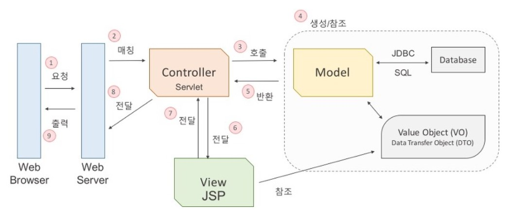
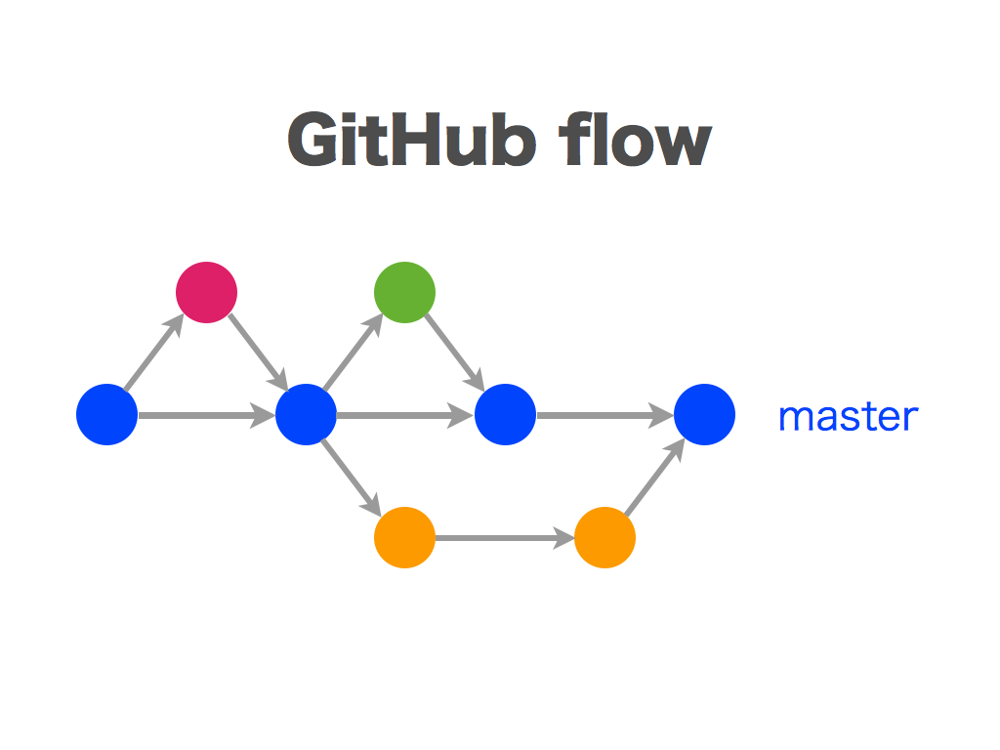

# 기초 개발 상식

## 좋은 코드

- ‘좋은 코드란?‘이라고 구글링해보면 많은 검색 결과가 나온다. 나도 그렇고 다들 궁금했던듯하다. ‘좋은 코드’란 녀석은 정체도, 실체도 없이 이 세상에 떠돌고 있다. 모두가 ‘좋은 코드’의 기준이 조금씩 다르고 각각의 경험을 기반으로 좋은 코드를 정의하고 있다. 세간에 좋은 코드의 정의는 정말 많다.
  - 읽기 쉬운 코드
  - 중복이 없는 코드
  - 테스트가 용이한 코드

  등등… 더 읽어보기 > https://jbee.io/etc/what-is-good-code/

## Object Oriented Programming

- 객체지향 프로그래밍이란 인간 중심적 프로그래밍 패러다임이라고 할 수 있다. 즉, 현실 세계를 프로그래밍으로 옮겨와 프로그래밍하는 것을 말한다. 현실 세계의 사물들을 객체라고 보고 그 객체로부터 개발하고자 하는 애플리케이션에 필요한 특징들을 뽑아와 프로그래밍 하는 것이다. 이것을 추상화라한다.

- OOP 로 코드를 작성하면 이미 작성한 코드에 대한 재사용성이 높다. 자주 사용되는 로직을 라이브러리로 만들어두면 계속해서 사용할 수 있으며 그 신뢰성을 확보 할 수 있다. 또한 라이브러리를 각종 예외상황에 맞게 잘 만들어두면 개발자가 사소한 실수를 하더라도 그 에러를 컴파일 단계에서 잡아낼 수 있으므로 버그 발생이 줄어든다. 또한 내부적으로 어떻게 동작하는지 몰라도 개발자는 라이브러리가 제공하는 기능들을 사용할 수 있기 때문에 생산성이 높아지게 된다. 객체 단위로 코드가 나눠져 작성되기 때문에 디버깅이 쉽고 유지보수에 용이하다. 또한 데이터 모델링을 할 때 객체와 매핑하는 것이 수월하기 때문에 요구사항을 보다 명확하게 파악하여 프로그래밍 할 수 있다.

- 객체 간의 정보 교환이 모두 메시지 교환을 통해 일어나므로 실행 시스템에 많은 overhead 가 발생하게 된다. 하지만 이것은 하드웨어의 발전으로 많은 부분 보완되었다. 객체 지향 프로그래밍의 치명적인 단점은 함수형 프로그래밍 패러다임의 등장 배경을 통해서 알 수 있다. 바로 객체가 상태를 갖는다는 것이다. 변수가 존재하고 이 변수를 통해 객체가 예측할 수 없는 상태를 갖게 되어 애플리케이션 내부에서 버그를 발생시킨다는 것이다. 이러한 이유로 함수형 패러다임이 주목받고 있다.

  ### 객체 지향적 설계 원칙(SOLID원칙)

  1. 단일 책임 원칙
     - 클래스는 단 하나의 책임을 가져야 하며 클래스를 변경하는 이유는 단 하나의 이유이어야 한다.
  2. 개방-폐쇄 원칙
     - 확장에는 열려 있어야 하고 변경에는 닫혀 있어야 한다.
  3. 리스코프 치환원칙
     - 상위 타입의 객체를 하위 타입의 객체로 치환해도 상위 타입을 사용하는 프로그램은 정상적으로 동작해야 한다.
  4. 인터페이스분리 원칙
     - 인터페이스는 그 인터페이스를 사용하는 클라이언트를 기준으로 분리해야 한다.
  5. 의존 역전 원칙
     - 고수준 모듈은 저수준 모듈의 구현에 의존해서는 안된다.

## RESTful API

> 월드 와이드 웹(World Wide Web a.k.a WWW)과 같은 분산 하이퍼미디어 시스템을 위한 소프트웨어 아키텍처의 한 형식으로 자원을 정의하고 자원에 대한 주소를 지정하는 방법 전반에 대한 패턴

- API(Application Programming Interface)란

  - 데이터와 기능의 집합을 제공하여 컴퓨터 프로그램간 상호작용을 촉진하며, 서로 정보를 교환가능 하도록 하는 것

- `REST`란, REpresentational State Transfer 의 약자이다. 여기에 ~ful 이라는 형용사형 어미를 붙여 ~한 API 라는 표현으로 사용된다. 즉, REST 의 기본 원칙을 성실히 지킨 서비스 디자인은 'RESTful'하다라고 표현할 수 있다.

- `REST`가 디자인 패턴이다, 아키텍처다 많은 이야기가 존재하는데, 하나의 아키텍처로 볼 수 있다. 좀 더 정확한 표현으로 말하자면, REST 는 `Resource Oriented Architecture` 이다. API 설계의 중심에 자원(Resource)이 있고 HTTP Method 를 통해 자원을 처리하도록 설계하는 것이다.

  ### REST 6 가지 원칙

  - Uniform Interface
  - Stateless
  - Caching
  - Client-Server
  - Hierarchical system
  - Code on demand

  

### RESTful 하게 API 를 디자인 한다는 것은 무엇을 의미하는가.

1. **리소스** 와 **행위** 를 명시적이고 직관적으로 분리한다.
   - 리소스는 `URI`로 표현되는데 리소스가 가리키는 것은 `명사`로 표현되어야 한다.
   - 행위는 `HTTP Method`로 표현하고, `GET(조회)`, `POST(생성)`, `PUT(기존 entity 전체 수정)`, `PATCH(기존 entity 일부 수정)`, `DELETE(삭제)`을 분명한 목적으로 사용한다.
2. Message 는 Header 와 Body 를 명확하게 분리해서 사용한다.
   - Entity 에 대한 내용은 body 에 담는다.
   - 애플리케이션 서버가 행동할 판단의 근거가 되는 컨트롤 정보인 API 버전 정보, 응답받고자 하는 MIME 타입 등은 header 에 담는다.
   - header 와 body 는 http header 와 http body 로 나눌 수도 있고, http body 에 들어가는 json 구조로 분리할 수도 있다.
3. API 버전을 관리한다.
   - 환경은 항상 변하기 때문에 API 의 signature 가 변경될 수도 있음에 유의하자.
   - 특정 API 를 변경할 때는 반드시 하위호환성을 보장해야 한다.
4. 서버와 클라이언트가 같은 방식을 사용해서 요청하도록 한다.
   - 브라우저는 form-data 형식의 submit 으로 보내고 서버에서는 json 형태로 보내는 식의 분리보다는 json 으로 보내든, 둘 다 form-data 형식으로 보내든 하나로 통일한다.
   - 다른 말로 표현하자면 URI 가 플랫폼 중립적이어야 한다.

### 어떠한 장점이 존재하는가?

1. Open API 를 제공하기 쉽다
2. 멀티플랫폼 지원 및 연동이 용이하다.
3. 원하는 타입으로 데이터를 주고 받을 수 있다.
4. 기존 웹 인프라(HTTP)를 그대로 사용할 수 있다.

### 단점은 뭐가 있을까?

1. 사용할 수 있는 메소드가 4 가지 밖에 없다.
2. 분산환경에는 부적합하다.
3. HTTP 통신 모델에 대해서만 지원한다.

##### Reference

- [REST API 제대로 알고 사용하기 - TOAST](http://meetup.toast.com/posts/92)
- [바쁜 개발자들을 위한 RESTFul api 논문 요약](https://blog.npcode.com/2017/03/02/바쁜-개발자들을-위한-rest-논문-요약/)
- [REST 아키텍처를 훌륭하게 적용하기 위한 몇 가지 디자인 팁 - spoqa](https://spoqa.github.io/2012/02/27/rest-introduction.html)

## MVC 아키텍쳐

### MVC 각 컴포넌트의 역할

#### Controller(컨트롤러)

- 클라이언트의 요청을 받았을 떄, 그 요청에 대해 실제 업무를 수행하는 모델 컴포넌트를 호출한다. 클라이언트가 보낸 데이터가 있다면, 모델에 전달하기 쉽게 데이터를 가공한다. 모델이 업무를 마치면 그 결과를 뷰에 전달한다.

#### Model

- 컨트롤러가 호출할 떄, 요청에 맞는 역할을 수행한다. 응용프로그램에서 데이터를 처리하는 부분이다. DB에 연결하고 데이터를 추출하거나 저장, 삭제, 업데이트, 변환 등의 작업을 수행한다. 상태의 변화가 있을 떄 컨트롤러와 뷰에 통보해 후속 조치 명령을 받을 수 있다.

#### View

- 컨트롤러로부터 받은 모델의 결과값을 가지고 사용자에게 출력할 화면을 만드는 일을 한다. 만들어진 화면을 웹 브라우저에 전송하여 출력하게 한다. 화면에 표시되는 부분으로, 추출한 데이터나 일반적인 텍스트 데이터를 표시하거나 입력폼 또는 사용자와의 상호작용을 위한 인터페이스를 표시하는 영역이다.

### MVC 구동 원리

1. 웹 브라우저가 웹 서버에 웹 애플리케이션 실행을 요청한다.

2. 웹 서버는 들어온 요청을 처리할 수 있는 서블릿을 찾아서 요청을 전달한다(Matching)

   **서블릿**(**servlet**)은 서버에서 웹페이지 등을 동적으로 생성하거나 데이터 처리를 수행하기 위해 자바로 작성된 프로그램이다

3. 서블릿은 모델 자바 객체의 메서드를 호출한다.

4. 데이터를 가공하여 값 객체를 생성하거나, JDBC를 사용하여 데이터베이스와의 인터랙션을 통해 값 객체를 생성한다.

5. 업무 수행을 마친 결과값을 컨트롤러에게 반환한다,

6. 컨트롤러는 모델로부터 받은 결과값을 View에 전달한다.

7. JSP는 전달받은 값을 참조하여 출력할 결과 화면을 만들고 컨트롤러에게 전달한다.

8. 뷰로부터 받은 화면을 웹 서버에게 전달한다.

9. 웹 브라우저는 웹 서버로부터 요청한 결과값을 응답받으면 그 값을 화면에 출력한다.

- **JSP (JavaServer Pages )**

  JSP 란 JavaServer Pages 의 약자이며

  HTML 코드에 JAVA 코드를 넣어 동적웹페이지를 생성하는 웹어플리케이션 도구이다.

  JSP 가 실행되면 자바 서블릿(Servlet) 으로 변환되며 웹 어플리케이션 서버에서 동작되면서 필요한 기능을 수행하고

  그렇게 생성된 데이터를 웹페이지와 함께 클라이언트로 응답한다.

- **JDBC(Java Database Connectivity)**

  자바에서 데이터베이스에 접속할 수 있도록 하는 자바 API이다.

## GIT

[GIT에 관해 알아보자](https://www.slideshare.net/ky200223/git-89251791)

### 	Git이란

- VCS이다(버전컨트롤 시스템)
- 형상관리 시스템중 원격 저장소 방식이다.

### 특징

- 비선형적인 개발을 위해 브랜치 시스템 사용
- 원격저장소와 로컬을 분리함으로써 여러 개발자가 분산작업을 원활하게 할 수 있게 고안
- 모든 커밋에 대해 Checksum을 만들어 데이터 무결성 보장

### 명령어

- git init : git 디렉토리 시작
- git add * : git으로 관리할 파일 고르기
- git commit : 메세지와 함께 디렉토리 상태 저장
- git push : 원격 저장소에 커밋 내용 보내기
- git checkout : 브랜치 변경
- git branch (name) : 새로운 브랜치 만들기
- git reset --hard HEAD : 마지막 커밋으로 모든 것을 되돌림
- git merge (name) : 현재 체크아웃된 브랜치를 기준으로 name 머지
- git status : 파일들의 상태 보기

### gitignore

- git이 몇몇 파일을 무시하게 하고 싶으면 최상위 디렉토리에 .gitignore파일을 수동으로 만들어라.
- *.a : 확장자가 .a인 파일 무시
- !lib.a : 윗 라인에서 .a파일을 무시하게 했지만 lib.a는 무시하지 않음
- /TODO : 현재 디렉토리에 있는 TODO파일을 무시. subdir/TODO처럼 하위 디렉토리에있는 파일은 무시 X
- build/ : build디렉토리에 있는 모든 파일 무시
- doc/*.txt : doc 디렉토리 바로 아래의 .txt파일 무시
- doc/**/\*.pdf : doc 디렉토리 아래의 모든 .pdf파일 무시

### GIT 전략

### Git flow vs GitHub flow vs GitLab flow

### 	Git flow

- 기본 브런치
  - feature > develop > release > hotfix > master
  - 머지 순서는 앞에서 뒤로 진행된다.

- 구조화 흐름
  - 가장 중심이 되는 브런치는 master랑 develop브런치 이며, 이 두 개 브런치는 무조건 있어야 한다. 
  - 머지된 feature, release, hotfix 브런치는 삭제하도록 한다.
- **Feature 브런치**
  - 브런치 나오는 곳 : develop
  - 브런치 들어가는 곳 : develop
  - 이름 지정 : master, develop, release-\*, hotfix-\*를 제외한 어떤 것이든 가능
  - 설명
    - 새로운 기능을 추가하는 브런치이다.
    - feature브런치는 origin에는 반영하지 않고, 개발자의 reop에만 존재하도록 한다.
- **Release 브런치**
  - 브런치 나오는 곳 : develop
  - 브런치 들어가는 곳 : develop, master
  - 이름 지정 : release-\*
  - 설명
    - 새로운 Production 릴리즈를 위한 브런치. 지금까지 한 기능을 묶어 develop 브런치에서 release 브런치를 따내고, develop 브런치에서는 다음번 릴리즈에서 사용할 기능을 추가한다. release 브런치에서는 버그 픽스에 대한 부분만 커밋하고, 릴리즈가 준비 되었다고 생각하면 master로 머지를 진행한다.그 뒤 develop 브런치로 머지한다.
- **Hotfix 브런치**
  - 브런치 나오는 곳 : master
  - 브런치 들어가는 곳 : develop, master
  - 이름 지정 : hotfix-\*
  - 설명
    - Production에서 발생한 버그들을 전부 수정하는 브런치. 수정이 끝나면 develop, master 브런치에 반영한다. 만약 release 브런치가 존재한다면 release 브런치에 hotfix브런치를 머지하여 릴리즈 될 떄 반영 될 수 있도록 한다.
- **장점**
  - 명령어가 나와있다.
- **단점**
  - 브런치가 많아 복잡하다.
  - 안 쓰는 브런치가 있다.

### GitHub Flow

- **특징**
  - 모든 브런치를 master에서 따고, master는 어떤 떄든 배포가 가능하다.(항상 최신)
  - git flow와 다르게 feature 브런치나 develop 브런치가 존재하지 않으므로, 브런치 이름을 자세하게 기입
  - 원격 브런치로 수시로 push를 한다.
  - 피드백이나 도움이 필요할 때, 머징 준비가 완료되었을 떄는 pull request를 생성한다.
- **장점**
  - 단순하다.
- **단점**
  - 복잡할 수 있다.

### GitLab Flow

- 
- 

