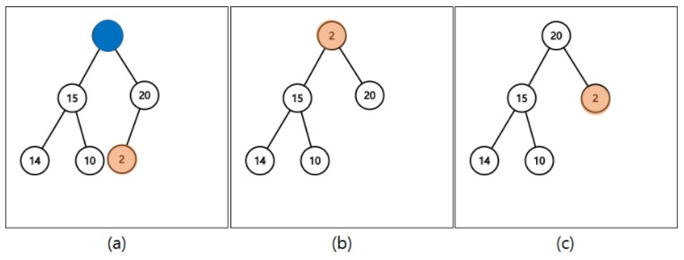

# Data Structure

## 목차
  * [선형자료구조](#선형자료구조)
  * [Array](#array)
  * [Linked List](#linked-list)
  * [Stack](#stack)
  * [Queue](#queue)
  * [비선형자료구조](#비선형자료구조)
  * [Tree](#tree)
    + [Binary Tree(이진 트리)](#binary-tree(이진-트리))
    + [이진 탐색 트리( Binary Search Tree )](#이진-탐색-트리(binary-search-tree--))
    + [Binary Heap](#binary-heap)
    + [Red Black Tree](#red-black-tree)
  * [Hash Table](#hash-table)
    + [Hash Function](#hash-function)
    + [Resolve Conflict](#resolve-conflict)
  * [Trie](#Trie)

## 선형자료구조

* 선형자료구조 : 자료를 구성하는 데이터를 순차적으로 1개씩 나열시킨 형태

## Array

### 특징

* 논리적 저장 순서와 물리적 저장 순서가 일치한다.
* 메모리에 연속적으로 저장된다.
* 고정된 크기의 할당이 필요하다.
* 인덱스로 해당 원소에 접근할 수 있다.
* 삽입, 삭제가 빈번하게 발생하는 프로세스의 경우 바람직하지않다.

### 장점

* 인덱스 값을 알고있으면 O(1)만에 해당 원소로 접근할 수 있다.(Random access가능)

### 단점

* 삭제, 삽입의 과정에서는 해당 원소에 접근하여 작업을 완료한 후, 특정 작업이 필요하다.
* 위 작업시 배열의 연속적인 특징이 깨지게 된다(빈공간이 생김). 이를 처리하기 위해 원소들을 shift해주는 비용이 발생한다(O(n)).
* 데이터 삭제시 가장 마지막 공간이 낭비되고, 데이터 삽입시 공간이 부족하다면 메모리 공간 확장이 필요하다.

## Linked List

### 특징

* Array와 달리 각각의 원소들은 물리적으로 연속적이지 않다.
* 각각의 원소들은 자기 자신 다음에 어떤 원소인지만(포인터)을 기억하고 있다.
* Tree 구조의 근간이 되는 자료구조이다.

### 장점

* 주소로 연결되어있기 때문에 삭제와 삽입을 O(n)만에 처리 가능하다.
* 각각의 데이터가 물리적으로 연속할 필요가 없기때문에, 공간을 효율적으로 사용할 수 있다.

### 단점

* 구현이 어렵다.
* 데이터를 탐색할때, Head부터 출발해서 Search하므로 O(n)이 걸린다.
* 삽입과 삭제 수행시, 해당 위치를 탐색하기위해 결과적으로 O(n)이 걸리게된다.

## Stack

### 특징

* Last In First Out(LIFO), 나중에 들어간 원소가 먼저 나온다는 특성을 가진다.
* 상자에 책을 쌓듯이 데이터가 들어올때 마다 마지막으로 들어온 데이터 위에 쌓이게 된다.
* 호출시, Stack에서 가장 위에 있는 데이터가 호출된다.
* 정해진방향으로만 삽입(push), 호출(top), 삭제(pop)가 가능하다.
* 자료가 없을 때 `pop`하는 오류를 `stack underflow`, 스택의 크기 이상의 자료를 push 하려고 할 때의 오류를 `stack overflow`라고 함.
* 재귀 함수에사용할 때 사용된다.

### 장점

* 데이터의 삽입과 삭제가 빠르다(O(n))

### 단점

* 데이터 탐색이 어렵다.(탐색을 하려면 원소를 하나하나 옮겨가면서 해야함)
* 가장위의 원소만 접근이 가능하다.

#### 사용 사례

- 재귀 알고리즘(dfs)
- 함수 호출
- 실행 취소
- 웹 브라우저 방문기록

## Queue

### 특징

* First In First Out(FIFO), 먼저 들어간 원소가 먼저 나온다는 특성을 가진다.
* 호출시, Queue에서 가장 앞에 있는 데이터가 호출된다.
* 정해진방향에서만 back,rear(삽입(push)), front(호출(front), 삭제(pop))가 가능하다.

### 장점

* 데이터의 삽입과 삭제가 빠르다(O(n))

### 단점

* 데이터 탐색이 어렵다.(탐색을 하려면 원소를 하나하나 옮겨가면서 해야함)
* 가장위의 원소만 접근이 가능하다.
* front에서 삭제가 일어나고, back에서 삽입이 일어나므로, 배열로 구현시 점점 front공간은 비게 되고, back공간은 부족하게 된다. => 이를해결하기 위한 방법( 원형 queue )

#### 사용 사례

- BFS
- 업무 대기열
  - 프린터
  - 고객 대기시간
  - 프로세스 관리

#### 원형 Queue

* 큐의 처음과 끝이 서로 연결되었다고 가정한다.
* % 연산자와 큐의 크기 M을 사용한다.
* 값 증가시
  * front : (front + 1) % M
  * rear : (rear + 1) % M
* 값 감소시
  * front : (front + M - 1) % M
  * rear : (rear + M -1 ) % M

* empty : front == rear (초기 상태 : front == rear == 0)
* full : front % M == (rear + 1 ) % M
* empty와 full을 구별하기 위해 하나의 공간을 항상 비워둔다.

## 비선형자료구조

* 비선형자료구조 : 하나의 자료 뒤에 여러개의 자료가 존재할 수 있음

## Tree

### 특징

* 구성요소
  * Node(노드) : 트리를 구성하고 있는 각각의 요소를 의미한다.
  * Edge(간선) : 트리를 구성하기 위해 노드와 노드를 연결하는 선을 의미한다.
  * Root Node(루트 노드) : 트리 구조에서 최상위에 있는 노드를 의미한다.
  * Terminal Node( = leaf Node, 단말 노드) : 하위에 다른 노드가 연결되어 있지 않은 노드를 의미한다.
  * Internal Node(내부노드, 비단말 노드) : 단말 노드를 제외한 모든 노드로 루트 노드를 포함한다.
  * Level(레벨) : 루트 노드의 레벨은 0 이며, 각 층별로 1씩 더해간다. 트리의 최고 레벨을 해당 트리의 height라고 한다.

### Binary Tree(이진 트리)

* 루트 노드를 중심으로 두 개 이하의 서브 트리(큰 트리에 속하는 작은 트리)로 나뉘어 진다. 또한 나뉘어진 두 서브 트리도 모두 이진 트리어야 한다.
* 배열로 구현시 노드의 개수가 n개이고, root가 1에서 시작할때, i번째 노드에 대해서 parent(i) = i/2, left_child(i) = 2i, right_child(i) = 2i + 1
* **편향 이진 트리** 
  * 모든 노드들이 한쪽으로 편향 되어 생성된 이진트리
  * 문제점
    * 탐색속도 저하 : 편향 이진트리로 형성이 되면 탐색시 모든 노드를 탐색해야 하므로 Linked List와 탐색시간이 동일하다.
    * 공간 낭비 : Linked List로 구현한 경우는 문제가 없지만 Index로 구현한 경우 노드의 개수가 i이면, 최대 2^i의 공간을 필요로
    *  한다.

* **Perfect Binary Tree ( 포화 이진 트리 )**
  * 모든 레벨이 꽉 찬 이진 트리
  * 높이가 h일 때, 노드의 수가 2^(h+1) - 1개를 만족하는 이진트리

* **Complete Binary Tree ( 완전 이진 트리 )**
  * 위에서 아래로, 왼쪽에서 오른쪽으로 순서대로 채워진 이진 트리

* **Full Binary ( 정 이진 트리 )** : 모든 노드가 0개 혹은 2개의 자식 노드만을 갖는 이진 트리

  

#### 이진 트리의 표현 방법

1. 순차표현(Array이용)
   * 포화이진트리를 가정하고 인덱스상에 표현
   * 0번은 편의상 사용 X ??
   * 장점
     * 인덱스 규칙을 통해 원하는 노드를 찾기 쉽다.
     * 구현이 간단하다
   * 단점
     * 완전이진트리의 경우 배열 공간을 최적으로 사용하지만 편향이진트리의 경우 많은 공간을 필요로하며, 낭비한다.

2. Linked List표현
   * 각 노드를 3개의 필드 left, data, right로 구성한다.

### 이진 탐색 트리( Binary Search Tree ) 

* 탐색을 효율적으로 하기 위한 자료구조

* **규칙**

  * 규칙 1. 이진 탐색 트리의 노드에 저장된 키는 유일하다.
  * 규칙 2. 부모의 키가 왼쪽 자식보다 크고 오른쪽 자식보다 작다
  * 규칙 3. 왼쪽과 오른쪽 서브트리도 이진 탐색 트리이다.
  
* 이진탐색트리에서 탐색시간은 완전이진트리의 경우 O(log2(n))이지만 편향트리의 경우 O(n)이다.

  

* 루트에서 부터 시작해, 찾고자하는 데이터가 해당 노드보다 작으면 왼쪽, 크면 오른쪽으로 이동하며 탐색한다.

### Binary Heap

* 완전 이진 트리의 형태이다.

* 우선순위 큐에 사용된다.

* 이진 탐색트리에서는 중복된 값을 허용하지 않지만, 힙은 중복값을 허용한다.

* 최대힙, 최소힙 두 종류가 있다.

* 최대힙 : 각 노드의 값이 해당 자식의 값보다 크거나 같은 완전 이진 트리

* 노드의 고유번호 값과 배열의 index를 일치시켜 혼동을 줄이기 위해 배열에서 1번 index부터 루트 노드를 시작시킨다.

  

  #### 최대힙(Max Heap)

  * 삽입

    

    * (a)에서 새로운 데이터 30 이 추가되는 경우 완전이진트리를 유지하기 위해 (b)처럼 추가된다.
    * 최대힙구조를 유지하기 위해, 부모보다 작거나 같을때까지 swap한다. (Heapify)

  * 삭제

    

    * 최대힙에서 삭제는 가장 큰 값을 삭제하는 것이다. 즉 Root값을 삭제한다.
    * 삭제후 가장마지막 노드에 있는 2가 루트노드로 올라간다.
    * 이후 최대힙을 유지하기 위해 자기보다 큰 자식노드가 있다면 그중 가장 큰 자식노드와 swap한다.(최대힙이 될 때 까지)

### Red Black Tree

- 다음의 성질들을 만족하는 BST(이진탐색트리)이다.
  1. 각 노드는 Red, Black 이라는 색을 갖는다.
  2. Root node의 색깔은 Black이다.
  3. 각 leaf node는 black이다.
  4. 어떤 노드의 색깔이 red라면 두 개의 children의 색깔은 모두 black이다.(== red노드가 연속해서 나올 수 없다.)
  5. 각 노드에 대해서 노드로부터 descendant leaves 까지의 단순 경로는 모두 같은 수의 black nodes들을 포함하고 있다. 이를 해당 노드의 Black-Height라고 한다.
- **특징**
  - BST의 특징을 갖는다.
  - Root node 부터 leaf node 까지의 모든 경로 중 최소 경로와 최대 경로의 크기 비율은 2 보다 크지 않다. 이러한 상태를 balanced 상태라고 한다.
  - 노드의 child가 없을 경우 child를 가리키는 포인터는 NIL 값을 저장한다. 이러한 NIL 들을 leaf node로 간주한다.
- **동작과정**
  - **삽입**
    - 삽입되는 노드는 무조건 red이다. (root노드 제외)
    - 삽입시 4번조건에 위배되면(Double Red) Restructuring, Recoloring 둘 중 하나를 실행한다.
      - **Restructuring**
        - 삽입된 노드의 uncle 노드의 색이 black일 경우 실행
        - 한번만 실행된다.
        - **동작과정**
          1. 나와 내 부모, 내 부모의 부모노드를 오름차순으로 정렬
          2. 무조건 가운데 있는 값을 부모로 만들고 나머지 둘을 자식으로 만든다.
          3. 올라간 가운데 있는 값을 black으로 만들고 그 두 자식들을 red로 만든다.
          4. 그 후 uncle노드를 붙여준다.
        - **시간복잡도** : O(1) 이지만 현재 노드가 들어갈 위치를 찾는데 O(logn)
      - **Recoloring**
        - 삽입된 노드의 uncle 노드의 색이 red일 경우 실행
        - 한번만 실행되지 않을 가능성이 있다.
        - **동작과정**
          1. 부모노드와 uncle 노드를 black으로 하고 부모의 부모를 red로 한다.
          2. 부모의 부모가 Root node가 아닐시 Double Red가 다시 발생할 수 있다.
        - **시간복잡도** : O(logn)  (최악의 경우 Root node까지 올라갈 수 있다.)

## Hash Table

### 특징

* 내부적으로 Array을 사용하여 데이터를 저장하기 때문에 빠른 검색 속도를 갖는다.
* 특정한 값을 Search 하는데 데이터 고유의 Index로 접근하므로 평균적으로 O(1)의 시간 복잡도를 갖는다.
* 특별한 알고리즘을 이용하여 저장할 데이터와 연관된 고유한 숫자를 만들어 낸 뒤 이를 Index로 사용한다.

* 특정 데이터가 저장되는 인덱스는 그 데이터만의 고유한 위치이기 때문에, 삽입 연산 시 다른 데이터의 사이에 끼어들거나, 삭제 시 다른 데이터로 채울 필요가 없으므로 연산에서 추가적인 비용이 없도록 만들어진 구조이다.

### Hash Function

* 위에서 언급한 '특별한 알고리즘'을 `hash method` 또는 `해시 함수(hash function)`라고 하고 이 메소드에 의해 반환된 데이터의 고유 숫자 값을 `hashcode`라고 한다. 저장되는 값들의 key 값을 `hash function`을 통해서 **작은 범위의 값들로** 바꿔준다.

#### 장점

- 적은 리소스로 많은 데이터를 효율적으로 관리할 수 있다.
- 빠른 검색, 삽입, 삭제가 가능하다.(O(1))
- Key와 Hash에 연관성이 없어 보안에 유리하다.

#### 단점

- 충돌이 발생할 수 있다.
- 공간 복잡도가 증가
- 순서 무시
- 해시 함수에 의존

**읽어볼것**

* 하지만 어설픈 `hash function`을 통해서 key 값들을 결정한다면 동일한 값이 도출될 수가 있다. 이렇게 되면 동일한 key 값에 복수 개의 데이터가 하나의 테이블에 존재할 수 있게 되는 것인데 이를 `Collision` 이라고 한다(해시충돌). *Collision : 서로 다른 두 개의 키가 같은 인덱스로 hashing(hash 함수를 통해 계산됨을 의미)되면 같은 곳에 저장할 수 없게 된다.*

>  그렇다면 좋은 `hash function`은 어떠한 조건들을 갖추고 있어야 하는가?

* 일반적으로 좋은 `hash function`는 키의 일부분을 참조하여 해쉬 값을 만들지 않고 키 전체를 참조하여 해쉬 값을 만들어 낸다. 하지만 좋은 해쉬 함수는 키가 어떤 특성을 가지고 있느냐에 따라 달라지게 된다.

* `hash function`을 무조건 1:1 로 만드는 것보다 Collision 을 최소화하는 방향으로 설계하고 발생하는 Collision 에 대비해 어떻게 대응할 것인가가 더 중요하다. 1:1 대응이 되도록 만드는 것이 거의 불가능하기도 하지만 그런 `hash function`을 만들어봤자 그건 array 와 다를바 없고 메모리를 너무 차지하게 된다.

* Collision 이 많아질 수록 Search 에 필요한 Time Complexity 가 O(1)에서 O(n)에 가까워진다. 어설픈 `hash function`은 hash 를 hash 답게 사용하지 못하도록 한다. 좋은 `hash function`을 선택하는 것은 hash table 의 성능 향상에 필수적인 것이다.

* 따라서 hashing 된 인덱스에 이미 다른 값이 들어 있다면 세 데이터를 저장할 다른 위치를 찾은 뒤에야 저장할 수 있는 것이다.

### Resolve Conflict(해쉬 충돌 해결법)

#### 1. Open Address 방식 (개방주소법)

* 비어있는 해시를 찾아 데이터를 저장하는 기법
* 방법
  * 선형탐색(Linear Probing) : 순차적으로 탐색하며 비어있는 버킷을 찾을 때까지 계속 진행된다.
  * 제곱 탐색(Quadratic probing) : 2 차 함수를 이용해 탐색할 위치를 찾는다.
  * 이중 해시(Double hashing probing) : 하나의 해쉬 함수에서 충돌이 발생하면 2 차 해쉬 함수를 이용해 새로운 주소를 할당한다. 위 두 가지 방법에 비해 많은 연산량을 요구하게 된다
* 장점
  * 추가적인 저장공간 없이 해시테이블 내에서 데이터 저장 및 처리가 가능하다.
  * 또 다른 저장공간에서의 추가적인 작업이 없다.
* 단점
  * 해시 함수의 성능에 전체 해시테이블의 성능이 좌지우지된다.
  * 데이터의 길이가 늘어나면 그에 해당하는 저장소를 마련해 두어야 한다.

#### 2. Separate Chaining 방식 (분리 연결법)

- 자료 저장 시, 저장소(bucket)에서 충돌이 일어나면 해당 값을 기존 값과 연결시키는 기법
- 방법
  - **연결 리스트를 사용하는 방식(Linked List)** 각각의 버킷(bucket)들을 연결리스트(Linked List)로 만들어 Collision 이 발생하면 해당 bucket 의 list 에 추가하는 방식이다. 연결 리스트의 특징을 그대로 이어받아 삭제 또는 삽입이 간단하다. 하지만 단점도 그대로 물려받아 작은 데이터들을 저장할 때 연결 리스트 자체의 오버헤드가 부담이 된다. 또 다른 특징으로는, 버킷을 계속해서 사용하는 Open Address 방식에 비해 테이블의 확장을 늦출 수 있다.
  - **Tree 를 사용하는 방식 (Red-Black Tree)** 기본적인 알고리즘은 Separate Chaining 방식과 동일하며 연결 리스트 대신 트리를 사용하는 방식이다. 연결 리스트를 사용할 것인가와 트리를 사용할 것인가에 대한 기준은 하나의 해시 버킷에 할당된 key-value 쌍의 개수이다. 데이터의 개수가 적다면 링크드 리스트를 사용하는 것이 맞다. 트리는 기본적으로 메모리 사용량이 많기 때문이다. 데이터 개수가 적을 때 Worst Case 를 살펴보면 트리와 링크드 리스트의 성능 상 차이가 거의 없다. 따라서 메모리 측면을 봤을 때 데이터 개수가 적을 때는 링크드 리스트를 사용한다.
- 장점
  - 한정된 저장소를 효율적으로 사용가능
  - 상대적으로 적은 메모리를 사용, 미리 공간을 잡아 놓을 필요가 없음
- 단점
  - 한 Hash에 자료들이 계속 연결되면(쏠림 현상) 검색 효율을 낮춤
  - 외부 저장 공간을 사용
  - 외부 저장 공간 작업이 추가로 필요하다.

#### ***추가***

#### 해시 버킷 동적 확장(Resize)

해시 버킷의 개수가 적다면 메모리 사용을 아낄 수 있지만 해시 충돌로 인해 성능 상 손실이 발생한다. 그래서 HashMap 은 key-value 쌍 데이터 개수가 일정 개수 이상이 되면 해시 버킷의 개수를 두 배로 늘린다. 이렇게 늘리면 해시 충돌로 인한 성능 손실 문제를 어느 정도 해결할 수 있다. 또 애매모호한 '일정 개수 이상'이라는 표현이 등장했다. 해시 버킷 크기를 두 배로 확장하는 임계점은 현재 데이터 개수가 해시 버킷의 개수의 75%가 될 때이다. `0.75`라는 숫자는 load factor 라고 불린다.

**resize의 이유**

- saperate chaining의 경우 성능 향상을 위해, Open Address의 경우 배열 크기 확장을 위해 resizing 한다.

## Trie

* 문자열을 저장하고 효율적으로 탐색하기 위한 트리 형태의 자료구조

* 트리의 루트에서 부터 자식노드들을 따라가면서 생성된 문자열들이 트라이에 저장된다.
* 저장된 단어는 끝을 표시하는 변수를 추가해서 저장된 단어의 끝을 구분한다
* 검색어 자동완성, 사전에서 찾기 그리고 문자열 검사 같은 부분에서 사용된다.
* 장점
  * 문자열에서 BST를 사용할 경우 문자열길이가 M 이면 시간복잡도가 O(MlogN)인데 반해, Trie사용시 O(M)이다.
* 단점
  * 공간 복잡도가 크다
  * 최종메모리 = (포인터 크기 * 포인터 배열의 개수 * 트라이에 존재하는 총 노드의 수)

## Graph

- 정점과 간선의 집합
- **종류**
  - Undirected Graph(무방향 그래프)
  - Directed Graph(방향 그래프)
  - 가중치 그래프
  - 부분 그래프
- **구현방법**
  - 인접 행렬 사용
  - 인접 리스트 사용
- **그래프 탐색**
  - DFS(깊이 우선 탐색)
  - BFS(너비 우선 탐색)

- **Minimum Spanning Tree**
  - 그래프 G의 spanning tree중 edge weight 의 합이 최소인 spanning tree를 말한다. spanning tree란 그래프G의 모든 vertex가 cycle이 없이 연결된 형태를 말한다.
  - **Kruskal Algorithm**
    - MST를 만드는 알고리즘
    - **동작과정**
      - 가중치가 작은 순서대로 Edge를 정렬한다.
      - 하나씩 꺼내면서 Cycle을 형성하지 않는 경우에 Edge를 추가한다.
    - **시간복잡도**
      1. Edge 정렬 : O(ElogE)
      2. cycle 생성여부 검사 + set_id 통일 : O(E+VlogV)
  - **Prim Algorithm**
    - MST를 만드는 알고리즘
    - **동작과정**
      - 임의의 정점을 T 그룹에 추가한다.
      - T그룹이 아닌 정점중 T그룹과 연결되는 Edge 가중치가 가장 작은 정점을 T그룹에 추가한다.
      - 반복
    - **시간복잡도**
      - O(ElogV)

