# Database

## Database

## 데이터베이스란

* 통합하여 관리되는 데이터의 집합체
* 중복된 데이터를 없애고, 자료를 구조화하여, 효율적인 처리를 할 수 있도록 관리된다.
* 응용 프로그램과는 다른 별도의 미들웨어에 의해 관리된다.
* 데이터베이스를 관리하는 미들웨어를 데이터베이스 관리 시스템(DBMS : DataBase Management System)이라고 불린다.

## 데이터베이스를 사용하는 이유

데이터베이스가 존재하기 이전에는 데이터를 파일 시스템을 이용하여 관리하였다(지금도 부분적으로는 사용). 데이터를 각각 파일 단위로 저장하면 이러한 일들을 처리하기 위한 독립적인 에플리케이션과 상호 연동이 되어야한다. 이 때 데이터 종속성 문제, 데이터 무결성 문제가 발생한다.

## 특징

1. 실시간 접근성(Real-Time Accessibility) : 수시적이고 비정형적인 질의(조회)에 대하여 실시간 처리에 의한 응답이 가능해야 한다.
2. 계속적인 변화(Continuous Evolution) : 데이터베이스의 상태는 동적이다. 즉 새로운 데이터의 삽입(Insert),삭제(Delete),갱신(Update)로 항상 최신의 데이터를 유지한다.
3. 동시공용(Concurrent Sharing): 데이터베이스는 서로 다른 목적을 가진 여러 응용자들을 위한 것이므로 다수의 사용자가 동시에 같은 내용의 데이터를 이용할 수 있어야 한다.
4. 내용에 의한 참조(Content Reference): 데이터베이스에 있는 데이터를 참조할 때 데이터 레코드의 주소나 위치에 의해서가 아니라, 사용자가 요구하는 데이터 내용으로 데이터를 찾는다.

## 용어정리

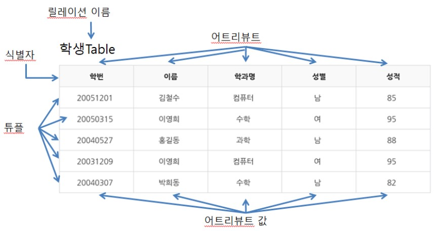

## 테이블 (Table)

**행 (row)** 과 **열 (colum)** 로 이루어진 데이터의 집합을 **테이블**이라고 한다. 흔히 엑셀을 떠올리면 된다. 일반적인 데이터베이스에서는 행과 열 만 있으면 테이블이라고 하지만 **관계형 데이터베이스**에서는 여기에 특별한 제약을 추가해서 **릴레이션 (relation)** 이라고 부른다.

> 모든 값은 유일한 값을 가진다.
>
> 하나의 릴레이션에서 중복되는 행이 존재하면 안된다.

위 조건을 충족하는 테이블만이 릴레이션이 될 수 있기 때문에 모든 릴레이션은 테이블이지만 모든 테이블이 릴레이션인건 아니다.

## 식별자(identifier)

* 여러개의 집합체를 담고있는 관계형 데이터베이스에서 각각의 구분할 수 있는 논리적인 개념
* 유일성 : 하나의 릴레이션에서 모든 행은 서로 다른 키 값을 가져야 한다.
* 최소성 : 꼭 필요한 최소한의 속성들로만 키를 구성해야 한다.

## 행 (Row)

테이블을 구성하는 데이터들 중 가로로 묶은 데이터셋을 의미한다. 일반적으로 행은 한 객체에 대한 정보를 가지고있다. 이 또한 관계형 데이터베이스에서는 **튜플 (Tuple)** 또는 **레코드 (Record)** 라는 이름으로 불린다.

## 열 (Column)

테이블을 구성하는 데이터들 중 세로로 묶은 데이터셋을 의미한다. 일반적으로 열은 그 테이블의 속성을 의미하며 열을 구성하는 값들은 같은 **도메인 (Domain)** 으로 되어있다. 이 또한 관계형 데이터베이스에서는 **속성 (Attribute)** 라는 이름으로 불린다.

## 엔터티 (Entity)

* 엔터티는 사람, 장소, 물건, 사건, 개념 등과 같은 명사에 해당된다.
* 엔터티는 업무상 관리가 필요한 것에 해당된다.
* 엔터티는 저장 되기 위한 어떤 것(Thing)에 해당된다.
* ex) 학교라는곳에서 과목 (엔터티)
  * 엔터티는 인스턴스의 집합이다.
  * ex) 과목 (엔터티)중 수학, 영어 (인스턴스) 등...
  * 이 인스턴스를 설명할 수 있는것 : 이름 (속성 (Attribute ))

## 도메인 (Domain)

데이터베이스에서 **필드 (Field)**에 채워질 수 있는 값의 집합이다. 예를들어 도메인이 1에서 10사이의 정수인 속성의 필드에 **11**이나 **-1**처럼 도메인을 벗어나는 값 또는 **“고양이”** 처럼 아예 자료형이 다른 값이 들어갈 수 없다.

## 스키마 (Schema)

데이터베이스의 구조를 전반적으로 기술한 것을 말한다. 구체적으로 데이터베이스를 구성하는 데이터 레코드의 크기, 키의 정의, 레코드 간의 관계 등을 정의한 것을 말한다.
사용자의 관점에 따라 외부 스키마, 개념 스키마, 내부 스키마로 구분한다. DBMS는 외부 스키마에 명세된 사용자의 요구를 개념 스키마 형태로 변환하고, 이를 다시 내부 스키마 형태로 변환한다. 

- 외부 스키마
  사용자의 입장에서 정의한 데이터베이스의 논리적 구조. 데이터들을 어떤 형식, 구조, 화면을 통해 사용자에게 보여줄 것인가에 대한 명세를 말하며 하나의 데이터베이스에는 여러개의 외부 스키마가 있을 수 있다.
  일반 사용자에게는 질의어를 이용해 DB를 쉽게 사용할 수 있도록 하고 응용 프로그래머는 언어를 사용해서 DB에 접근하도록 한다.
- 개념 스키마
  조직체 전체를 관장하는 입장에서 DB를 정의한 스키마. DB에 대한 모든 논리적 구조를 기술하기 때문에 데이터베이스에 하나만 존재하며, 통상 스키마 라고 하면 개념 스키마를 일컫는다.
- 내부 스키마
  데이터베이스가 어떻게 저장장치에 저장될 지에 대한 명세. 물리적인 저장장치와 데이터베이스 간의 관계를 정의하므로 시스템 프로그래머나 시스템 설계자가 보는 관점의 스키마이다.

## DBMS

* 사용자와 데이터베이스 사이에서 데이터베이스를 관리하며 응용 프로그램들이 데이터베이스를 공유하며 사용할 수 있는 환경을 제공하는 소프트웨어.

* 다수의 사용자가 데이터베이스 내의 데이터를 접근할 수 있음

* **RDBMS( Relational DBMS)**

  * DBMS의 한 종류로 관계형 데이터 모델에 기초를 둔 데이터 베이스인 RDB를 관리하는 SW
  * 테이블이 서로 연관되어 있기 떄문에 일반 DBMS보다 효율적으로 데이터를 저장, 구성 및 관리할 수 있다.
  * **특징**
    * 데이터는 **정해진 데이터 스키마에 따라 테이블에 저장**된다.
    * 데이터는 **관계를 통해 여러 테이블에 분산**된다.
  * **스키마를 준수하지 않은 레코드는 테이블에 추가할 수 없다.** 
  * 하나의 테이블에서 중복 없이 하나의 데이터만을 관리하기 때문에 다른 테이블에서 부정확한 데이터를 다룰 위험이 없어지는 장점이 있다.
  * RDBMS에서 검색속도를 높이기 위한 기술 : Index

* 종류

  <details>

  대표적인 DBMS는 Oracle사의 Oracle, My_SQL MicroSoft사의 MS_SQL이 있다.

  * **Oracle**
    * 오라클에서 만들어 판매중인 상업용 데이터베이스
    * 윈도우즈 리눅스 유닉스 등 다양한 운영체제에 설치를 할 수 있다.
    * MS_SQL , MY_SQL보다 대량의 데이터를 처리하기 좋음
    * 대기업에서 주로 사용하며 글로벌 DB시장 점유율 1위
    * 오픈소스가 아닌 비공개 소스로 운영
  * **MY_SQL**
    * MySQL사에서 개발, 썬마이크로시스템즈를 거쳐 현재 오라클에 흡수합병됨
    * 윈도우즈 리눅스 유닉스 등 다양한 운영체제에 설치를 할 수 있다.
    * 오픈소스로 이루어져있는 무료 프로그램(상업적 사용시 비용있음)
    * 가격등의 장점을 앞세워 다수의 중소기업에서 사용중
  * **MS_SQL**
    * 마이크로소프트 사에서 개발한 상업용 데이터베이스
    * 다른 운영체제도 사용가능하지만 윈도우즈에 특히 특화되어있음
    * 비공개 소스로 폐쇄적인 정책 (리눅스버전은 오픈소스)
    * 비교적 중소기업에서 주로 사용함


  </details>

## VIEW 테이블 (가상테이블)

* View란 한개 이상의 기본 테이블이나 다른 뷰를 이용하여 생성되는 가상 테이블(virtual table)이다.
* View는 기존에 생성된 테이블 또는 다른 View에서 접근할 수 있는 전체 데이터 중에서 일부만 접근할 수 있도록 제한하기 위한 기법이다.
* 테이블은 디스크 공간이 할당되어 데이터를 저장할 수 있지만, View는 데이터 딕셔너리 테이블에 View에 대한 정의만 저장
* **사용이유**
  * 자주 쓰는 쿼리문을 안쓰고 테이블만 조회하면 된다.
  * 보안에 유리하다.
  * 뷰 테이블에 자료가 추가되는 것은 실체 테이블에 반영되지 않기 때문에 주의를 요한다.
* **장점**
  * DB의 선택적인 부분만 보여주므로 접근을 제한
  * 다양한 접근 경로 설정
  * 복잡한 질의를 단순화
  * 데이터의 독립성 제공
  * 동일한 데이터를 또 다른 뷰로 표현
  * 한 개의 뷰에 여러 테이블의 데이터를 검색 가능
  * 한 개의 테이블로부터 여러 뷰를 생성 가능
* **단점**
  * 뷰의 정의?를 변경할 수 없고 insert, delete, update에 많은 제한이 있음

## SQL(Structured Query Language)

* DB에서 데이터를 정의, 조작, 제어하기 위해 사용하는 언어

* RDBMS에 사용

* SQL 문으로 작성한 요청을 RDBMS에 보내면 RDBMS는 요청된 데이터를 반환한다. (2차원 표형태)

* SQL 구문의 분류

  1. DDL( Data Defnition Language )

     데이터베이스 스키마와 설명을 처리하는 정의하는 언어이다. 데이터베이스나 테이블 생성/변경/삭제 등의 작업이 여기에 포함된다.

  2. DML( Data Manipulation Language )

     데이터 검색, 삽입, 변경, 삭제를 수행하여 조작하는 언어이다. 실질적으로 저장된 데이터에 처리할 때 사용한다.

  3. DCL (Data Control Language )

     데이터에 접근할 수 있는 권한을 관리하는 언어이다.

  4. TCL 

     트랜잭션을 다루는 언어이다.

  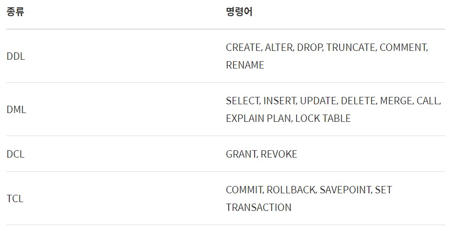

## NoSQL

* 관계형 데이터 모델을 **지양** 하며 대량의 분산된 데이터를 저장하고 조회하는 데 특화되었으며 스키마 없이 사용 가능하거나 느슨한 스키마를 제공하는 저장소를 말한다.

* NoSQL에서는 다른 구조의 데이터를 같은 컬렉션에 추가가 가능하다.

* 문서(documents) ( == RDBMS에서의 레코드) 는 Json과 비슷한 형태로 가지고 있다. 관계형 데이터베이스처럼 여러 테이블에 나누어담지 않고, 관련 데이터를 동일한 '컬렉션'에 넣는다.

* 따라서 여러 테이블에 조인할 필요없이 이미 필요한 모든 것을 갖춘 문서를 작성하는 것이 NoSQL이다.

* 그러면 조인하고 싶을 때 NoSQL은 어떻게 할까?

  > 컬렉션을 통해 데이터를 복제하여 각 컬렉션 일부분에 속하는 데이터를 정확하게 산출하도록 한다.

* 하지만 이러면 데이터가 중복되어 서로 영향을 줄 위험이 있다. 따라서 조인을 잘 사용하지 않고 자주 변경되지 않는 데이터일 때 NoSQL을 쓰면 상당히 효율적이다.

## SQL vs NoSQL

### SQL

* 장점
  * 명확하게 정의된 스키마, 데이터 무결성 보장
  * 릴레이션은 각 데이터를 중복없이 한번만 저장
* 단점
  * 덜 유연함. 데이터 스키마를 사전에 계획하고 알려야 함. (나중에 수정하기 힘듬)
  * 관계를 맺고 있어서 조인문이 많은 복잡한 쿼리가 만들어질 수 있음
  * 대체로 수직적 확장만 가능함

### NoSQL

* 장점
  * 스키마가 없어서 유연함. 언제든지 저장된 데이터를 조정하고 새로운 필드 추가 가능
  * 데이터는 애플리케이션이 필요로 하는 형식으로 저장됨. 데이터 읽어오는 속도 빨라짐
  * 수직 및 수평 확장이 가능해서 애플리케이션이 발생시키는 모든 읽기/쓰기 요청 처리 가능
* 단점
  * 유연성으로 인해 데이터 구조 결정을 미루게 될 수 있음
  * 데이터 중복을 계속 업데이트 해야 함
  * 데이터가 여러 컬렉션에 중복되어 있기 때문에 수정 시 모든 컬렉션에서 수행해야 함 (SQL에서는 중복 데이터가 없으므로 한번만에 수행이 가능)

### SQL 데이터베이스 사용이 더 좋을 때

- 관계를 맺고 있는 데이터가 자주 변경되는 애플리케이션의 경우

  > NoSQL에서는 여러 컬렉션을 모두 수정해야 하기 때문에 비효율적

- 변경될 여지가 없고, 명확한 스키마가 사용자와 데이터에게 중요한 경우

### NoSQL 데이터베이스 사용이 더 좋을 때

- 정확한 데이터 구조를 알 수 없거나 변경/확장 될 수 있는 경우
- 읽기를 자주 하지만, 데이터 변경은 자주 없는 경우
- 데이터베이스를 수평으로 확장해야 하는 경우 (막대한 양의 데이터를 다뤄야 하는 경우)

## Key

* 검색, 정렬시 Tuple을 구분할 수 있는 기준이 되는 Attribute

1. Super Key (슈퍼키)
   * 유일성은 만족하는 속성들의 집합
   * 이 키로 검색시 유일한 튜플이 나와야 한다.
2. Candidate Key (후보키)
   * 슈퍼키 중 유일성을 만족시킬 수 있는 최소한의 집합
   * 만족해야하는 조건 2개
     * 유일성 : Key로 하나의 Tuple을 유일하게 식별할 수 있음
     * 최소성 : 꼭 필요한 속성으로만 구성
3. **Primary Key** (기본키)
   * 후보키 중 선택한 Main Key
   * 테이블 내에서 튜플을 완벽하게 구분할 수 있는 유일한 속성
   * 특징
     * Null 값을 가질 수 없음
     * 동일한 값이 중복될 수 없음
4. **Foreign Key** (외래키)
   * 다른 릴레이션의 기본키를 참조하는 속성들의 부분집합.
   * 외래키 관계가 있는 R1, R2 테이블이 있고 R1에서 R2를 참조하려 할때, R1의 기본키와 대응되어 R2의 튜플을 구분할 수 있는 속성
   * DB에 있는 데이터를 참조할 때, 데이터 레코드의 주소나 위치에 의해서가 아니라 사용자가 요구하는 데이터 내용으로 찾는것을 말한다.
   * 테이블과 테이블을 연결하고, 중복을 방지하기 위해서 사용된다. [참고](https://brunch.co.kr/@dan-kim/26)
5. Alternate Key (대리키)
   * 후보키 중 기본키를 제외한 나머지 키 = 보조키
6. Surrogate Key (대체키)
   * 자연적인 값이 아니라 데이터베이스를 만들기 위해 임의로 만들어낸 값들
   * ex) 번호(1, 2, 3, ....)

## Join

* 두 개 이상의 테이블이나 데이터베이스를 연결하여 데이터를 검색하는 방법

* 테이블을 연결하려면, 적어도 하나의 column을 서로 공유하고 있어야 하므로 이를 이용하여 데이터 검색에 활용한다.

* Join 종류

  * INNER JOIN

  * LEFT OUTER JOIN

  * RIGHT OUTER JOIN

  * FULL OUTER JOIN

  * CROSS JOIN

  * SELF JOIN

    

  * **INNER JOIN**

    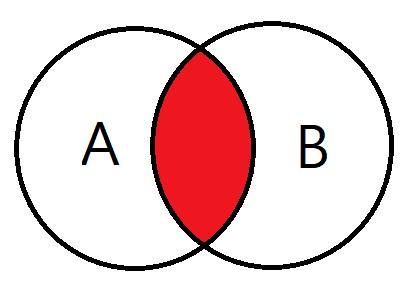

    교집합으로, 기준 테이블과 join 테이블의 중복된 값을 보여준다.

    ```sql
    SELECT
    A.NAME, B.AGE
    FROM EX_TABLE A
    INNER JOIN JOIN_TABLE B ON A.NO_EMP = B.NO_EMP
    ```

  * **LEFT OUTER JOIN**

    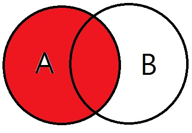

    조인테이블과 중복된 값과 기준테이블값을 보여준다.

    ```sql
    SELECT
    A.NAME, B.AGE
    FROM EX_TABLE A
    LEFT OUTER JOIN JOIN_TABLE B ON A.NO_EMP = B.NO_EMP
    ```

  * ### RIGHT OUTER JOIN

    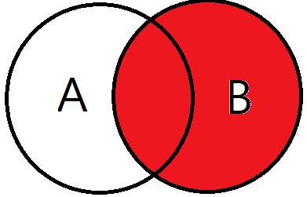

    ```sql
    SELECT
    A.NAME, B.AGE
    FROM EX_TABLE A
    RIGHT OUTER JOIN JOIN_TABLE B ON A.NO_EMP = B.NO_EMP
    ```

  * ### FULL OUTER JOIN

    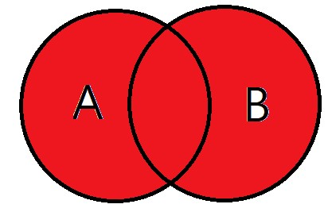

    합집합. A와 B 테이블의 모든 데이터가 검색된다.

    ```sql
    SELECT
    A.NAME, B.AGE
    FROM EX_TABLE A
    FULL OUTER JOIN JOIN_TABLE B ON A.NO_EMP = B.NO_EMP
    ```

  * ### CROSS JOIN

    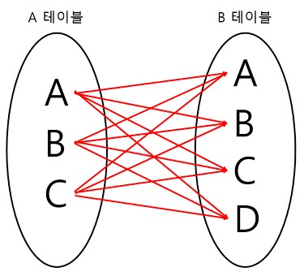

    모든 경우의 수를 전부 표현해주는 방식이다.

    A가 3개, B가 4개면 총 3*4 = 12개의 데이터가 검색된다.

    ```sql
    SELECT
    A.NAME, B.AGE
    FROM EX_TABLE A
    CROSS JOIN JOIN_TABLE B
    ```

  * SELF JOIN

    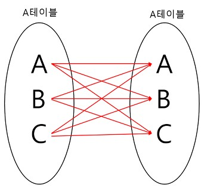

    자기자신과 자기자신을 join하는 것이다.

    하나의 테이블을 여러번 복사해서 join하는 것.

    자신이 갖고 있는 column을 다양하게 변형시켜 활용할 때 자주 사용한다.

    ```sql
    SELECT
    A.NAME, B.AGE
    FROM EX_TABLE A, EX_TABLE B
    ```

## 트랜잭션 (Transaction)

* 트랜잭션이란?

  * 데이터베이스의 상태를 변화시키기 위해 수행하는 작업 단위 또는 한꺼번에 실행되어야하는 일련의 작업들
  * 작업의 완전성을 보장해준다.

* 상태를 변화시킨다는 것 → SQL 질의어를 통해 DB에 접근하는 것

  ```sql
  - SELECT
  - INSERT
  - DELETE
  - UPDATE
  ```

* 작업 단위 → 많은 SQL 명령문들을 사람이 정하는 기준에 따라 정하는 것

```
예시) 사용자 A가 사용자 B에게 만원을 송금한다.

* 이때 DB 작업
- 1. 사용자 A의 계좌에서 만원을 차감한다 : UPDATE 문을 사용해 사용자 A의 잔고를 변경
- 2. 사용자 B의 계좌에 만원을 추가한다 : UPDATE 문을 사용해 사용자 B의 잔고를 변경

현재 작업 단위 : 출금 UPDATE문 + 입금 UPDATE문
→ 이를 통틀어 하나의 트랜잭션이라고 한다.
- 위 두 쿼리문 모두 성공적으로 완료되어야만 "하나의 작업(트랜잭션)"이 완료되는 것이다. `Commit`
- 작업 단위에 속하는 쿼리 중 하나라도 실패하면 모든 쿼리문을 취소하고 이전 상태로 돌려놓아야한다. `Rollback`
```

​	즉, 하나의 트랜잭션 설계를 잘 만드는 것이 데이터를 다룰 때 많은 이점을 가져다준다.

<details>
    <summary>트랜잭션과 Lock</summary>

잠금(Lock)과 트랜잭션은 서로 비슷한 개념 같지만 사실 잠금은 동시성을 제어하기 위한 기능이고 트랜잭션은 데이터의 정합성을 보장하기 위한 기능이다. 잠금은 여러 커넥션에서 동시에 동일한 자원을 요청할 경우 순서대로 한 시점에는 하나의 커넥션만 변경할 수 있게 해주는 역할을 한다. 여기서 자원은 레코드나 테이블을 말한다. 이와는 조금 다르게 트랜잭션은 꼭 여러 개의 변경 작업을 수행하는 쿼리가 조합되었을 때만 의미있는 개념은 아니다. 트랜잭션은 하나의 논리적인 작업 셋 중 하나의 쿼리가 있든 두 개 이상의 쿼리가 있든 관계없이 논리적인 작업 셋 자체가 100% 적용되거나 아무것도 적용되지 않아야 함을 보장하는 것이다. 예를 들면 HW 에러 또는 SW 에러와 같은 문제로 인해 작업에 실패가 있을 경우, 특별한 대책이 필요하게 되는데 이러한 문제를 해결하는 것이다.

</details>

#### 	**트랜잭션 특징**(ACID)

* **원자성(Atomicity)**

  트랜잭션이 DB에 모두 반영되거나, 혹은 전혀 반영되지 않아야 된다. ( 작업단위를 일부분만 실행하지 않는다. )

* **일관성(Consistency)**

  트랜잭션의 작업 처리 결과는 항상 일관성 있어야 한다.

* **독립성(Isolation)**

  둘 이상의 트랜잭션이 동시에 병행 실행되고 있을 때, 어떤 트랜잭션도 다른 트랜잭션 연산에 끼어들 수 없다.

* **지속성(Durability)**

  트랜잭션이 성공적으로 완료되었으면, 결과는 영구적으로 반영되어야 한다. 

  commit을 하면 현재 상태는 영원히 보장된다.

### 트랜잭션의 상태

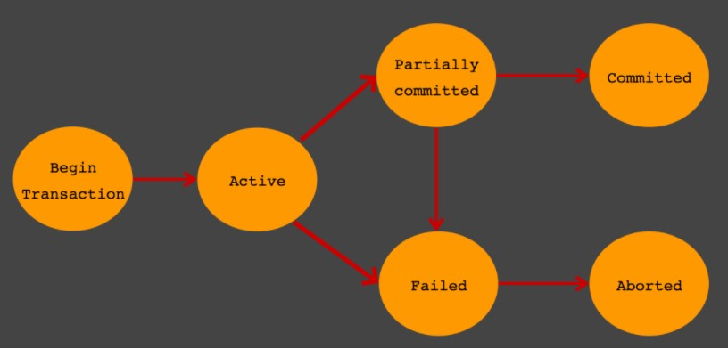

##### Active

트랜잭션의 활동 상태. 트랜잭션이 실행중이며 동작중인 상태를 말한다.

##### Failed

트랜잭션 실패 상태. 트랜잭션을 더이상 정상적으로 진행 할 수 없는 상태를 말한다.

##### Partially Committed

트랜잭션의 `Commit` 명령이 도착한 상태. 트랜잭션의 `commit`이전 `sql`문이 수행되고 `commit`만 남은 상태를 말한다.

##### Commited

하나의 트랜잭션이 성공적으로 끝났고, DB가 일관성있는 상태일 때 이를 알려주기 위해 사용하는 연산(commit)

##### Aborted

트랜잭션이 취소 상태. 트랜잭션이 취소되고 트랜잭션 실행 이전 데이터로 돌아간 상태를 말한다.

#### Partially Committed 와 Committed 의 차이점

`Commit` 요청이 들어오면 상태는 `Partial Commited` 상태가 된다. 이후 `Commit`을 문제없이 수행할 수 있으면 `Committed` 상태로 전이되고, 만약 오류가 발생하면 `Failed` 상태가 된다. 즉, `Partial Commited`는 `Commit` 요청이 들어왔을때를 말하며, `Commited`는 `Commit`을 정상적으로 완료한 상태를 말한다.

##### Rollback

트랜잭션 내의 질의를 수행하면서 문제가 발생해 트랜잭션 원자성이 깨진 경우 실행이전으로 되돌리는 것.

##### Recovery

rollback과는 다르게 시스템의 오류 또는 물리적인 문제가 발생한 경우 트랜잭션을 다시 수행해 트랜잭션의 원자성과 영속성 보장

* 시스템 오류 또는 물리적인 문제를 failure라고 한다.

* failure의 두종류

  * local failure

    하나의 트랜잭션 실패

  * global failure

    모든 트랜잭션의 실패

* undo, redo

  failure가 발생하면 시스템의 회복을 위해 수행한다.

  * undo

    트랜잭션을 이전 상태로 되돌리는 것

  * redo

    이전 상태로 되돌아간 후, 실패가 발생하기 전까지의 과정을 그대로 따라가는 것

    redo를 하기 위해 정상적으로 실행 되기까지의 과정을 기록해야 하는데, 이를 log라고 한다.

* check point

  * check point로 설정한 지점 이전 까지는 트랜잭션이 성공적으로 수행이 돼서 disk에 확실히 저장된 상태를 의미
  * failure가 발생하여 recovery를 할 때 check point가 설정되어 있다면, redo는 check point 시점부터 log를 따라가면서 트랜잭션을 수행하지만, undo는 log를 따라가지 않고 트랜잭션을 재수행 한다.

  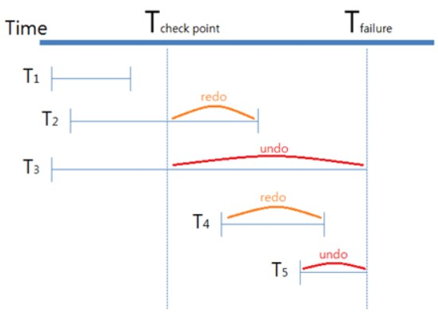

  - 트랜잭션 T1

    - check point 이전에 실행이 완료되었으므로 failure 되더라도 이미 disk에 저장이 된 상태이므로 회복을 하지 않습니다.

  - 트랜잭션 T2

    - check point 이전에 실행된 내용은 disk에 반영이 되었으므로 check point 이후의 내용을 log를 따라가는 redo를 수행합니다.

  - 트랜잭션 T3

    - failure 시점에 실행중이였으므로 check point 시점으로 undo한 후, 트랜잭션을 재실행합니다.

  - 트랜잭션 T4

    - check point 이후에 실행됐고 failure 시점 전에 실행이 끝났으므로 redo를 수행합니다.

  - 트랜잭션 T5

    - check point 이후에 실행됐고 failure 시점에 실행중이였으므로 시작지점까지 undo한 후, 트랜잭션을 재실행합니다.

  > failure 발생시 실행 중이던 트랜잭션은 undo, check point와 failure 사이에 작업이 완료 된 트랜잭션은 redo 한다.

### 트랜잭션을 사용할 때 주의할 점

트랜잭션은 꼭 필요한 최소의 코드에만 적용하는 것이 좋다. 즉 트랜잭션의 범위를 최소화하라는 의미다. 일반적으로 데이터베이스 커넥션은 개수가 제한적이다. 그런데 각 단위 프로그램이 커넥션을 소유하는 시간이 길어진다면 사용 가능한 여유 커넥션의 개수는 줄어들게 된다. 그러다 어느 순간에는 각 단위 프로그램에서 커넥션을 가져가기 위해 기다려야 하는 상황이 발생할 수도 있는 것이다.

## 교착상태 (Dead Lock)

#### 교착상태란 무엇인가

- 여러개의 트랜잭션들이 실행을 하지 못하고 무한정 기다리는 상태
- 두 개 이상의 트랜잭션이 특정 자원의 잠금을 획득한 채 다른 트랜잭션이 소유하고있는 잠금을 요구하면 발생

#### 해결방법

- 예방
  - 각 트랜잭션이 실행되기 전에 필요한 데이터를 모두 로킹 해주는것. 비효율적이다.
- 회피
  - 타임스탬프를 이용하여 교착상태를 회피하는것
    - Wait-Die방식 : 트랜잭션 Ti가 Tj에 의해 로킹된 데이터를 요청할 때 Ti가 먼저들어온 트랜잭션이면 기다린다. 나중에 들어온 트랜잭션이면 포기(Die)하고 나중에 다시 요청한다.
    - Wound-Wait방식 : 트랜잭션 Ti가 Tj에 의해 로킹된 데이터를 요청할 때 Ti가 먼저들어온 트랜잭션이면 데이터를 선점(Wound)한다. 나중에 들어왔다면 기다린다. 

교착상태의 탐지는 Union-Find를 이용한다. 

#### 교착 상태의 빈도를 낮추는 방법 ( 조금더 공부 필요 )

- 트랜잭션을 자주 커밋한다.
- 정해진 순서로 테이블에 접근한다. 트랜잭션들이 동일한 테이블 순으로 접근하게 한다.
- 읽기 잠금 획득 (SELECT ~ FOR UPDATE)의 사용을 피한다.
- 한 테이블의 복수 행을 복수의 연결에서 순서 없이 갱신하면 교착상태가 발생하기 쉽다, 이 경우에는 테이블 단위의 잠금을 획득해 갱신을 직렬화 하면 동시성을 떨어지지만 교착상태를 회피할 수 있다.

## Index

### 인덱스(Index)란 무엇인가?

인덱스란 원하는 데이터 레코드에 빠르게 접근하기 위해 키값, 포인터 쌍으로 저장하는 데이터 구조

### Index 생성시 특징

* 검색 속도 향상
* 인덱스를 위한 추가 공간 필요
* INSERT, UPDATE, DELETE 자주발생시 성능 하락

### Index 자료구조

<details>

* 그렇다면 DBMS 는 인덱스를 어떻게 관리하고 있는가

  

  #### B+-Tree 인덱스 알고리즘
  * 일반적으로 사용되는 인덱스 알고리즘은 B+-Tree 알고리즘이다. B+-Tree 인덱스는 칼럼의 값을 변형하지 않고(사실 값의 앞부분만 잘라서 관리한다.), 원래의 값을 이용해 인덱싱하는 알고리즘	이다.

  

  #### Hash 인덱스 알고리즘
  * 칼럼의 값으로 해시 값을 계산해서 인덱싱하는 알고리즘으로 매우 빠른 검색을 지원한다. 하지만 값을 변형해서 인덱싱하므로, 특정 문자로 시작하는 값으로 검색을 하는 전방 일치와 같이 값의 일부만으로 검색하고자 할 때는 해시 인덱스를 사용할 수 없다. 주로 메모리 기반의 데이터베이스에서 많이 사용한다.

  

  #### 왜 index 를 생성하는데 b-tree 를 사용하는가?

  * 데이터에 접근하는 시간복잡도가 O(1)인 hash table 이 더 효율적일 것 같은데? SELECT 질의의 조건에는 부등호(<>) 연산도 포함이 된다. hash table 을 사용하게 된다면 등호(=) 연산이 아닌 부등호 연산의 경우에 문제가 발생한다. 동등 연산(=)에 특화된 `hashtable`은 데이터베이스의 자료구조로 적합하지 않다.

  

  ### Primary Index vs Secondary Index
  * 클러스터(Cluster)란 여러 개를 하나로 묶는다는 의미로 주로 사용되는데, 클러스터드 인덱스도 크게 다르지 않다. 인덱스에서 클러스터드는 비슷한 것들을 묶어서 저장하는 형태로 구현되는데, 이는 주로 비슷한 값들을 동시에 조회하는 경우가 많다는 점에서 착안된 것이다. 여기서 비슷한 값들은 물리적으로 인접한 장소에 저장되어 있는 데이터들을 말한다.

  * 클러스터드 인덱스는 테이블의 프라이머리 키에 대해서만 적용되는 내용이다. 즉 프라이머리 키 값이 비슷한 레코드끼리 묶어서 저장하는 것을 클러스터드 인덱스라고 표현한다. 클러스터드 인덱스에서는 프라이머리 키 값에 의해 레코드의 저장 위치가 결정되며 프라이머리 키 값이 변경되면 그 레코드의 물리적인 저장 위치 또한 변경되어야 한다. 그렇기 때문에 프라이머리 키를 신중하게 결정하고 클러스터드 인덱스를 사용해야 한다.
  * 클러스터드 인덱스는 테이블 당 한 개만 생성할 수 있다. 프라이머리 키에 대해서만 적용되기 때문이다, 이에 반해 non 클러스터드 인덱스는 테이블 당 여러 개를 생성할 수 있다.

  

  ### Composite Index
  * 인덱스로 설정하는 필드의 속성이 중요하다. title, author 이 순서로 인덱스를 설정한다면 title 을 search 하는 경우, index 를 생성한 효과를 볼 수 있지만, author 만으로 search 하는 경우, index 를 생성한 것이 소용이 없어진다. 따라서 SELECT 질의를 어떻게 할 것인가가 인덱스를 어떻게 생성할 것인가에 대해 많은 영향을 끼치게 된다.

  

  ### Index 의 성능과 고려해야할 사항
  * SELECT 쿼리의 성능을 월등히 향상시키는 INDEX 항상 좋은 것일까? 쿼리문의 성능을 향상시킨다는데, 모든 컬럼에 INDEX 를 생성해두면 빨라지지 않을까? *결론부터 말하자면 그렇지 않다.* 우선, 첫번째 이유는 INDEX 를 생성하게 되면 INSERT, DELETE, UPDATE 쿼리문을 실행할 때 별도의 과정이 추가적으로 발생한다. INSERT 의 경우 INDEX 에 대한 데이터도 추가해야 하므로 그만큼 성능에 손실이 따른다. DELETE 의 경우 INDEX 에 존재하는 값은 삭제하지 않고 사용 안한다는 표시로 남게 된다. 즉 row 의 수는 그대로인 것이다. 이 작업이 반복되면 어떻게 될까?
  * 실제 데이터는 10 만건인데 데이터가 100 만건 있는 결과를 낳을 수도 있는 것이다. 이렇게 되면 인덱스는 더 이상 제 역할을 못하게 되는 것이다. UPDATE 의 경우는 INSERT 의 경우, DELETE 의 경우의 문제점을 동시에 수반한다. 이전 데이터가 삭제되고 그 자리에 새 데이터가 들어오는 개념이기 때문이다. 즉 변경 전 데이터는 삭제되지 않고 insert 로 인한 split 도 발생하게 된다.
  * 하지만 더 중요한 것은 컬럼을 이루고 있는 데이터의 형식에 따라서 인덱스의 성능이 악영향을 미칠 수 있다는 것이다. 즉, 데이터의 형식에 따라 인덱스를 만들면 효율적이고 만들면 비효율적은 데이터의 형식이 존재한다는 것이다. 어떤 경우에 그럴까?
  * `이름`, `나이`, `성별` 세 가지의 필드를 갖고 있는 테이블을 생각해보자. 이름은 온갖 경우의 수가 존재할 것이며 나이는 INT 타입을 갖을 것이고, 성별은 남, 녀 두 가지 경우에 대해서만 데이터가 존재할 것임을 쉽게 예측할 수 있다. 이 경우 어떤 컬럼에 대해서 인덱스를 생성하는 것이 효율적일까? 결론부터 말하자면 이름에 대해서만 인덱스를 생성하면 효율적이다.
  * 왜 성별이나 나이는 인덱스를 생성하면 비효율적일까? 10000 레코드에 해당하는 테이블에 대해서 2000 단위로 성별에 인덱스를 생성했다고 가정하자. 값의 range 가 적은 성별은 인덱스를 읽고 다시 한 번 디스크 I/O 가 발생하기 때문에 그 만큼 비효율적인 것이다.

</details>


## 정규화

### 정규화란

테이블의 각 속성이 서로 상호 관련성을 갖는 특징을 이용해 테이블을 무손실 분해하는 것을 말한다.

### 정규화는 어떤 배경에서 생겨났는가?

한 릴레이션에 여러 엔티티의 애트리뷰트들을 혼합하게 되면 정보가 중복 저장되며, 저장 공간을 낭비하게 된다. 또 중복된 정보로 인해 `갱신 이상`이 발생하게 된다. 동일한 정보를 한 릴레이션에는 변경하고, 나머지 릴레이션에서는 변경하지 않은 경우 어느 것이 정확한지 알 수 없게 되는 것이다. 이러한 문제를 해결하기 위해 정규화 과정을 거치는 것이다.

### 갱신이상의 종류

<details>

- 삽입 이상(insertion anomalies)

  - 데이터를 저장할 때 원하지 않는 정보가 함께 삽입되는 경우.
  - 신입생이 입학시, 학번과 학년을 입력하려 했으나, 과목과 성적이 없는 경우, 불필요한 정보를 함께 삽입해야함

- 삭제 이상(deletion anomalies)

  - 튜플을 삭제함으로써 유지되어야 하는 정보 까지도 연쇄적으로 삭제되는 경우. 
  - 학생번호가 2번인 학생의 과목성적을 삭제하는 경우 학생의 번호와 학년 등 모든 정보가 함께 사라져서 학생 정보 자체가 없어짐.

- 수정(갱신)이상(modification anomalies)

  - 중복된 튜플 중 일부의 속성만 갱신 시킴 으로써 정보의 모순성이 발생하는 경우.
  - 학생번호 3번이 2학년이 되어 학년 정보를 변경할때, 모든 과목에 대해 학년 정보를 변경하지 않는 경우 발생.

  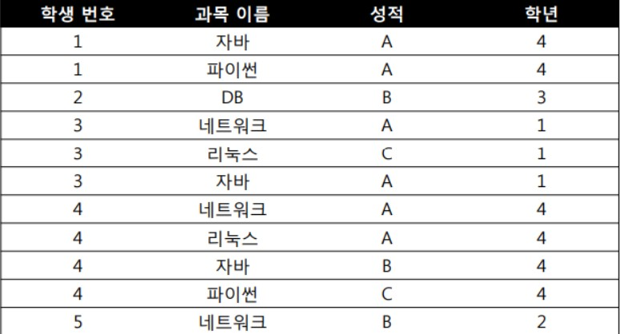

  

</details>

### 정규화란

* 관계형 데이터베이스에서 중복을 최소화하기 위해 데이터를 구조화하는 작업
* 정규화 과정을 거치게 되면 정규형을 만족하게 된다.
* 정규형이란 특정 조건을 만족하는 릴레이션의 스키마의 형태를 말하며 제 1 정규형, 제 2 정규형, 제 3 정규형, … 등이 존재한다.

### \'나쁜\' 릴레이션

* 엔티티를 구성하고 있는 애트리뷰트 간에 함수적 종속성(Functional Dependency)을 판단한다.
* 판단된 함수적 종속성은 좋은 릴레이션 설계의 정형적 기준으로 사용된다.
* 각각의 정규형마다 어떠한 함수적 종속성을 만족하는지에 따라 정규형이 정의되고, 그 정규형을 만족하지 못하는 정규형을 나쁜 릴레이션으로 파악한다.

> #### 함수적 종속성이란 무엇인가?
>
> 함수적 종속은 어떠한 릴레이션에서 속성들의 부분 집합을 X, Y라 할 때 특정 튜플에서 X의 값이 Y의 값을 함수적으로 결정 한다면 Y가 X에 함수적으로 종속 되었다고 합니다.
>
> 함수적 종속의 추론 규칙은 아래와 같습니다.
>
> - 재귀 규칙 : Y가 X의 부분 집합이면 X → Y 이다.
> - 증가 규칙 : X → Y 이면 WX → WY 이고 WX → Y 이다.
> - 이행 규칙 : X → Y 이고 Y → Z 이면 X → Z 이다.
> - 유니온 규칙 : X → Y 이고 X → Z 이면 X → YZ 이다.
> - 분해 규칙 : X → YZ 이면 X → Y와 X → Z 이다.
> - 가이행 규칙 : 만일 W → X 이고 XY → Z 이면 WY → Z 이다.

### 정규화 과정

* **제1 정규형**

  * 도메인은 모두 원자값(더이상 분해가 불가능한 값)이어야 한다.

    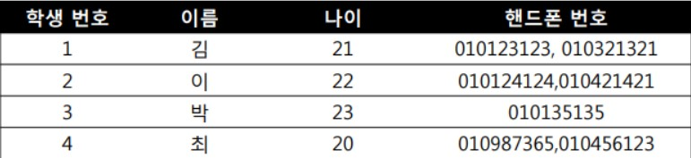

    핸드폰 번호에 2가지 정보가 들어있으므로 제1 정규형 만족 X

    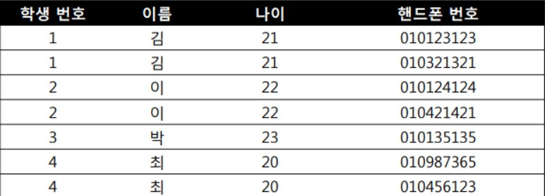

* **제2 정규형**

  * 모든 비주요 애트리뷰트들이 주요 애트리뷰트에 대해서 완전 함수적 종속이어야 한다.

    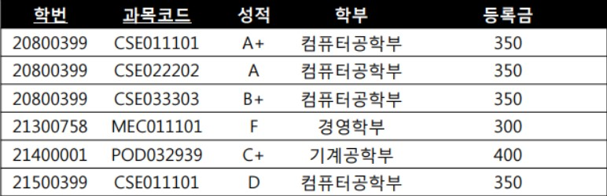

    학번은 학부와 등록금을 결정할 수 있고, 학번과 과목 코드는 성적을 결정할 수 있다.

    따라서 성적, 학부, 등록금에 모두 영향을 주는 학번을 기준으로 릴레이션을 분리한다.

    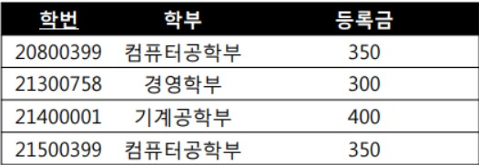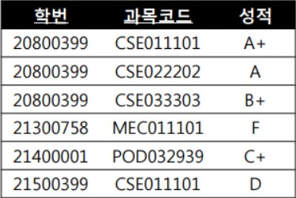

* **제3 정규형**

  * 어떠한 비주요 애트리뷰트도 기본키에 대해서 이행적으로 종속되지 않아야 한다.

  * 위의 상태에서 X → Y, Y → Z를 만족하므로, 릴레이션을 분리한다.

    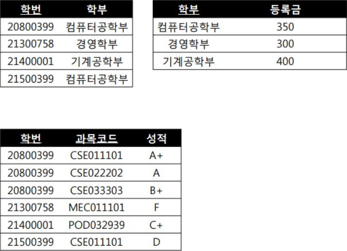

정규화 단계별 방식

- 제1정규형
  - 모든 도메인이 원자값을 가지도록 함
- 제2정규형
  - 부분 함수적 종속 제거
- 제3정규형
  - 이행적 함수적 종속 제거
- 제BCNF정규형
  - 결정자이면서 후보키가 아닌것 제거
- 제4정규형
  - 다치 종속 제거
- 제5정규형
  - 조인 종속성을 이용

### 정규화의 장단점

#### 장점

1. 데이터베이스 변경 시 이상 현상이 발생하는 문제점을 해결할 수 있다.
2. 데이터베이스 구조 확장 시 재 디자인 최소화 정규화된 데이터베이스 구조에서는 새로운 데이터 형의 추가로 인한 확장 시, 그 구조를 변경하지 않아도 되거나 일부만 변경해도 된다. 이는 데이터베이스와 연동된 응용 프로그램에 최소한의 영향만을 미치게 되며 응용프로그램의 생명을 연장시킨다.
3. 사용자에게 데이터 모델을 더욱 의미있게 제공 정규화된 테이블들과 정규화된 테이블들간의 관계들은 현실 세계에서의 개념들과 그들간의 관계들을 반영한다.

#### 단점

1. 릴레이션의 분해로 인해 릴레이션 간의 연산(JOIN 연산)이 많아진다. 
2. 이로 인해 질의에 대한 응답 시간이 느려질 수 있다. 

### 단점에서 도출가능한 대응책

<details>
    조희를 하는 SQL 문장에서 조인이 많이 발생하여 이로 인한 성능저하가 나타나는 경우에 반정규화를 적용하는 전략이 필요하다.
**반정규화(De-normalization, 비정규화)**

반정규화는 정규화된 엔티티, 속성, 관계를 시스템의 성능 향상 및 개발과 운영의 단순화를 위해 중복 통합, 분리 등을 수행하는 데이터 모델링 기법 중 하나이다. 디스크 I/O 량이 많아서 조회 시 성능이 저하되거나, 테이블끼리의 경로가 너무 멀어 조인으로 인한 성능 저하가 예상되거나, 칼럼을 계산하여 조회할 때 성능이 저하될 것이 예상되는 경우 반정규화를 수행하게 된다. 일반적으로 조회에 대한 처리 성능이 중요하다고 판단될 때 부분적으로 반정규화를 고려하게 된다.

**무엇이 반정규화의 대상이 되는가?**
자주 사용되는 테이블에 액세스하는 프로세스의 수가 가장 많고, 항상 일정한 범위만을 조회하는 경우
테이블에 대량 데이터가 있고 대량의 범위를 자주 처리하는 경우, 성능 상 이슈가 있을 경우
테이블에 지나치게 조인을 많이 사용하게 되어 데이터를 조회하는 것이 기술적으로 어려울 경우
**반정규화 과정에서 주의할 점**
반정규화를 과도하게 적용하다 보면 데이터의 무결성이 깨질 수 있다. 또한 입력, 수정, 삭제의 질의문에 대한 응답 시간이 늦어질 수 있다.

**반정규화 방법**

- 테이블 통합
- 테이블 분할
- 중복 테이블 추가
- 중복 속성 추가

</details>


## 기출문제

## Statement vs PreparedStatement  (공부 필요)

우선 속도 면에서 `PreparedStatement`가 빠르다고 알려져 있다. 이유는 쿼리를 수행하기 전에 이미 쿼리가 컴파일 되어 있으며, 반복 수행의 경우 프리 컴파일된 쿼리를 통해 수행이 이루어지기 때문이다.

`PreparedStatement`에는 보통 변수를 설정하고 바인딩하는 `static sql`이 사용되고 `Statement`에서는 쿼리 자체에 조건이 들어가는 `dynamic sql`이 사용된다. `PreparedStatement`가 파싱 타임을 줄여주는 것은 분명하지만 `static sql`을 사용하는데 따르는 퍼포먼스 저하를 고려하지 않을 수 없다.

하지만 성능을 고려할 때 시간 부분에서 가장 큰 비중을 차지하는 것은 테이블에서 레코드(row)를 가져오는 과정이고 SQL 문을 파싱하는 시간은 이 시간의 10 분의 1 에 불과하다. 그렇기 때문에 `SQL Injection` 등의 문제를 보완해주는 `PreparedStatement`를 사용하는 것이 옳다.

### 데이터 베이스의  성능

* 데이터베이스의 성능 이슈는 디스크I/O를 어떻게 줄이느냐에서 시작된다. 디스크 I/O란 디스크 드라이브의 플래터(원판)를 돌려서 읽어야 할 데이터가 저장된 위치로 디스크 헤더를 이동시킨 다음 데이터를 읽는 것을 의미한다. 이 때 데이터를 읽는데 걸리는 시간은 디스크 헤더를 움직여서 읽고 쓸 위치로 옮기는 단계에서 경정된다. 즉, 디스크의 성능은 디스크 헤더의 위치 이동 없이 얼마나 많은 데이터를 한 번에 기록하느냐에 따라 결정된다고 볼 수 있다.
* 따라서 순차 I/O가 랜덤I/O보다 빠를 수 밖에 없다. 하지만 현실에서는 대부분의 I/O작업이 랜덤 I/O 이다. ''랜덤 I/O를 순차 I/O로 바꿔서 실행할 수는 없을까? '' 라는 생각에서 시작되는 데이터베이스 쿼리 튜닝은 랜덤 I/O 자체를 줄여주는 것이 목적이라고 할 수 있다.
