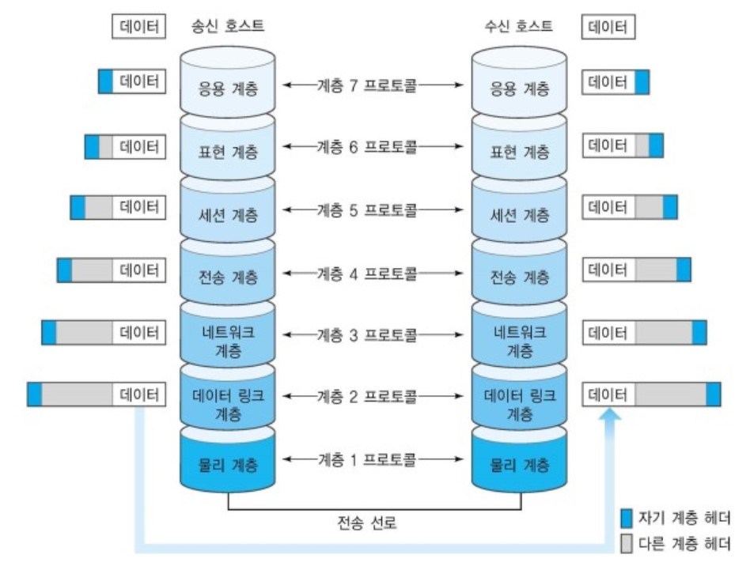

# Network

* 몇 개의 독립적인 장치가 적절한 영역내에서 적당히 빠른 속도의 물리적 통신 채널을 통하여 서로가 직접 통신할 수 있도록 지원해 주는 데이타 통신 체계
* 어떤 연결을 통해 컴퓨터의 자원을 공유하는 것

## OSI 7계층

* 통신 접속에서 완료까지의 과정을 7단계로 정의한 국제 통신 표준 규약
* 데이터를 전송할 때 각 층마다 별도로 인식할 수 있는 헤더를 각각 붙이게 되는데, 이 과정을 캡슐화 라고 한다.

* Layer 1. **물리계층**
  * Data를 전기신호로 바꿔주는 역할을 한다.
  * 케이블 종류, 무선 주파수, 핀 배치, 전압, 물리 요건등이 포함된다.
  * 전송하는데 필요한 기능을 제공 ( 통신 케이블, 허브 )
  * 장비 : Hub, Repeater, Cable
  * 프로토콜 : RS-232, X.25 / X.21
  * 전송단위 : Bits

* Layer 2. **데이터링크계층** 
  * 물리적인 네트워크 사이에 Data 전송을 담당하는 계층
  * 에러 검충, 흐름 제어 등을 다룬다.
  * Data 전송시 에러가 발생하면 데이터링크층에서 검출하고, 전송계층에서 그 에러를 수정한다.
  * 두 가지 SubLayer로 나뉜다.
    * MAC(Media Access Control)
      * MAC 주소를 이용해서 Data를 해당 장비로 보냄
    * LLC(Logical Link Control)
      * 각 장비를 논리적으로 연결하고 유지하는 역할을 한다.
  * 장비 : Bridge, Switch
  * 프로토콜 : Ethernet, HDLC, PPP, Frame-Relay, FDDI, ATM
  * 전송단위 : Frame

* Layer 3. **네트워크계층** 
  * 주소(IP)를 정하고, 경로(Route)를 선택하고, 패킷을 전달하는 계층 ( 라우팅 )
  * 네트워크 라우팅 기능이 이루어진다.
  * 에러가 나면 상위 계층에서 해결해 주기 때문에 에러가 생기든 말든 일단 보내는 것에 중점을 둔다.
  * 장비 : Router, Multilayer Switch
  * 프로토콜 : IP, IPX, ICMP, ARP, IGMP
  * 전송단위 : Packet

* Layer 4. **전송계층** 
  * 두 host 시스템으로부터 발생하는 데이터 흐름 제공.
  * 보낼 데이터의 용량과 전송속도, 목적지, 에러 등을 처리한다.
  * 프로토콜 : TCP, UDP
  * 전송단위 : Secment

* Layer 5. **세션계층**
  * 통신 시스템 사용자간의 연결을 유지 및 설정한다.
  * 세션을 만들고 유지하며, 세션 종료, 전송 중단시 복구 기능이있다.
  * TCP/IP 세션을 만들고 없앤다.
  * OS(Operating System) 이 세션계층에 속함
  * 프로토콜 : NetBIOS, RPC, WinSock
  * 전송단위 : Data

* Layer 6. **표현계층**
  * 응용계층과 세션계층 사이에서 주고받는 data의 Format을 정의한다.
  * 전달, 전송하는 데이터의 인코딩 및 디코딩이 이루어진다.
  * MIME 인코딩, 암호화 동작
  * JPEG, TIFF, GIF, MPEG 등 다양한 포멧 구분
  * 프로토콜 : SSL, ASCII
  * 전송단위 : Data

* Layer 7. **응용계층**
  * 사용자 또는 어플리케이션이 네트워크에 접근할 수 있도록 서비스 제공
  * 메일 전송, 인터넷 접속 등 작업을 수행
  * 프로토콜 : 웹 브라우저, HTTP, FTP, WWW, Telnet, SMTP, POP 등의 사용자와 직접적으로 상호작용 하는 모든 **응용 프로그램**들이 속한다.
  * 전송단위 : Data

## TCP/IP 프로토콜 4계층

* **Layer 1. 네트워크 엑세스 계층 **
  * OSI 7계층의 물리계층, 데이터 링크 계층에 해당
  *  OS의 네트워크 카드와 디바이스 드라이버 등과 같이 하드웨어적인 요소와 관련되 는 모든 것을 지원하는 계층
  * 송신측 컴퓨터의 경우 상위 계층으로부터 전달받은 패킷에 물리적인 주소인 MAC 주소 정보를 가지고 있는 헤더를 추가하여 프레임을 만들고, 프레임을 하위계층인 물리 계층으로 전달한다.
  * 수신측 컴퓨터의 경우 데이터 링크 계층에서 추가된 헤더를 제거하여 상위 계층인 네트워크 계층으로 전달한다
  * CSMA/CD, MAC, LAN, X25, 패킷망, 위성 통신, 다이얼 모뎀 등 **전송에 사용**
  * 프로토콜 : Ehternet(이더넷), Token Ring, PPP
* **Layer 2. 인터넷 계층**
  * OSI 7계층의 네트워크 계층에 해당
  * 통신 노드 간의 IP패킷을 전송하는 기능과 라우팅 기능을 담당
  * 프로토콜 : IP, ICMP, ARP, RARP, OSPF, BGP 등등
* **Layer 3. TCP/UDP 전송 계층**
  * OSI 7계층중 전송계층에 해당한다.
  * 통신 노드 간의 연결을 제어하고, 신뢰성 있는 데이터를 전송
  * 프로토콜 : TCP, UDP
* **Layer 4. 애플리케이션 계층**
  * OSI 7 Layer에서 세션계층 , 프레젠테이션계층, 애플리케이션 계층에 해당한다. (5, 6, 7계층)
  * 응용프로그램들이 네트워크서비스, 메일서비스, 웹서비스 등을 할 수 있도록 표준적인 인터페이스를 제공한다.
  * TCP/IP 기반의 **응용 프로그램**을 구분할 때 사용한다.
  * 프로토콜 : HTTP, FTP, Telnet, DNS, SMTP

## HTTP와 HTTPS

## HTTP

#### **정의**

* Hyper Text Transfer Protocol
* 인터넷에서 데이터( ex) HTML문서  )를 주고받을 수 있는 프로토콜[1](#footnote_1), 모든 데이터 교환의 기초
* 클라이언트-서버 프로토콜[2](#footnote_2)이기도 하다.

### 문제점

`다른 암호화하지 않은 프로토콜들의 공통적인 문제점`

### TCP/IP는 도청 가능한 네트워크이다.

* TCP/IP 구조의 통신은 전부 통신 경로 상에서 엿볼 수 있다. 패킷을 수집하는 것만으로 도청할 수 있다. 평문으로 통신을 할 경우 메시지의 의미를 파악할 수 있기 때문에 **암호화**하여 통신해야 한다.

* #### 보안 방법

  1. 통신 자체를 암호화 `SSL(Secure Socket Layer)` or `TLS(Transport Layer Security)`라는 다른 프로토콜을 조합함으로써 HTTP 의 통신 내용을 암호화할 수 있다. SSL 을 조합한 HTTP 를 `HTTPS(HTTP Secure)` or `HTTP over SSL`이라고 부른다.
  2. 콘텐츠를 암호화 말 그대로 HTTP 를 사용해서 운반하는 내용인, HTTP 메시지에 포함되는 콘텐츠만 암호화하는 것이다. 암호화해서 전송하면 받은 측에서는 그 암호를 해독하여 출력하는 처리가 필요하다.

### 통신 상대를 확인하지 않기 때문에 위장이 가능하다.

* HTTP 에 의한 통신에는 상대가 누구인지 확인하는 처리는 없기 때문에 누구든지 리퀘스트를 보낼 수 있다. IP 주소나 포트 등에서 그 웹 서버에 액세스 제한이 없는 경우 리퀘스트가 오면 상대가 누구든지 무언가의 리스폰스를 반환한다. 이러한 특징은 여러 문제점을 유발한다.

* 문제점

  1. 리퀘스트를 보낸 곳의 웹 서버가 원래 의도한 리스폰스를 보내야 하는 웹 서버인지를 확인할 수 없다.

  2. 리스폰스를 반환한 곳의 클라이언트가 원래 의도한 리퀘스트를 보낸 클라이언트인지를 확인할 수 없다.

  3. 통신하고 있는 상대가 접근이 허가된 상대인지를 확인할 수 없다.

  4. 어디에서 누가 리퀘스트 했는지 확인할 수 없다.

  5. 의미없는 리퀘스트도 수신한다. —> DoS 공격을 방지할 수 없다.

#### 보완 방법

* 위 암호화 방법으로 언급된 `SSL`로 상대를 확인할 수 있다. SSL 은 상대를 확인하는 수단으로 **증명서** 를 제공하고 있다. 증명서는 신뢰할 수 있는 **제 3 자 기관에 의해** 발행되는 것이기 때문에 서버나 클라이언트가 실재하는 사실을 증명한다. 이 증명서를 이용함으로써 통신 상대가 내가 통신하고자 하는 서버임을 나타내고 이용자는 개인 정보 누설 등의 위험성이 줄어들게 된다. 한 가지 이점을 더 꼽자면 클라이언트는 이 증명서로 본인 확인을 하고 웹 사이트 인증에서도 이용할 수 있다.

### 완전성을 증명할 수 없기 때문에 변조가 가능하다

여기서 완전성이란 **정보의 정확성** 을 의미한다. 서버 또는 클라이언트에서 수신한 내용이 송신측에서 보낸 내용과 일치한다라는 것을 보장할 수 없는 것이다. 리퀘스트나 리스폰스가 발신된 후에 상대가 수신하는 사이에 누군가에 의해 변조되더라도 이 사실을 알 수 없다. 이와 같이 공격자가 도중에 리퀘스트나 리스폰스를 빼앗아 변조하는 공격을 중간자 공격(Man-in-the-Middle)이라고 부른다.

#### 보완 방법

`MD5`, `SHA-1` 등의 해시 값을 확인하는 방법과 파일의 디지털 서명을 확인하는 방법이 존재하지만 확실히 확인할 수 있는 것은 아니다. 확실히 방지하기에는 `HTTPS`를 사용해야 한다. SSL 에는 인증이나 암호화, 그리고 [다이제스트](https://ideveloper2.dev/blog/2019-11-23--%EA%B8%B0%EB%B3%B8-%EC%9D%B8%EC%A6%9D-%EB%8B%A4%EC%9D%B4%EC%A0%9C%EC%8A%A4%ED%8A%B8-%EC%9D%B8%EC%A6%9D/) 기능을 제공하고 있다.

## HTTPS

> HTTP 에 암호화와 인증, 완전성보호를 더함

* `HTTPS`는 SSL의 껍질을 덮어쓴 HTTP 이다( 새로운 프로토콜이 아님 ). HTTP 통신하는 소켓 부분을 SSL or TLS라는 프로토콜로 대체하는 것 뿐이다.

* HTTP 는 원래 TCP 와 직접 통신했지만, HTTPS 에서 HTTP 는 SSL 과 통신하고 **SSL 이 TCP 와 통신** 하게 된다. SSL 을 사용한 HTTPS 는 암호화와 증명서, 안전성 보호를 이용할 수 있게 된다.

* HTTPS 의 SSL 에서는 공통키 암호화 방식과 공개키 암호화 방식을 혼합한 하이브리드 암호 시스템을 사용한다. 공통키를 공개키 암호화 방식으로 교환한 다음에 다음부터의 통신은 공통키 암호를 사용하는 방식이다.

* #### 모든 웹 페이지에서 HTTPS 를 사용하지 않는 이유

  * 평문 통신에 비해서 암호화 통신은 CPU 나 메모리 등 리소스가 많이 필요하다. 통신할 때마다 암호화를 하면 많은 리소스를 소비하기 때문에 서버 한 대당 처리할 수 있는 리퀘스트의 수가 줄어들게 된다. 그렇기 때문에 민감한 정보를 다룰 때만 HTTPS 에 의한 암호화 통신을 사용한다.

* 추가

  *  [HTTPS 가 HTTP 보다 빠르다.](https://tech.ssut.me/https-is-faster-than-http/)

## HTTP의 GET, POST

둘 다 HTTP 프로토콜을 이용해서 서버에 무엇인가를 요청할 때 사용하는 방식이다. 하지만 둘의 특징을 제대로 이해하여 기술의 목적에 맞게 알맞은 용도에 사용해야한다.

### GET

* **서버로부터 정보를 조회하기 위해** 설계된 메소드
* 요청하는 데이터가 `HTTP Request Message` 의 Header 부분의 url에 담겨서 전송된다.
* url[2](#footnote_2)상의 `?`뒤에 데이터가 붙어 request를 보내게 된다. ( 쿼리스트링 )
* 요청 파라미터가 여러개이면 &로 연결한다.
* url 이라는 공간에 담겨가기 때문에 전송할 수 있는 데이터의 크기가 제한적이다.
* 데이터가 url에 노출되므로 password와 같은 보안이 필요한 데이터에는 적절하지 않다.
* ex) http://www.example-url.com/resources?name1=value1&name2=value2 ( 요청 파라미터 : name1, name2, 파라미터값 : value1, value2)
* **추가**
  * js, css, 이미지 같은 정적 컨텐츠는 데이터양이 크고, 변경될 일이 적어서 반복해서 동일한 요청을 보낼 필요가없다.
  * 때문에, 브라우저에서 요청을 캐시해두고, 동일한 요청이 발생할 때 서버로 요청을 보내지 않고 캐시된 데이터를 사용한다. => 프론트엔드 개발시 컨텐츠를 변경해도 내용이 바뀌지 않는 경우가 발생 => 브라우저의 캐시를 지워주면 서버로 요청을 보냄
  * 즉 POST방식으로 요청해야 할 것을 데이터의 크기가 작고 보안적인 이슈가 없다는 이유로 GET방식으로 요청하면 caching 되었던 데이터가 응답될 가능성이 존재한다.

### POST

* **리소스를 생성/변경하기 위해** 설계된 메소드
* GET과는 다르게 `HTTP Message의 Body`부분에 데이터가 담겨서 전송된다.
* `HTTP Message의 Body` 는 길이의 제한이 없기 때문에 대용량 데이터 전송 가능.
* 개발자 도구등을 이용하면 요청내용을 확인 할 수 있기 때문에 암호화가 실질적으로 필요함.
* 요청을 보낼 때 요청 헤더의 Content-Type에 요청 데이터의 타입을 표시해야 한다. 표시하지 않으면 서버가 타입을 유추하게 되고, 알 수 없는 경우 `application/octet-stream` 으로 요청을 처리한다.

### 결론

* GET은 Idempotnet[3](#footnote_3), POST는 Non-Idempotent하게 설계되었다.
* 즉, GET은 서버에게 동일한 요청을 여러 번 전송하더라도 동일한 응답이 돌아와야 한다. => 서버의 데이터나 상태를 변경시키지 않아야 한다. **때문에 주로 조회를 할 때 사용해야 한다.**
* POST는 서버에 동일한 요청을 여러 번 전송해도 응답은 항상 다를 수 있다. => 서버의 상태나 데이터를 변경시킬 때 사용된다. 

## TCP

* `Transmission Control Protocol(전송제어 프로토콜)`의 약자이며 대부분의 인터넷 응용 분야들은 신뢰성과 순차적인 전달을 필요로 한다. UDP로는 이를 만족시킬 수 없어 탄생했다.

* 

      
특징

  * 인터넷 상에서 데이터를 메세지의 형태( **세그먼트** 라는 블록 단위)로 보내기 위해 IP와 함께 사용하는 프로토콜

    * TCP와 IP를 함께 사용하는데, IP가 데이터의 배달을 처리한다면 TCP는 패킷[4](#footnote_4)을 추적 및 관리한다.

      

          
TCP의 패킷 추적 방식

      데이터는 패킷단위로 나누어 같은 목적지(IP계층)으로 전송된다고 설명하였습니다. 예를 들어 한줄로 서야하는 A,B,C라는 사람(패킷)들이 서울(발신지)에서 출발하여 부산(수신지)으로 간다고 합시다. 그런데 A,B,C가 순차적으로 가는 상황에서 B가 길을 잘못 들어서 분실되었다고 합시다. 하지만 목적지에서는 A,B,C가 모두 필요한지 모르고 A,C만 보고 다 왔다고 착각할 수 있습니다. 그렇기 때문에 A,,B,C라는 패킷에 1,2,3이라는 번호를 부여하여 패킷의 분실 확인과 같은 처리를 하여 목적지에서 재조립을 합니다. 이런 방식으로 TCP는 패킷을 추적하며, 나누어 보내진 데이터를 받고 조립을 할 수 있습니다.

      

  * **연결형 서비스**[5](#footnote_5)로 가상 회선 방식을 제공한다.

    

        
가상회선방식

    

    * 데이터를 전송하기 전 논리적 연결이 설정된다. (가상회선) 패킷 전송 후 해지.
    * 경로를 설정할때 한번만 수행하므로, 경로상 한 노드가 다운되면 그 가상회선을 잃게 된다.
    * 모든 패킷은 전송된 순서대로 도착한다.

    

  * 3-way handshaking과정을 통해 연결을 설정하고, 4-way handshaking을 통해 연결을 해제한다

  * 흐름제어 및 혼잡제어를 제공한다.

    * 흐름제어

      * 데이터를 송신하는 곳과 수신하는 곳의 데이터 처리 속도를 조절하여 수신자의 버퍼 오버플로우를 방지하는 것
      * 송신하는 곳에서 감당이 안되게 많은 데이터를 바르겍 보내 수신하는 곳에서 문제가 일어나는 것을 막는다.

    * 혼잡제어

      * 네트워크 내의 패킷 수가 넘치게 증가하지 않도록 방지하는 것

      * 정보의 소통량이 과다하면 패킷을 조금만 전송하여 혼잡 붕괴 현상이 일어나는 것을 막는다.

  * 높은 신뢰성을 보장한다.

  * UDP보다 속도가 느리다.

  * 멀티캐스트 불가능

  * 전이중(Full-Duplex), 점대점(Point to Point) 방식이다.

    * 전이중
      * 전송이 양방향으로 동시에 일어날 수 있다.
    * 점대점
      * 각 연결이 정확히 2개의 종단점(소켓)을 가지고 있다.

  * 연속성보다 신뢰성있는 전송이 중요할 때에 사용된다.

    * ex) 파일 전송

  * 위와 같은 기능들은 CPU를 사용하기 떄문에 속도가 UDP보다 느리게 된다.

</detail>

### 3-way handshake

* TCP 통신을 이용하여 데이터를 전송하기 위해 네트워크 연결을 설정 하는 과정

  * 양쪽 모두 데이터를 전송할 준비가 되었다는 것을 보장하고, 실제로 데이터 전달이 시작하기 전에 한 쪽이 다른 쪽이 준비되었다는 것을 알 수 있도록 한다.

* 즉, TCP/IP 프로토콜을 이용해서 통신을 하는 응용 프로그램이 뎅터를 전송하기 전에 정확한 전송을 보장하기 위해 상대방 컴퓨터와 사전에 세션을 수립하는 과정을 의미한다.

* A 프로세스(Client)가 B 프로세스( Server )에 연결을 요청하는 과정

  

  1. A -> B: SYN
     * 접속 요청 프로세스 A가 연결 요청 메세지 전송(SYN)
     * 송신자가 최초로 데이터를 전송할 때 Sequence Number를 임의의 랜덤 숫자로 지정하고, SYN 플래그 비트를 1로 설정한 세그먼트를 전송한다.
     * PORT 상태 - B : LISTEN, A : CLOSED
  2. B -> A : SYN + ACK
     * 접속요청을 받은 프로세스 B가 요청을 수락했으며, 접속 요청 프로세스인 A도 포트를 열어 달라는 메세지 전송( SYN + ACK)
     * 수신자는 Acknowledgement Number 필드를 (Sequence Number + 1)로 지정하고, SYN과 ACK 플래그 비트를 1로 설정한 세그먼트를 전송한다.
     * PORT 상태 - B: SYN_RCV, A: CLOSED
  3. A -> B: ACK
     * PORT 상태 - B: SYN_RCV, A: ESTABLISHED
     * 마지막으로 접속 요청 프로세스 A가 수락 확인을 보내 연결을 맺음 (ACK)
     * 이때, 전송할 데이터가 있으면 이 단계에서 데이터를 전송할 수 있다.
     * PORT 상태 - B: ESTABLISHED, A: ESTABLISHED

### 4-way handshake

* TCP의 연결을 해제 하는 과정

* A 프로세스(Client)가 B 프로세스(Server)에 연결 해제를 요청하는 과정

  

  1. A -> B : FIN

     * 프로세스 A가 연결을 종료하겠다는 FIN 플래그를 전송

     * 프로세스 B가 FIN 플래그로 응답하기 전까지 연결을 계속 유지

  2. B -> A : ACK

     * 프로세스 B는 일단 확인 메시지를 보내고 자신의 통신이 끝날 때까지 기다린다. (이 상태가 TIME_WAIT 상태)
     * 수신자(B)는 Acknowledgement Number 필드를 (Sequence Number + 1)로 지정하고,  ACK 플래그 비트를 1로 설정한 세그먼트를 전송한다.
     * 그리고 자신이 전송할 데이터가 남아있다면 이어서 계속 전송한다.

  3. B -> A : FIN

     * 프로세스 B가 통신이 끝났으면 연결 종료 요청에 합의한다는 의미로 프로세스 A에게 FIN 플래그를 전송

  4. A -> B : ACK

     * 프로세스 A는 확인했다는 메세지를 전송하고 CLOSED
     * B는 ACK가 들어오면 CLOSED

### 참고

    
TCP Header 안의 플래그 정보

* TCP Header에는 CONTROL BIT(플래그 비트, 6bit)가 존재하며, 각각의 bit는 “URG-ACK-PSH-RST-SYN-FIN”의 의미를 가진다.
  * 즉, 해당 위치의 bit가 1이면 해당 패킷이 어떠한 내용을 담고 있는 패킷인지를 나타낸다.
* SYN(Synchronize Sequence Number)
  * 연결 설정 / 000010
  * Sequence Number를 랜덤으로 설정하여 세션을 연결하는 데 사용하며, 초기에 Sequence Number를 전송한다.
* ACK(Acknowledgement)
  * 응답 확인 / 010000
  * 패킷을 받았다는 것을 의미한다.
  * Acknowledgement Number 필드가 유효한지를 나타낸다.
  * 양단 프로세스가 쉬지 않고 데이터를 전송한다고 가정하면 최초 연결 설정 과정에서 전송되는 첫 번째 세그먼트를 제외한 모든 세그먼트의 ACK 비트는 1로 지정된다고 생각할 수 있다.
* FIN(Finish)
  * 연결 해제 / 000001
  * 세션 연결을 종료시킬 때 사용되며, 더 이상 전송할 데이터가 없음을 의미한다.

## UDP

* `User Datagram Protocol(사용자 데이터그램 프로토콜)`의 약자이며, 비연결형 프로토콜 이다.

  

      
데이터그램 패킷 교환 방식

  

  * 논리적 연결이 설정되지 않고 각각의 패킷이 독립적으로 전송된다. (데이터그램)
  * 패킷을 수신한 각 라우터는 최적의 경로를 선택하여 패킷을 전달한다. 때문에 한 노드가 다운 되더라도 다른 노드를 통해 전달이 가능하다.
  * 하나의 메세지에서 분할된 각 패킷은 서로 다른 경로로 전송되기 때문에 수신 측에 순서대로 도착하지 않을 수 있다.

  

* 빠른 요청과 응답 및 멀티 캐스팅이 가능 => 실시간 통신 또는 응용계층 프로그램에 적합하다.

* 전송 속도에 특별한 제한이 없으며 1:n의 여러 다수 지점에 동시 전송이 가능하다. (멀티캐스팅)

* 헤더의 크기가 20바이트인 TCP에 비해 8바이트 고정크기이므로 헤더의 처리에 적은 리소스가 필요하다.

* 데이터 전송 단뒤 : 메세지

* 사용예

  * DNS ( 도메인 이름 서비스 )
  * IPTV
  * 음성 인터넷 프로토콜(VoIP)
  * 비디오 스트리밍
  * 온라인게임

## TCP vs UDP

## DNS round robin 방식

**원리**

* 웹 서버의 경우, 웹 서비스를 담당할 여러 대의 웹 서버는 자신의 공인 IP를 각각 가지고 있다. 접속을 원하는 사용자가 도메인 주소를 브라우저에 입력하면, DNS는 도메인의 정보를 조회하는데, 이때 IP주소를 여러 대의 서버 IP 리스트 중에서 라운드 로빈 형태로 랜덤하게 하나 or 여러개를 선택하여 다시 사용자에게 알려준다.
* 웹 사이트에 접속하는 다수의 사용자는 실제로는 복수의 웹 서버에 나뉘어 접속하게 되면서 자연스럽게 서버의 부하가 분산된다.

### DNS Round Robin 방식의 문제점

1. 서버의 수 만큼 공인 IP 주소가 필요함 부하 분산을 위해 서버의 대수를 늘리기 위해서는 그 만큼의 공인 IP 가 필요하다.
2. 균등하게 분산되지 않음. 모바일 사이트 등에서 문제가 될 수 있는데, 스마트폰의 접속은 캐리어 게이트웨이 라고 하는 프록시 서버를 경유 한다. 프록시 서버에서는 이름변환 결과가 일정 시간 동안 캐싱되므로 같은 프록시 서버를 경유 하는 접속은 항상 같은 서버로 접속된다. 또한 PC 용 웹 브라우저도 DNS 질의 결과를 캐싱하기 때문에 균등하게 부하분산 되지 않는다. DNS 레코드의 TTL 값을 짧게 설정함으로써 어느 정도 해소가 되지만, TTL 에 따라 캐시를 해제하는 것은 아니므로 반드시 주의가 필요하다.
3. 서버가 다운되도 확인 불가 DNS 서버는 웹 서버의 부하나 접속 수 등의 상황에 따라 질의결과를 제어할 수 없다. 웹 서버의 부하가 높아서 응답이 느려지거나 접속수가 꽉 차서 접속을 처리할 수 없는 상황인 지를 전혀 감지할 수가 없기 때문에 어떤 원인으로 다운되더라도 이를 검출하지 못하고 유저들에게 제공한다. 이때문에 유저들은 간혹 다운된 서버로 연결이 되기도 한다. DNS 라운드 로빈은 어디까지나 부하분산 을 위한 방법이지 다중화 방법은 아니므로 다른 S/W 와 조합해서 관리할 필요가 있다.

### Round Robin 방식을 기반으로 단점을 해소하는 DNS 스케줄링 알고리즘의 예

#### Weighted round robin (WRR)

* 각각의 웹 서버에 가중치를 가미해서 분산 비율을 변경한다. 물론 가중치가 큰 서버일수록 빈번하게 선택되므로 처리능력이 높은 서버는 가중치를 높게 설정하는 것이 좋다

#### Least connection

* 접속 클라이언트 수가 가장 적은 서버를 선택한다. 로드밸런서에서 실시간으로 connection 수를 관리하거나 각 서버에서 주기적으로 알려주는 것이 필요하다.

## 자주 나오는 질문

#### OSI 7계층을 설명하시오

#### UDP란?

TCP의 대안으로, IP와 같이 쓰일 땐 UDP/IP라고도 부름

TCP와 마찬가지로, 실제 데이터 단위를 받기 위해 IP를 사용함. 그러나 TCP와는 달리 메시지를 패킷으로 나누고, 반대편에서 재조립하는 등의 서비스를 제공하지 않음 즉, 여러 컴퓨터를 거치지 않고 데이터를 주고 받을 컴퓨터끼리 직접 연결할 때 UDP를 사용한다.

UDP를 사용해 목적지(IP)로 메시지를 보낼 수 있으며, 컴퓨터를 거쳐 목적지까지 도달할 수도 있음 (도착하지 않을 가능성도 존재함)

정보를 받는 컴퓨터는 포트를 열어두고, 패킷이 올 때까지 기다리며 데이터가 오면 모두 다 받아들인다. 패킷이 도착했을 때 출발지에 대한 정보(IP와 PORT)를 알 수 있음

UDP는 이런 특성 때문에 비신뢰적이고, 안정적이지 않은 프로토콜임. 하지만 TCP보다 속도가 매우 빠르고 편해서 데이터 유실이 일어나도 큰 상관이 없는 스트리밍이나 화면 전송에 사용됨

#### HTTP와 HTTPS의 차이는?

HTTP 동작 순서 : TCP → HTTP

HTTPS 동작 순서 : TCP → SSL → HTTP

SSL(Secure Socket Layer)을 쓰냐 안쓰냐의 차이다. SSL 프로토콜은 정보를 암호화시키고 이때 공개키와 개인키 두가지를 이용한다.

HTTPS는 인터넷 상에서 정보를 암호화하기 위해 SSL 프로토콜을 이용해 데이터를 전송하고 있다는 것을 말한다. 즉, 문서 전송시 암호화 처리 유무에 따라 HTTP와 HTTPS로 나누어지는 것

모든 사이트가 HTTPS로 하지 않는 이유는, 암호화 과정으로 인한 속도 저하가 발생하기 때문이다.

#### GET과 POST의 차이는?

둘다 HTTP 프로토콜을 이용해 서버에 무언가 요청할 때 사용하는 방식이다.

GET 방식은, URL을 통해 모든 파라미터를 전달하기 때문에 주소창에 전달 값이 노출됨. URL 길이가 제한이 있기 때문에 전송 데이터 양이 한정되어 있고, 형식에 맞지 않으면 인코딩해서 전달해야 함

POST 방식은 HTTP BODY에 데이터를 포함해서 전달함. 웹 브라우저 사용자의 눈에는 직접적으로 파라미터가 노출되지 않고 길이 제한도 없음.

보통 GET은 가져올 때, POST는 수행하는 역할에 활용한다.

GET은 SELECT 성향이 있어서 서버에서 어떤 데이터를 가져와서 보여주는 용도로 활용

POST는 서버의 값이나 상태를 바꾸기 위해 활용

#### [#](https://gyoogle.dev/blog/interview/네트워크.html#iocp를-설명하시오)IOCP를 설명하시오

IOCP는 어떤 I/O 핸들에 대해, 블록 되지 않게 비동기 작업을 하면서 프로그램 대기시간을 줄이는 목적으로 사용된다.

동기화 Object 세마포어의 특성과, 큐를 가진 커널 Object다. 대부분 멀티 스레드 상에서 사용되고, 큐는 자체적으로 운영하는 특징 때문에 스레드 풀링에 적합함

동기화와 동시에 큐를 통한 데이터 전달 IOCP는, 스레드 풀링을 위한 것이라고 할 수 있음

##### [#](https://gyoogle.dev/blog/interview/네트워크.html#pooling이란)POOLING이란?

여러 스레드를 생성하여 대기시키고, 필요할 때 가져다가 사용한 뒤에 다시 반납하는 과정 (스레드의 생성과 파괴는 상당히 큰 오버헤드가 존재하기 때문에 이 과정을 이용한다)

IOCP의 장점은 사용자가 설정한 버퍼만 사용하기 때문에 더 효율적으로 작동시킬 수 있음. (기존에는 OS버퍼, 사용자 버퍼로 따로 분리해서 운영했음)

커널 레벨에서는 모든 I/O를 비동기로 처리하기 때문에 효율적인 순서에 따라 접근할 수 있음

#### [#](https://gyoogle.dev/blog/interview/네트워크.html#라우터와-스위치의-차이는)라우터와 스위치의 차이는?

라우터는 3계층 장비로, 수신한 패킷의 정보를 보고 경로를 설정해 패킷을 전송하는 역할을 수행하는 장비

스위치는 주로 내부 네트워크에 위치하며 MAC 주소 테이블을 이용해 해당 프레임을 전송하는 2계층 장비

## 추가

## 웹 통신의 큰 흐름

## **각 계층별 관련 프로토콜**

### Application Layer

1. FTP (File Transfer Protocol)
   * 파일 전송 프로토콜
2. VSFTP (Very Secure File Transfer Protocol)
   * VSFTP는 보안 부분을 특히 강조한 데몬으로 Redhat,Suse,Open-BSD에서 기본 FTP로 채택하고 있으며 보안, 빠른 퍼포먼스, 안정성을 주요 특징으로 소개하고 있다.
3. SNMP (Simple Network Management Protocol)
   * SNMP는 TCP/IP 프로토콜 그룹을 이용하여 인터넷상에서 장치를 관리하기위한 기반구조이다. 이것은 인터넷을 감시하고 관리하기 위한 기본적인 운영을 제공한다.
4. SMTP (Simple Mail Transfer Protocol)
   * 전자 우편을 보내고 받는데 사용되는 TCP/IP 프로토콜이다.
5. HTTP (Hyper Text Transfer Protocol)
   * Web-Browser같은 응용프로그램을 통해 Web-Client와 Web-Server사이에 데이터를 전송하는 프로토콜 이다.
   * 평문 (암호화 하지않은) 통신이기 때문에 도청이 가능하다.
6. HTTPS (Hyper Test Transfer Protocol Secure)
   * HTTP의 약점을 보안하기 위하여 HTTP 암호화나 인증 등의 구조를 더한 것 이다.
   * 웹페이지의 로그인이나 쇼핑의 결제 화면 등에서 사용되고 있다.
7. DNS (Domain Name System)
   * 네트워크상에서 컴퓨터들은 IP주소를 이용하여 서로를 구별하고 통신한다. 사람들이 네트워크를 통해 원격의 컴퓨터에 접속하기 위해서는 IP주소를 이용하여야 하지만, 숫자의 연속인 IP주소를 일일이 외울 수 없기 때문에 쉽게 기억할 수 있는 도메인 주소 체계가 만들어 졌다.
   * 도메인 주소를 IP주소로 변환시켜주거나 그 반대의 기능을 한다.

### Transport Layer

1.  TCP (Transmission Control Protocol)
   * 인터넷상의 컴퓨터들 사이에서 데이터를 메시지의 형태로 보내기 위해 IP와 함께 사용되는 프로토콜이다. IP가 실제로 데이터의 배달처리를 하는 동안, TCP는 데이터 패킷을 추적 관리한다.
   * TCP는 연결지향 프로토콜인데, 이것은 메시지들이 각단의 응용프로그램들에 의해 교환되는 시간동안 연결이 확립되고 유지되는 것을 의미한다.
   * TCP는 IP가 처리 할 수 있도록 메시지를 여러개의 패킷들로 확실히 나누고, 반대편에서는 완전한 메시지로 패킷들을 재조립할 책임이 있다.
2.  UDP (User Datagram Protocol)
   * UDP는 IP를 사용하는 네트워크 내에서 컴퓨터들 간에 메시지들이 교환될 떄 제한된 서비스만을 제공하는 통신 프로토콜이다.
   * UDP 는 TCP와는 달리 메시지를 패킷으로 나누고, 반대편에서 재조립하는 등의 서비스는 제공하지 않는다.
   * 교환해야할 데이터가 매우 적은 네트워크 응용프로그램들은 처리시간 단축을 위해 Tcp보다 UDP를 쓴다.
3. SCTP (Stream Control Transmission Protocol)
   * TCP와 UDP의 단점을 개선한 전송계층 기술로 고속전송과 신뢰성을 보장한다.
   * Flow control : 시간당 송신자가 보내는 패킷의 양이 수신자가 수신할 수 있는 패킷의 양을 넘어서지 않게 하는 것이다.

### Network Layer

1. IP (Internet Protocol)
   * TCP/ IP 기반의 인터넷 망을 통하여 데이터 전달을 담당하는 프로토콜이다.
   * 패킷의 완전한 전달을 보장하지 않는다.
   * IP패킷 헤더 내에 수신 및 발신 주소를 포함한다.
2. ICMP (Internet Control Message Protocol)
   * 인터넷 계층 프로토콜 중 ICMP는 호스트 또는 라우터 사이에 오류정보, 제어 메세지를 전달하는데 사용되며 주로 IP가 이용하지만 ping과같은 응용프로그램이 직접 사용하는 경우도 있다.
3. IGMP (Internet Group Message Protocol)
   * 로컬 네트워크상의 멀티캐스팅 그룹관리를 위한 프로토콜
   * 하나의 라우터와 여러 호스트로 구성되는 서브네트워크 상에서, 호스트들이 어떤 멀티캐스트 그룹에 속하는 가를 라우터가 알도록 하기위한 일종의 그룹 관리용 프로토콜
   * ICMP, IGMP등은 데이터 전송용 프로토콜이 아니고, 네트워크상에 이벤트 또는 변화를 알리는데 사용되는 제어용 프로토콜이다.
4. ARP (Address Resolution Protocol)
   * 인터넷에 연결되는 모든 호스트는 네트워크 계층 주소에 해당하는 32bit의 IP주소를 가지고 있다.
   * LAN에서 어떤 컴퓨터에 IP패킷을 물리적으로 전달하기 위해서는 먼저 그 장비의 MAC주소를 알아야 하는데 어떤 장비의 IP주소를 가지고 그 장비의 MAC 주소를 알아내기 위한 절차(프로토콜)를 ARP 라고 한다.
   * 동일한 목적지 호스트에 IP패킷을 연속하여 보낼 때 매번 ARP를 사용하면 ARP를 처리하기 위한 패킷들을 자주 전송하게 되어 대역 이용률이 떨어진다. 이와같이 매번 ARP request 패킷을 방송하지 않도록 하기위하여, ARP로 얻은 최근의 정보를 캐시에 기록해 두는 것이 효율적이다.
5. RARP (Reverse Address Resolution Protocol)
   * ARP의 역과정 , 즉 48 비트의 MAC주소로부터 그 장비의 32비트 IP 주소를 알아내는 과정을 RARP 라고 한다.

###  Data-Link Layer

1. 이더넷
   * 회선상에서 데이터를 전송하는 여러 가지 방식들중 현재 전세계적으로 90%이상 사용되는 대표적인 네트워크 형태이다.
   * 데이터를 전송하기 위해 CSMA/CD 라는 약속을 사용하며 전송속도는 현재 10~1000Mbps 까지 다양하게 존재한다.
   * 이더넷에 접속되어 있는 장치들은 어느때라도 데이터를 전송할 수 있는데, 전송하기 전에 회선이 사용 중인지 감시하고 있다가 회선이 비어 있을 때 데이터를 전송한다. 만약 데이터를 전송하는 시점에 다른 장치가 동시에 전송을 개시하면 충돌이 발생하게 되며, 충돌한 데이터들은 버려지고 데이터를 전송한 장치들에게 재전송을 요구하게 된다

## 주석

<a name="footnote_1">1</a> : 일련의 규칙

<a name="footnote_2">2</a> : 수신자 측(주로 웹브라우저)에 의해 요청이 초기화되는 프로토콜

<a name="footnote_3">3</a> : 수학이나 전산학에서 연산의 한 성질을 나타내는 것으로, **연산을 여러 번 적용하더라도 결과가 달라지지 않는 성질** (멱등)

<a name="footnote_4">4</a> : 인터넷 내에서 데이터를 보내기 위한 경로배정(라우팅)을 효율적으로 하기 위해서 데이터를 여러 개의 조각들로 나누어 전송을 하는데 이때, 이 조각을 패킷이라고 합니다.

<a name="footnote_5">5</a> : 송신자와 수신자 사이의 논리적인 연결을 확립하고 데이터를 전송하는 방법. 패킷들의 순서가 맞지 않을 위험이 적고 오류 발생 시 재전송을 하여 신뢰성 있는 전송이다.