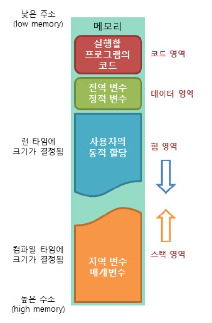
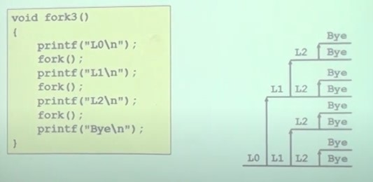
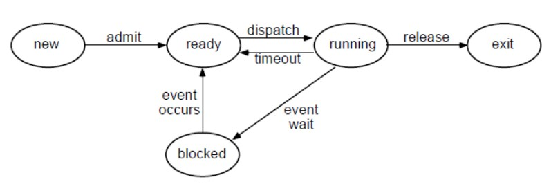

# 운영체제(Operation System)

## 운영체제란?

- 하드웨어 바로 위에 설치되어 사용자 및 다른 모든 SW와 HW를 연결하는 SW계층
- 시스템의 자원을 효율적으로 관리하여 컴퓨터를 효율적으로 사용할 수 있도록 환경을 제공하는 소프트웨어
- 작은의미의 운영체제(커널)
  - OS의 핵심 부분으로 메모리에 상주하는 부분
- 넓은의미의 OS
  - 커널 + 주변 시스템 유틸리티

### 운영체제의 목적

- 컴퓨터 시스템의 자원을 효율적으로 관리한다.(가장 중요)
  - 주어진 리소스를 효율적으로 관리
    - HW리소스 : 프로세서, 기억장치, 입출력 장치
    - SW리소스 : 프로세스, 파일, 메시지
- 사용자가 컴퓨터를 편하게 사용할 수 있는 환경을 제공
  - 만약 OS가 없다면 특정 동작을 수행하기 위해 머신랭귀지를 사용해서 직접 컨트롤해야한다.
  - 운영체제는 여러 프로그램들이 동시에 실행될 수 있도록 한다.
  - CPU를 짧은 시간씩 각각의 프로그램들에게 할당
- 운영체제가 low-level을 컨트롤 하므로 잘못된 또는 악의적인 사용을 방지한다

### 운영체제의 분류

#### 동시작업 가능여부

- 단일작업
  - 한번에 하나의 작업만 처리
  - ex) MS-DOS
- 다중작업
  - 동시에 두 개 이상의 작업을 처리
  - 대부분의 OS

#### 사용자의 수

- 단일 다용자
  - MS-DOS, MS Windows
- 다중 사용자
  - UNIX 등

#### 처리방식

- 일괄 처리(batch processing)
  - 프로그램 예약 시스템의 단점을 개선
  - 작업 요청을 일정량 모아서 한꺼번에 처리
  - 작업이 완전 종료될 때까지 기다려야함
- 시분할(Time sharing) - 대부분
  - 여러 작업을 수행할 떄 일정한 시간 단위로 분할하여 사용
  - 일괄처리에 비해 응답시간이 빠름(interactive함)
  - 다른 프로세스로 작업이 넘어갈때 이전 프로세스의 명령어 위치가 프로그램카운터에, 레지스터의 내용도 저장해야함(커널(OS)이 이를 수행하고 복구한다)= > context switching.
- 실시간(RTOS)
  - dead line이 있어서 정해진 시간 안에 어떤 일이 반드시 종료됨이 보장되어야 함
  - 특수 목적 system에서 사용함
  - 미사일 발사, 원자로, 반도체 등 매우 정교한 시설에서 사용

## 프로세스

### 프로세스란 

- 실행중인 한 프로그램의 인스턴스이다. (프로그램으로부터 생성된 새로운 객체)
- 프로세서가 할당되는 것. 실행중인 프로그램등.
- 프로세스는 자신이 혼자 프로세서를 사용한다고 생각
- 프로세스는 자신만의 메모리를 가진다(가상 메모리) => 물리적메모리(DRAM)보다 훨씬 클 수 있다

### 가상메모리

- pysical 주소 : DRAM의 주소
- virtual 주소 : 가상의 주소

### 프로그램의 실행

- 프로그램이 실행되기 위해서는 프로그램이 메모리에 로드 되어야한다. (가상메모리에)

- 운영체제가 프로그램에게 메모리 공한을 할당한다.

  

- 프로그램이 운영체제로부터 할당받는 메모리 공간
  - 코드영역
    - 실행할 프로그램의 코드가 저장되는 영역
    - CPU는 코드 영역에 저장된 명령어를 하나씩 가져가서 처리한다.
  - 데이터영역
    - 프로그램의 전역 변수와 정적변수가 저장되는 영역.
    - 프로그램의 시작과 함께 할당되며, 프로그램 종료시 소멸
  - 스택영역
    - 함수의 호출과 관계되는 지역 변수와 매개변수가 저장되는 영역 (각각 변수의 영역 : 스택프레임)
    - 함수의 호출과 함께 할당되며, 함수 종료시 소멸
  - 힙영역
    - 사용자가 직접 관리할 수 있고 해야하는 메모리 영역
    - 사용자에 의해 동적으로 할당되는 메모리(malloc)

- 힙과 스택은 다이나믹 메모리로 영역이 변경된다.
- 스택은 위에서 아래로, 힙은 아래서 위로 할당된다.
- 프로그램카운터 : 다음실행할 명령어의 주소를 가지고있다.
- 스케쥴링 : 어떤 프로세스에게 CPU를 할당할지 컨트롤하는것

### 프로세스의 생성과 종료

- 프로세스 spawning
  - 프로세스를 생성하는것
  - 특정 프로세스가 커널에 fork라는 시스템 콜을 하면 자식 프로세스를 생성한다.
- 프로세스 termination
  - 프로세스가 exit 시스템 콜을 하면 종료된다.

### fork의 동작

- fork실행시 child프로세스가 만들어지고 parent 프로세스와 같은 코드를 실행한다.

- 리턴시 child는 0, parent는 child프로세스의 pid를 리턴한다.

- 처음fork시 child와 parent는 같은 상태를 가지지만 각각의 공간을 가진다.

- 동일한 코드를 실행시키므로 처음에는 같지만 이후 달라진다.

- process 그래프

  - horizental은 프로세스의 실행 

  - virtical은 fork의 분기를 나타낸다.

    

### exit의 동작

- 프로세스를 종료하는 시스템 콜
- atexit
  - exit이 실행됐을때, 실행할 코드

### 프로세스의 상태

**Five-State Process Model**

- new : 프로세스의 생성(fork등)
- ready : 프로세스를 메모리로 읽어온 이후
- running : 디스패치되어 프로세서를 할당받음, 만약 할당된 시간에 대해 timeout되면 ready로 돌아감(큐로 돌아감)
- blocked : IO를 요청하는 경우 IO가 끝날때 까지 대기 하는것, IO이후 다시 ready로 돌아감
- exit : 프로세스의 종료
- FSPM에서는 ready Q, blocked Q(이벤트마다 큐가 존재함) 두가지 큐가 존재한다.

### 프로세스의 Suspension(메모리 밖으로 쫓아내는것)

- Swapping
  - 모든 프로세스가 blocked상태에 있고, 메모리가 꽉차서 새로운 프로세스가 들어올 수 없는 경우 blocked상태에 있는 프로세스를 쫓아내는것(메모리에서 디스크로 쫓아낸다.)
  - block에서 suspend된 프로세스는 suspended라는 상태를 가지고 대기하다가 시스템에 의해 ready상태(메모리로 들여옴)로 돌아올 수 있다.
  - ready에서 suspend된 프로세스도 있다.

### Interrupt/Exception

- 메커니즘은 비슷하지만 발생원인이 다르다
- Exception(synchronous하다 항상 같은 위치에서 발생함)
  - 현재 실행중인 프로세스의 특정 명령어에 의해서 발생
  - 종류
    - traps
      - 실행을 마치자 마자 발생하는 것
      - ex) 디버거, 시스템 콜
    - faults
      - 특정 예외상황에 의해 명령어를 모두 마치지 못한 상태
      - ex) 페이지 미스,tlb미스?
    - aborts
- Interrupt(asynchronous하다. 외부에서 언제발생 할 지 모르기때문 but 매 싸이클마다 발생했는지 확인할 필요가 있음)
  - 외부적인 이벤트, 실행되고 있는 프로세스랑 아무 관련이 없다.
  - ex) 키보드 입력, 리부트, 
- interrupt나 exception이 발생하면 실행중인 프로세스는 중단되고 핸들러 코드가 실행된다.
- 핸들러들은 OS코드가 아니라 펌웨어다(cpu개발자가 만듬)

## 추가정보

- C등에서 printf 요청등을 하면 C가 운영체제에 시스템 콜을 던져서 해당기능을 수행해달라고 요청한다.
- CPU(프로세서)의 기능 : 메모리에 있는 프로그램(명령어들)을 읽어와서 실행시킴
- 명령어들의 역할 : 머신의 state를 바꾼다.
- 컴퓨터의 state : 메모리, 레지스터
- 어플리케이션과 라이브러리를 나누는 경계 : API
- 라이브러리와 OS에 시스템 콜하는 인터페이스 : ABI(Application Binary interface)
- x86 이란 : ISA(Instruction Set Architecher)의 종류이며 컴퓨터 마다 사용하는 고유의 언어(Machine Language) => 결과물 0,1 비트
- x86-64 : x86 ISA를 사용하면서 데이터의 크기(Word)는 64비트를 사용하는 컴퓨터.
- AP(Application Processerr) : 
- ARM : 스마트폰에 사용되는 ISA 
- AMD : AMD와 intel 은 ISA가 같기때문에 서로 같은 application 을 동작시킬 수 있다
- MIPS : RISC 프로세서 회사
- CISC(Complex Instruction Set Computer) : 명령어하나하나가 복잡하고 명령의 수가 많음
- RISC(Reduced Instruction Set Computer) : 명령어 가 간단하고 수가 적음 (신식)
- Word : 컴퓨터의 기본 데이터 단위
- 책 추천 : History of Almost Everything
- 멀티태스킹 (멀티프로그래밍) : 여러프로세스를 메모리에 올려서 CPU가 쉬지않고 프로세스들을 옮겨 다니면서 작업을 수행한다.
- 프로세서 : 하드웨어
- 프로그램의 life : 변수등이 살아있는지 여부
- 프로그램의 scope : 변수등을 참조할 수 있는 영역
  - 변수가 live하지만 not visible => 가능
  - 변수가 visible하지만 not live => 불가능
- 링킹 : 여러개의 파일들을 연결시켜서 프로그램을 만드는것
- 글로벌 변수와 스태틱 변수를 구분해서 사용하는 이유 : 스콥을 조절해서 오용,악용을 방지한다.
- 프로세스 컨트롤 블록: 프로세스와 관련된 정보들을 저장
- 인터럽트 익셉션
- 디스패쳐 : 커널에서 스케쥴링을 담당함
- 페이지 fault : 시스템이 특정 프로세스를 실행하려고 하는데 프로세스가 메모리에 없는 상황. 시스템은 디스크에서 프로세스를 찾아 메모리에 넣고 해당 프로세스부터 디스패치한다.

