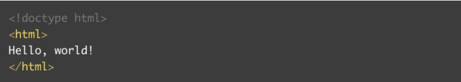

# WEB

# 브라우저의 동작 원리

**브라우저**

웹 페이지, 이미지, 비디오 등의 콘텐츠를 수신, 전송 및 표현하는 소프트웨어이다.

ex) 크롬, 사파리 등

### 브라우저 주요 기능

* 사용자가 선택한 자원을 서버에 요청, 브라우저에 표시
* 자원은 매우 다양한 형태(HTML문서 또는 PDF, 이미지 등)
* 자원의 주소는 URI(Uniform Resource Indentifier)에 의해 정해짐
* html과 css 명세(W3C에서 정함)에 따라서 html파일을 해석해서 표시한다. 

### 브라우저 기본 구조


* **사용자 인터페이스**
  * 주소 표시줄, 이전/다음 버튼, 북마크 등 사용자가 활용하는 서비스들(요청한 페이지를 보여주는 창을 제외한 나머지 부분)
* **브라우저 엔진**
  * 사용자 인터페이스와 렌더링 엔진 사이의 동작 제어
* **렌더링 엔진**
  * 요청한 콘텐츠 표시 (html 요청이 들어오면 html과 css를 파싱하여 화면에 표시한다)
* **통신**
  * http 요청과 같은 네트워크 호출에 사용
* **UI 백엔드**
  * 플랫폼에서 명시하지 않은 일반적 인터페이스.
  * 콤보 박스 창같은 기본적인 장치를 그린다.
* **자바스크립트 해석기**
  * 자바스크립트 코드를 해석하고 실행한다.
* **자료 저장소**
  * 쿠키와 같은 모든 종류의 자원을 저장하는 계층

> 추가 : 크롬은 대부분의 브라우저와 달리 각 탭마다 별도의 렌더링 엔진 인스턴스를 유지한다.

## 렌더링

### 렌더링 엔진

* 요청받은 내용을 브라우저 화면에 표시하는 일을 한다.

* 기본적으로 html, xml문서, 이미지등을 표시한다.(확장기능등으로 pdf같은 유형도 표시가능)

* **종류**

  * 크롬, 사파이 : 웹킷(Webkit) 엔진 사용

  * 파이어폭스 : 게코(Gecko) 엔진 사용

    > 웹킷
    >
    > * 최초 리눅스 플랫폼에서 동작하기 위해 제작된 오픈소스 엔진
    > * 애플이 맥과 윈도우즈에서 사파리 브라우저를 지원하기위해 수정을 가함

### 렌더링 과정


```
먼저 html 문서를 파싱한다.

그리고 콘텐츠 트리 내부에서 태그를 모두 DOM 노드로 변환한다.

그 다음 외부 css 파일과 함께 포함된 스타일 요소를 파싱한다.

이 스타일 정보와 html 표시 규칙은 
렌더 트리라고 부르는 또 다른 트리를 생성한다.

이렇게 생성된 렌더 트리는 정해진 순서대로 화면에 표시되는데, 
생성 과정이 끝났을 때 배치가 진행되면서 
노드가 화면의 정확한 위치에 표시되는 것을 의미한다.

이후에 UI 백엔드에서 렌더 트리의 각 노드를 가로지으며 
형상을 만드는 그리기 과정이 진행된다.

이러한 과정이 점진적으로 진행되며, 렌더링 엔진은 좀더 빠르게 
사용자에게 제공하기 위해 모든 html을 파싱할 때까지 기다리지 않고 
배치와 그리기 과정을 시작한다.

전송을 받고 기다리는 동시에 받은 내용을 먼저 화면에 보여준다
(우리가 웹페이지에 접속할 때 한꺼번에 뜨지 않고 점점 화면에 나오는 것이 이 때문!!!)
```

### 웹킷의 동작 구조


### 게코의 동작 구조


*웹킷과 게코는 용어가 약간 다르지 동작 과정은 기본적으로 동일하다*

## 파싱과 DOM 트리 구축

### 파싱(parsing)

* 문서 파싱은, 브라우저가 코드를 이해하고 사용할 수 있는 구조로 변환하는 것
* 파싱의 결과는 보통 문서 구조를 나타내는 노드 트리(파싱트리, 문법 트리라고도 부름)
* 파싱은 어휘 분석과 구문 분석 두가지로 구분할 수 있다.
  * 어휘 분석
    * 자료를 토큰으로 분해하는 과정.
    * 토큰 : 사람으로 치면 사전에 등장하는 모든 단어
  * 구문 분석
    * 언어의 구문 규칙을 적용하는 과정
* 어휘 분석을 통해 의미 없는 문자(공백, 줄 바꿈)등을 제거하고, 토큰으로 분해한다.
* 구문 분석기가 토큰을 받아 구문 규칙과 일치하는지 확인하고, 규칙에 맞으면 파싱트링 추가한다.
* 규칙에 맞지 않으면 토큰을 내부적으로 저장하고, 일치하는 규칙이 발견될 때 까지, 요청한다.
* 맞는 규칙이 없는경우 문서가 유효하지 않은 구문 오류를 포함하고 있다는 것.
* 파서 트리는 최종 결과물이 아니다. 이를 다시 다른 양식으로 변환하여 사용한다.
  * ex) 컴파일러는 소스코드를 이용해 파싱 트리를 생성하고, 이를 기계 코드 문서로 변환환다.

## DOM(Document Object Model)

* html, xml 문서의 프로그래밍 interface

* html 문서를 파싱한 결과이다.

* 다음과 같은 html을 파싱하면 아래와 같은 노드 트리가 된다.

  

* DOM은 HTML과 동일하지 않을 수 있다.

  1. 작성된 HTML 문서가 유효하지 않을 때

     DOM이 생성될 때, 유효하지 않은 HTML코드가 교정될 수 있다. 아래 그림에서 HTML문서에는 head와 body가 빠져있지만 DOM에는 추가 돼 있다.

     

     

  2. 자바스크립트에 의해 DOM이 수정될 때

     

     이 코드로 인해서 HTML 문서는 변하지 않지만 DOM은 수정 된다.
  
  DOM은 웹 브라우저가 html 페이지를 인식하는 방식을 말한다.

## 브라우저 동작원리 요약

1. 주소창에 url을 입력하고 Enter를 누르면, 서버에 요청이 전송된다.

2. 해당 페이지에 존재하는 여러 자원들이 보내진다.

3. 브라우저는 해당 자원이 담긴 html과 스타일이 담긴 css를 W3C 명세에 따라 해석한다.

4. 해석과정(by 렌더링 엔진)

   

   1. html파싱을 한다. html파서가 문서에 존재하는 어휘와 구문을 분석하면서 DOM트리를 구축한다.
   2. css 파싱을 한다. css 파서가 모든 css 정보를 스타일 구조체(CSSOM)로 생성한다.
   3. 이 2가지를 연결시켜 렌더 트리를 만든다. 렌더 트리를 통해 문서가 시각적 요소를 포함한 형태로 구성된다.

5. 화면에 배치를 시작하고, UI 백엔드가 노드를 돌며 형상을 일부분씩 진행하면서 화면에 표시한다.

**스크립트를 만나게 되면 어떻게 되는 가?**

JS인 \<script> 태그를 만나면 진행중인 HTML파싱을 중지하고 js엔진으로 제어 권한을 넘긴다. JS파싱과 실행이 종료되면 렌더링 엔진으로 다시 돌아가 파싱이 중단된 시점부터 다시 파싱을 시작한다.

스크립트가 외부에 있는 경우 우선 네트워크로부터 자원을 가져와야 하는데 이 또한 실시간으로 처리되고 자원을 받을 때까지 파싱은 중단됩니다. 때문에 스크립트 소스는 body 태그 끝에 두는 것을 권장한다.

한편 스타일 시트는 이론적으로 DOM 트리를 변경하지 않기 때문에 문서 파싱을 기다리거나 중단하지 않습니다.

```html
<html>
    <head>
        <title>타이틀</title>
    </head>
    <body>
        1. HTML 구문 작성
        
        2. 자바스크립트 구문 실행
        <script src = "file.js"></script>
        3. HTML 나머지 구문 작성
    </body>
</html>
```

실행 순서는 1->2->3 순서 이다.

이때, file.js가 용량이 큰 파일이어서 로드되는데 2초가 걸리고 실행시간이 1초가 걸린다고 하면, 1번 HTML 구문 렌더링 -> 2번 자바스크립트 로드(3초) -> HTML 가머지 구문 렌더링 으로 동작한다. 이때, 사용자들은 홈페이지가 느리다고 판단한다.

따라서 async 속성을 이용한다.

```html
<script src-"file.js" async></script>
```

async속성은 HTML렌더링을 멈추지 않고 동시에 js파일을 다운로드 하고 다운로드가 끝난 후에 자바스크립트를 실행한다. 이를 통해 페이지 로드 속도를 향상시킬 수 있다.

## 쿠키 & 세션

쿠키와 세션을 사용하는 이유는 HTTP 프로토콜이 Connectionless, Stateless한 특성을 가지고 있기 때문.

* Connectionless : 클라이언트가 요청을 한 후 응답을 받으면 그 연결을 끊어 버림
* Stateless : 통신이 끝나면 상태를 유지하지 않는 특징

쿠키와 세션은 이를 해결하고 클라이언트 인증을 유지하기 위해서 사용한다. 사용하지 않을시 페이지를 이동할 때마다 로그인정보가 사라짐

### 쿠키

* 클라이언트 로컬에 저장되는 `key-Value`쌍의 작은 데이터 파일

* 쿠키이름, 쿠키값, 만료시간, 전송할 도메인명, 전송할 경로, 보안연결여부, HttpOnly 여부

* **동작방식**

  

  1. 클라이언트가 서버에 로그인 요청을 한다.
  2. 서버는 클라이언트의 로그인 요청의 유효성을 확인(아이디, 비밀번호 검사) 하고 `응답헤더`에 `set-cookie : user=chrisjune`를 추가하여 응답한다.
  3. 클라이언트는 이후 서버에 요청할 때, 전달받은 `set-cookie : user=chrisjune`쿠키를 자동으로 `요청헤더`에 추가하여 요청한다(브라우저가 처리).

* 쿠키는 클라이언트에서 수정할 수 있기 때문에 쿠키값을 암호화할 필요가 있다.

### 세션

* 브라우저가 종료되기 전까지 클라이언트의 요청을 유지하게 해주는 기술

* **동작방식**

  

  1. 클라이언트가 서버에 로그인 요청을 한다.
  2. 서버는 클라이언트의 로그인 요청의 유효성을 확인하고(아이디와 비밀번호 검사) 클라이언트 정보를 저장한 후, unique한 id를 sessionid라는 이름으로 저장함
  3. 서버가 응답할 때 `응답헤더`에 `set-cookie: sessionid:a1x2fjz`를 추가 하여 응답한다.
  4. 클라이언트는 세션아이디를 쿠키로 저장하고 이후 서버에 요청할 때 전달받은 `sessionid:a1x2fjz`쿠키를 자동으로 요청헤더에 추가하여 요청한다.
  5. 서버에서는 `요청헤더`의 `sessionid`값을 저장된 세션저장소에서 찾아보고 유효한지 확인 후 요청을 처리하고 응답한다.

* 세션의 내용은 서버에 저장되기 때문에 계속하여 늘어날 경우 서버에 부하가 발생할 수 있다.

### 쿠키 vs 세션


* **저장위치**
  * 쿠키는 로컬(사용자측)에, 세션은 로컬과 서버에 저장된다.
* **보안**
  * 쿠키는 탈취와 변조가 가능하지만, 세션은 ID값만 가지고 있고 서버에도 저장이 되어있기 때문에 상대적으로 안전하다.
* **Lifecycle**
  * 쿠키는 브라우저를 종료해도 파일로 남아있지만, 세션은 일반적으로 브라우저 종료시 세션을 삭제.
* **속도**
  * 쿠키는 파일에서 읽기 때문에 상대적으로 빠르고, 세션은 요청마다 서버에서 처리해야하기 때문에 비교적 느리다.

## HTTP status code

> HTTP API 통신 시, 응답 상태 코드를 통해 성공/실패 여부를 확인할 수 있으므로 API 문서를 작성할 때 꼭 알아야 할 것이 HTTP status code다

- 10x : 정보 확인

- 20x : 통신 성공

  

- 30x : 리다이렉트

  

- 40x : 클라이언트 오류

  

- 50x : 서버 오류

  

* [조금 더 자세히 확인하기](https://developer.mozilla.org/ko/docs/Web/HTTP/Status)

## REST

> REST(REpresentational State Transfer)
>
> 자원을 이름으로 구분하여 해당 자원의 상태를 주고받는 모든것

- API(Application Programming Interface)
  - 데이터와 기능의 집합을 제공하여 프로그램간 상호작용 하도록 하는 것
- REST API
  - 즉, 자원을 이름으로 구분하여 해당 자원의 상태를 주고받도록 설계된 API

### REST의 요소

* **Method**

  

  > Idempotent : 한 번 수행한것과, 여러번 수행한것의 결과가 같은지

* **Resource**
  * http://myweb/users와 같은 URI
  * 모든 것을 Resource (명사)로 표현하고, 세부 Resource에는 id를 붙인다.
* **Message**
  
  * 메세지 포맷이 존재한다.(JSON, XML)

### REST 특징

* Uniform (유니폼 인터페이스)
  * HTTP 표준에만 따른다면, 특정 언어(C, Java, Python ....), 플랫폼(안드로이드, IOS)에 종속되지 않고 사용할 수 있다.
* Stateless (무상태성)
  * REST는 무상태성 성격을 가진다. 
  * 즉 서버에서 어떤 작업을 하기 위해 상태정보를 기억할 필요가 없고 들어온 요청에 대해 처리만 해주면 되기 때문에 구현이 쉽고 단순해진다.
  * *REST API 실행중 실패가 발생한 경우, Transaction 복구를 위해 기존의 상태를 저장할 필요가 있다. (POST Method 제외)* - **추가 공부 필요**
* Cacheable (캐시 가능) - **추가적으로 공부 필요**
  * 웹에서 사용하는 기존 인프라를 그대로 활용할 수 있다. 따라서 HTTP가 가진 캐싱 기능이 적용할 수 있다.
  * *HTTP 프로토콜 표준에서 사용하는 Last-Modified 태그나 E-Tag를 이용하면 캐싱 구현이 가능하다.*
* Self-descriptiveness (자체 표현 구조)
  * REST API 메시지만 보고도 이를 쉽게 이해할 수 있는 자체 표현 구조로 되어 있다.
* Client - Server 구조
  * REST 서버는 API 제공, 클라이언트는 사용자 인증이나 컨텍스트(세션, 로그인 정보) 등을 직접 관리하는 구조로 각각의 역할이 확실히 구분되기 때문에 클라이언트와 서버에서 개발해야 할 내용이 명확해지고 서로 간 의존성이 줄어들게 된다.
* Layered System (계층형 구조)
  * 클라이언트와 서버가 분리되어 있기 때문에 중간에 프록시 서버, 암호화 계층등 중간매체를 사용할 수 있어 자유도가 높다.

## Web Server와 WAS

### 정적 페이지, 동적페이지


* **Static Pages**
  * 바뀌지 않는 페이지로, 웹 서버는 파일 경로 이름을 받고, 경로와 일치하는 file contents를 반환한다(항상 동일).
* **Dynamic Pages**
  * 인자의 내용에 맞게 동적인 contents를 반환한다.
  * 웹 서버에 의해 실행되는 프로그램을 통해 만들어진 결과물이다.

### 웹 서버와 WAS의 차이


* **웹 서버**
  * HTTP 요청을 받고 컨텐츠를 제공하는 프로그램
  * 정적 컨텐츠의 경우
    * WAS를 거치지 않고 바로 자원을 제공한다.
  * 동적 컨텐츠의 경우
    * 클라이언트 요청을 WAS에 보내고, WAS에서 처리한 결과를 클라이언트에 전달
  * 종류 : Apache, Nginx, IIS 등
* **WAS** (Web Application Server)
  * 동적인 컨텐츠를 제공하기 위해 만들어진, 미들웨어 이다.
  * 웹 컨테이너 또는 서블릿 컨테이너라고도 불린다.
  * WAS = 웹 서버 + 웹 컨테이너
  * **기능**
    * 프로그램 실행 환경 및 DB 접속 기능 제공
    * 여러 트랜잭션 관리 기능
    * 비즈니스 로직 수행
  * **종류** : Tomcat, JBoss

### 웹 서버와 WAS를 구분하는 이유

* 웹 서버에서는 정적 컨텐츠만 처리하도록 기능 분배를 해서 서버 부담을 줄인다.
* WAS에서는 요청이 들어올 때 마다 DB와 비즈니스 로직을 통해 결과물을 만들어 제공한다.

## OAuth(Open Authentification)

* 인터넷 사용자들이 비밀번호를 제공하지 않고, 다른 웹사이트 상의 자신들의 정보에 대해 웹사이트나 애플리케이션의 접근 권한을 부여할 수있는 개방형 표준 방법 (네이버, 카카오 로그인)
* 타사 애플리케이션 및 웹사이트의 계정에 대한 정보를 공유할 수 있도록 허용해준다.
* 즉, 고객이 네이버, 카카오등으로 부터 고객의 정보를 다른사이트 (내가 개발한 사이트 등)에 안전하게 건내주기 위한 방법.
* 사용자 : 일반 유저, 소비자 : 카카오 로그인을 지원하는 웹 사이트, 서비스 제공자 : 카카오
* **요청 토큰** : 소비자가 사용자에게 접근권한을 인증받기 위해 필요한 정보가 담겨있음
* **접근 토큰** : 인증 후에 사용자가 서비스 제공자가 아닌 소비자를 통해 보호 자원에 접근하기 위한 키 값
* **토큰의 종류**
  * Access Token - 만료시간이 있고, 끝나면 다시 요청해야 한다.
  * Refresh Token - 만료되면 아예 처음부터 진행해야한다.

### Access Token

* 임의의 문자열 값으로, 토큰을 발급해준 서비스만 알 수 있다.
* Access Token 자체가 고객이 정보를 넘겨주는 것을 동의했다는 징표라고 이해하면 편하다.
* 우리는 고객이 준 토큰을 가지고 네이버, 카카오등에서 고객의 정보를 받아온다.

### 인증 과정

1. 소비자가 서비스 제공자에게 요청토큰을 요청한다.
2. 서비스 제공자가 소비자에게 요청토큰을 발급해준다.
3. 소비자가 사용자를 서비스제공자로 이동시킨다. 여기서 사용자 인증이 수행된다.
4. 서비스 제공자가 사용자를 소비자로 이동시킨다.
5. 소비자가 접근토큰을 요청한다.
6. 서비스제공자가 접근토큰을 발급한다.
7. 발급된 접근토큰을 이용해서 소비자에서 사용자 정보에 접근한다.

## CSR & SSR

- CSR : Client Side Rendering
- SSR : Server Side Rendering

### CSR


- 웹서버에 데이터가 없는 빈 HTML만 받아오고, 문서와 여러 정적 파일들이 로드 된 이후에 데이터를 요청해 받아온다.

### SSR


- 요청시 데이터까지 전부 삽입하여 완성된 HTML을 받아온다.

### SPA(Single Page Application)

- 처음에만 서버로부터 페이지를 받아오고 이후에는 동적으로 페이지를 구성해서 새로운 페이지를 받아오지 않는 웹 Application
- 페이지가 한번 로딩된 이후에는 데이터를 수정하거나 조회할 떄, 페이지가 새로 고침되지 않는다.

### MPA(Multi Page Application)

- 서버로부터 완전한 페이지를 받아오고 이후에 데이터를 수정하거나 조회할 때, 다른 완전한 페이지로 이동한다. (URL도 바뀔수 있음)

CSR 방식은 SPA를 사용, SSR 방식은 MPA방식을 사용한다.

SSR방식은 데이터를 요청 할 때,  완전히 새로운 문서를 서버측에서 랜더링해서 전달해야 하기 때문에 성능문제가 발생한다.

따라서 SPA에서 CSR방식을 사용하여 사용자의 행동에 따라 필요한 부분만 다시 읽어온다. 서버에서 JSON파일만 보내주고, 클라이언트 측에서 랜더링함으로써, 더욱 빠른 인터렉션을 가능하게 한다.

### 장단점

**CSR**

- 장점
  - 트래픽감소(필요한 데이터만 받기 때문)
  - UX
    - SPA이므로 새로고침이 발생하지 않아 사용자가 네이티브 앱과 같이 느낄 수 있다.
- 단점
  - 한번에 JavaScript파일과 함께 받기 때문에 초기 랜더링이 느리다.
  - 검색 엔진 최적화가 어렵다.

**SSR**

- 장점
  - 검색엔진 최적화
  - 초기로딩속도가 빠르다.
- 단점
  - 페이지 이동시 화면이 깜빡인다.(UX저하)
  - 성능 저하(서버렌더링)

## 네이티브 앱 & 웹 앱 & 하이브리드 앱

[링크](https://gyoogle.dev/blog/web-knowledge/%EB%84%A4%EC%9D%B4%ED%8B%B0%EB%B8%8C%20%EC%95%B1%20&%20%EC%9B%B9%20%EC%95%B1%20&%20%ED%95%98%EC%9D%B4%EB%B8%8C%EB%A6%AC%EB%93%9C%20%EC%95%B1.html)

## Vue.js vs React

#### 개발 CLI

- Vue.js : vue-cli
- React : create-react-app


#### CSS 파일 존재 유무

- Vue.js : 없음. style이 실제 컴포넌트 파일 안에서 정의됨
- React : 파일이 존재. 해당 파일을 통해 style 적용


#### 데이터 변이

- Vue.js : 반드시 데이터 객체를 생성한 이후 data를 업데이트 할 수 있음
- React : state 객체를 만들고, 업데이트에 조금 더 작업이 필요

```text
name: kim 값을 lee로 바꾸려면
Vue.js : this.name = 'lee'
React : this.setState({name:'lee'})
```

Vue에서는 data를 업데이트할 때마다 setState를 알아서 결합해준다.

## Longging Level

- ERROR
  - 프로그램 동작에 큰 문제가 발생했다는 것으로 즉시 문제를 조사해야하는 것
- WARN
  - 주의해야 하지만, 프로세스는 계속 진해오디는 상태. 하지만 WARN에서도 2가지의 부분에서는 종료가 일어난다.
    - 명확한 문제 : 현재 데이터를 사용 불가, 캐시값 사용 등
    - 잠재적 문제 : 개발 모드로 프로그램 시작, 관리자 콘솔 비밀번호가 보호되지 않고 접속하는 경우 등.
- INFO
  - 중요한 비즈니스 프로세스가 시작될 때와 종료될 때를 알려주는 로그
- DEBUG
  - 개발자가 기록할 가치가 있는 정보를 남기기 위해 사용하는 레벨

## 웹 성능과 관련된 Issue 정리

### 1. 네트워크 요청에 빠르게 응답하자

- `3xx` 리다이렉트를 피할 것
  - 웹사이트 상에서 유저가 어떠한 웹페이지를 방문했을 때 새로운 도메인 주소로 자동으로 변환 시켜주는 기능을 말한다.
- `meta-refresh` 사용금지
- `CDN(content delivery network)`을 사용할 것
- 동시 커넥션 수를 최소화 할 것
- 커넥션을 재활용할 것

### 2. 자원을 최소한의 크기로 내려받자

- 777K
- `gzip` 압축을 사용할 것
- `HTML5 App cache`를 활용할 것
- 자원을 캐시 가능하게 할 것
- 조건 요청을 보낼 것

### 3. 효율적인 마크업 구조를 구축하자

- 레거시 IE 모드는 http 헤더를 사용할 것
- @import 의 사용을 피할 것
- inline 스타일과 embedded 스타일은 피할 것
- 사용하는 스타일만 CSS 에 포함할 것
- 중복되는 코드를 최소화 할 것
- 단일 프레임워크를 사용할 것
- Third Party 스크립트를 삽입하지 말 것

### 4. 미디어 사용을 개선하자

- 이미지 스프라이트를 사용할 것 ( 하나의 이미지로 편집해서 요청을 한번만 보낸다의 의미인가? )
- 실제 이미지 해상도를 사용할 것
- CSS3 를 활용할 것
- 하나의 작은 크기의 이미지는 DataURL 을 사용할 것
- 비디오의 미리보기 이미지를 만들 것

### 5. 빠른 자바스크립트 코드를 작성하자

- 코드를 최소화할 것
- 필요할 때만 스크립트를 가져올 것 : flag 사용
- DOM 에 대한 접근을 최소화 할 것 : Dom manipulate 는 느리다.
- 다수의 엘리먼트를 찾을 때는 selector api 를 사용할 것.
- 마크업의 변경은 한번에 할 것 : temp 변수를 활용
- DOM 의 크기를 작게 유지할 것.
- 내장 JSON 메서드를 사용할 것.

### 6. 애플리케이션의 작동원리를 알고 있자.

- Timer 사용에 유의할 것.
- `requestAnimationFrame` 을 사용할 것
- 활성화될 때를 알고 있을 것

## 단어

HTML(HyperText Markup Language)

- 웹을 이루는 가장 기초적인 구성 요소.
- 웹 콘텐츠의 의미와 구조를 정의할 때 사용한다.
- HyperText
  - 웹 페이지를 다른 페이지로 연결하는 링크(웹의 근본적인 속성)
- Markup
  - 웹 브라우저에 표시되는 글, 이미지 등의 다양한 컨텐츠를 표시하기 위해 사용하는 것
  - ex) <head>, <title>.....

CSS

- 웹 페이지의 외형과 표현을 서술

JavaScript

- 기능과 동작을 서술

### URI(Uniform Resource Identifier)

* 통합 자원 식별자로, 인터넷에 있는 자원을 나타내는 유일한 주소이다.
* 인터넷에서 요구되는 기본조건으로 인터넷 프로토콜에 항상 붙어 다닌다.
* 하위개념으로 URL, URN이 있다.
* **URL**(Uniform Resource Locator)
  * 네트워크 상에서 자원이 어디 있는지를 알려주기 위한 규약이다.
  * 컴퓨터 네트워크와 검색 메커니즘에서의 위치를 지정하는, 웹 리소스에 대한 참조이다.
* **URN**(Uniform Resource Name)
  * 통합 자원 이름

**UI, UX**

* UI (User Interface)
  * 사용자가 사용하는 앱의 디자인(폰트, 색깔 등), 레이아웃(컴포넌트의 배치등), 기술등 표면적으로 드러나는 "인터페이스"를 말한다. 
* UX (User eXperience)
  * 사용자가 앱을 사용할때, 더 편하고 효율적인 방향으로 프로세스가 진행할 수 있도록 하여 사용자에게 최적의 경험을 제공하는 것이다.
  * 다양한 방법들이 있다.
  * ex) 이전 페이지 이동시 손가락을 스위핑하는것

### 크로스 브라우징

웹 표준에 따라 개발을 하여 서로 다른 OS 또는 플랫폼에 대응하는 것을 말한다. 즉, 브라우저의 렌더링 엔진이 다른 경우에 인터넷이 이상없이 구현되도록 하는 기술이다. 웹 사이트를 서로 비슷하게 만들어 어떤 **환경** 에서도 이상없이 작동되게 하는데 그 목적이 있다. 즉, 어느 한쪽에 최적화되어 치우치지 않도록 공통요소를 사용하여 웹 페이지를 제작하는 방법을 말한다.

### Axios vs fetch

#### 1. axios

- 구형 브라우저를 지원한다.
- 응답시간 초과를 설정하는 방법이 있다.
- JSON데이터 자동변환이 가능하다.
- node.js에서의 사용이 가능하다
- request aborting (요청취소)가 가능하다
- catch에 걸렸을 때, .then을 실행하지 않고, .console창에 해당 에러 로그를 보여준다.
- return 값은 Promise 객체 형태이다.

#### 2. fetch

- 자바스크립트 내장 라이브러리이기 때문에 import하지 않고 사용할 수 있다.
- 라이브러리의 업데이트에 따른 에러 방지가 가능하다 ( React Native의 경우 업데이트가 잦아서 라이브러리가 쫓아오지 못하는 경우가 많은데, fetch의 경우 이를 방지할 수 있다.)
- 네트워크 에러가 발생했을 때 기다려야 한다. (reponse timeout API 제공 x)
- 지원하지 않는 브라우저가 있다.
- return 값은 Promise객체 형태이다.

- 브라우저, Node.js를 위한 Promise API를 활용하는 HTTP 비동기 통신 라이브러리

### PWA (Progressive Web App)

웹의 장점과 앱의 장점을 결합한 환경.

`앱 수준과 같은 사용자 경험을 웹에서 제공하는 것이 목적이다.`

#### 특징

확장성이 좋고, 깊이 있는 앱같은 웹을 만드는 것을 지향한다.

웹 주소만 있다면, 누구나 접근하여 사용이 가능하고 스마트폰의 저장공간을 잡아 먹지 않음

**서비스 작업자(Service Worker) API** : 웹앱의 중요한 부분을 캐싱하여 사용자가 다음에 열 때 빠르게 로딩할 수 있도록 도와줌

→ 네트워크 환경이 좋지 않아도 빠르게 구동되며, 사용자에게 푸시 알림을 보낼 수도 있음


#### PWA 제공 기능

- **프로그래시브** : 점진적 개선을 통해 작성돼서어떤 브라우저든 상관없이 모든 사용자에게 적합
- **반응형** : 데스크톱, 모바일, 테블릿 등 모든 폼 factor에 맞음
- **연결 독립적** : 서비스 워커를 사용해 오프라인에서도 작동이 가능함
- **안전** : HTTPS를 통해 제공이 되므로 스누핑이 차단되어 콘텐츠가 변조되지 않음
- **검색 가능** : W3C 매니페스트 및 서비스 워커 등록 범위 덕분에 '앱'으로 식별되어 검색이 가능함
- **재참여 가능** : 푸시 알림과 같은 기능을 통해 쉽게 재참여가 가능함

### cors(Cross-Origin Resource Sharing)

- cors는 교차 출처 리소스 공유의 약자로, 추가 HTTP 헤더를 사용하여, A출처에서 실행 중인 웹 애플리케이션이 B출처의 선택한 자원에 접근할 수 있는 권한을 부여하도록 브라우저에 알려주는 체제이다. 웹 애플리케이션은 리소스가 자신의 출처(도메인, 프로토콜, 포트)와 다를 떄 교차 출처 HTTP 요청을 실행한다.
- ex) `~~//domain-a.com`의 프론트 엔드 JavaScript코드에서 XMLHttpRequest를 사용하여 `~~//domain-b.com/data.json`을 요청하는 경우
- 보안 상의 이유로, 브라우저는 Script에서 시작한 교차 출처 HTTP요청을 제한한다. 예츨 들어 XMLHttpRequest와 Fetch API는 동일 출처 정책을 따른다. 즉, 이 API를 사용하는 웹 애플리케이션은 자신의 출처와 동일한 리소스만 불러올 수 있으며, 다른 출처의 리소스를 불러오려면 그 출처(서버)에서 올바른 CORS 헤더(Access-Control-Allow-Origin 헤더)를 포함한 응답을 반환해야 한다.

- 여기서 `CORS`는 타 도메인 간에 자원을 공유할 수 있게 해주는 것이다. `Cross-Origin Resource Sharing` 표준은 웹 브라우저가 사용하는 정보를 읽을 수 있도록 허가된 **출처 집합**을 서버에게 알려주도록 허용하는 특정 HTTP 헤더를 추가함으로써 동작한다.

  | HTTP Header                      | Description                    |
  | -------------------------------- | ------------------------------ |
  | Access-Control-Allow-Origin      | 접근 가능한 `url` 설정         |
  | Access-Control-Allow-Credentials | 접근 가능한 `쿠키` 설정        |
  | Access-Control-Allow-Headers     | 접근 가능한 `헤더` 설정        |
  | Access-Control-Allow-Methods     | 접근 가능한 `http method` 설정 |

- **Preflight Request**

  - 실제 요청을 보내도 안전한지 판단하기 위해 preflight 요청을 먼저 보내는 방법을 말한다. 즉, `Preflight Request`는 실제 요청 전에 인증 헤더를 전송하여 서버의 허용 여부를 미리 체크하는 테스트 요청이다. 이 요청으로 트래픽이 증가할 수 있는데 서버의 헤더 설정으로 캐쉬가 가능하다. 서버 측에서는 브라우저가 해당 도메인에서 CORS 를 허용하는지 알아보기 위해 preflight 요청을 보내는데 이에 대한 처리가 필요하다. preflight 요청은 HTTP 의 `OPTIONS` 메서드를 사용하며 `Access-Control-Request-*` 형태의 헤더로 전송한다.

### 크로스 브라우징

- 웹 표준에 따라 개발을 하여 서로 다른 OS 또는 플랫폼에 대응하는 것을 말한다. 즉, 브라우저의 렌더링 엔진이 다른 경우에 인터넷이 이상없이 구현되도록 하는 기술이다. 웹 사이트를 서로 비슷하게 만들어 어떤 **환경** 에서도 이상없이 작동되게 하는데 그 목적이 있다. 즉, 어느 한쪽에 최적화되어 치우치지 않도록 공통요소를 사용하여 웹 페이지를 제작하는 방법을 말한다.

## LocalStorage, SessionStorage, Cookie의 차이점

### WEB STORAGE

Web Storage의 개념은 키/값 쌍으로 데이터를 저장하고 키를 기반으로 데이터를 조회하는 패턴이다.
그리고 영구저장소(LocalStorage)와 임시저장소(SessionStorage)를 따로 두어 데이터의 지속성을 구분할 수 있어 응용 환경에 맞는 선택이 가능하다.

Web Storage는 기존 웹 환경의 쿠키(Cookie)와 매우 유사한 개념이다.
사실 거의 차이가 없지만 몇 가지 쿠키의 단점을 극복하는 개선점이 도입되었다.
그러나 쿠키는 여전히 유효하고 꽤 적절한 클라이언트 저장도구임에 틀림없다. HTML5 에서 Web Storage 스펙을 새로 추가했지만 쿠키를 배제한다는 의미는 아니다. HTML5 에서도 여전히 쿠키를 이용 가능하다.

### Web Storage의 차이점(cookie와 비교)

- 쿠키는 매번 서버로 전송된다.
  - 웹 사이트에서 쿠키를 설정하면 이후 모든 웹 요청은 쿠키정보를 포함하여 서버로 전송된다. Web Storage는 저장된 데이터가 클라이언트에 존재할 뿐 서버로 전송은 이루어지지 않는다. 이는 네트워크 트래픽 비용을 줄여 준다.

- 단순 문자열을 넘어(스크립트) 객체정보를 저장할 수 있다.
  - 문자열 기반 데이터 이외에 체계적으로 구조화된 객체를 저장할 수 있다는 것은 개발 편의성을 제공해주는 주요한 장점이 된다. 브라우저의 지원 여부를 확인해 봐야 하는 항목이다.

- 용량의 제한이 없다
  - 쿠키는 개수와 용량에 있어 제한이 있다. 하나의 사이트에서 저장할 수 있는 최대 쿠키 수는 20개이다. 그리고 하나의 사이트에서 저장할 수 있는 최대 쿠키 크기는 4KB로 제한되어 있다. 그러나 Web Storage에는 이러한 제한이 없다. 그러나 쿠키도 하위키를 이용하면 이러한 제한을 일부 해소할 수 있습니다. 그리고 대부분 쿠키의 제한으로까지 데이터를 저장할 일이 없다.

- 영구 데이터 저장이 가능하다
  -  쿠키는 만료일자를 지정하게 되어 있어 언젠가 제거된다. 만료일자로 지정된 날짜에 쿠키는 제거되는 것이다. 만약 만료일자를 지정하지 않으면 세션 쿠키가 된다. 만일 영구 쿠키를 원한다면 만료일자를 굉장히 멀게 설정하여 해결할 수 있다.
    WebStorage는 만료기간의 설정이 없다. 즉, 한번 저장한 데이터는 영구적으로 존재하는 것이다.

> WebStorage와 쿠키의 차이점에 대해서 WebStorage가 특별히 좋은 이유는 없다고 봐도 무방하다. 다만 한가지 매번 서버로 전송되지 않는다는 특징은 꽤나 유용하다.

### LocalStorage와 SessionStorage

#### LocalStorage

저장한 데이터를 명시적으로 지우지 않는 이상 영구적으로 보관이 가능하다. 앞서 말한대로 도메인마다 별도로 로컬 스토로지가 생성된다. Windows 전역 객체의 LocalStorage라는 컬렉션을 통해 저장과 조회가 이루어진다.

#### SessionStorage

SessionStorage는 데이터의 지속성과 액세스 범위에 특수한 제한이 존재한다. SessionStorage는 windows 전역 객체의 sessionStorage라는 컬렉션을 통해 저장과 조회가 이루어진다.

#### 데이터 유지 측면

SessionStorage는 데이터가 지속적으로 보관되지 않는다. 이는 마치 브라우저 기반 세션 쿠키와 그 성질이 비슷한데, 현재 페이지가 브라우징되고 있는 브라우저 컨텍스트 내에서만 데이터가 유지된다.

LocalStorage는 브라우저를 종료해도 데이터는 보관되어 다음번 접속에도 그 데이터를 사용할 수 있는 반면, SessionStorage는 브라우저가 종료되면 데이터도 같이 지워진다. 즉, 브라우저가 종료되면 SessionStorage도 삭제된다는 것이다.

#### 데이터 범위 측면

SessionStorage 역시 Web Storage의 기본 보안 처럼 도메인별로 별도로 생성된다. 여기 더불어 SessionStorage는 같은 사이트의 같은 도메인이라 할지라도 브라우저가 다르면 서로 다른 영역이 된다. 브라우저 컨텍스트가 다르기 때문이다.

탭 브라우징이나 브라우저를 하나 더 실행해서 같은 페이지를 실행했을 때, 이 두 페이지의 SessionStorage는 각각 별개의 영역으로 서로 침범하지 못한다는 의미이다. 이는 도메인만 같으면 전역적으로 공유 가능한 LocalStorage와 구분되는 특징이다.

WebStorage의 보안은 서로 다른 도메인의 데이터 침범을 막고는 있지만 클라이언트, 즉 사용자를 막고 있지는 않다. 클라이언트는 얼마든지 저장된 값을 임의로 수정이 가능하다. 이것은 쿠키와 동일한 개념이다. 그렇다고 쿠키에 비해 별다른 보안 취약점을 더 가진 것은 아니다. 따라서 개발자는 사용자에 의한 이러한 임의 변경에 항상 예의 주시하고 방어 코드의 작성을 잊지 말아야 한다.

