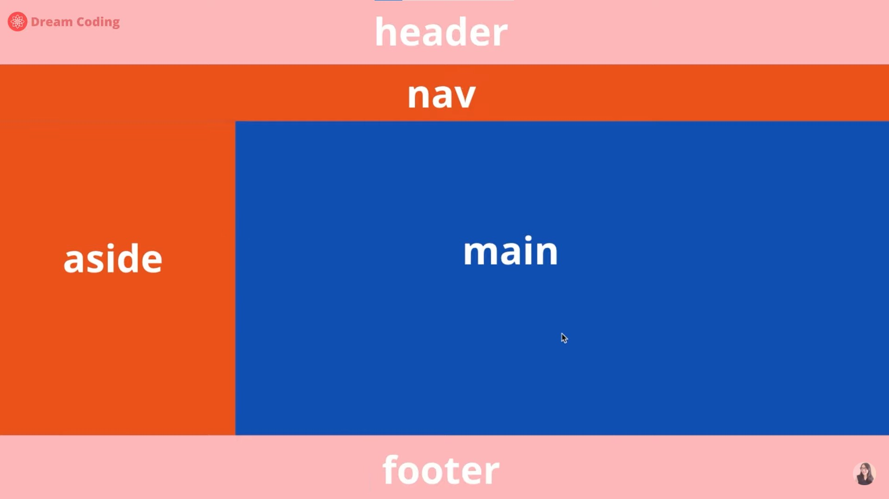
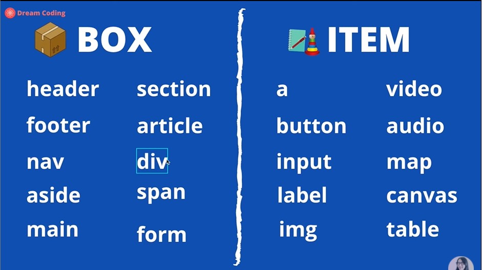
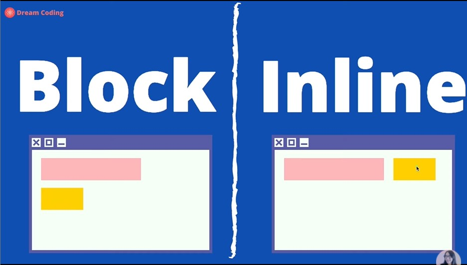
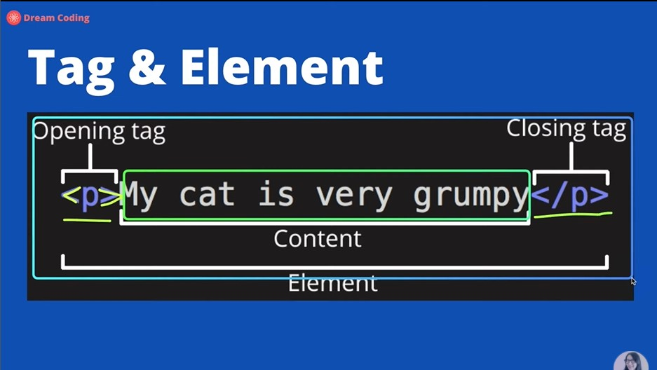
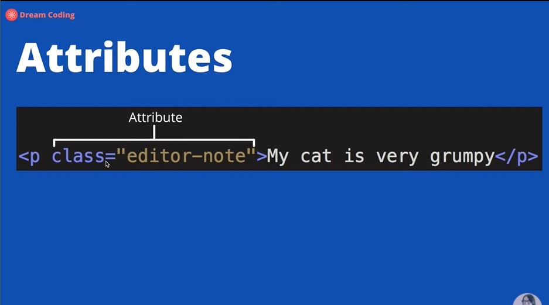
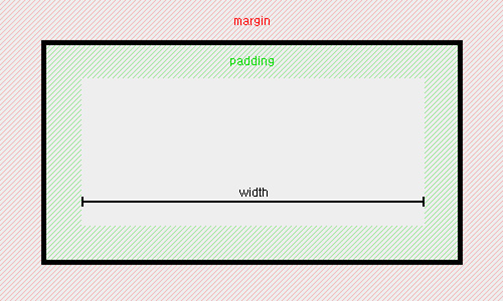

# Frontend

### 개념

## HTML

- Hyper Text Markup Language(웹 브라우저 상에서 보여지도록 디자인 된 문서)
- 웹을 이루는 가장 기본적인 빌딩블럭 웹 사이트의 가장 기초로 그 위에 css와 javaScript가 얹어진다.
- HTML에서 사용할 수 있는 태그들은 W3C에서 지정하여 모든 브라우저에서 이를 구현해 놓기로 한다. [MDN](https://developer.mozilla.org/en-US/docs/web/HTML/element)에서 확인 가능(파라미터, 이벤트, 호환성 등)
- HTML은 기본적으로 어느정도의 에러를 무시하고 실행되기 때문에 꼼꼼한 확인이 필요하다. [Validator](https://validator.w3.org/nu/#textarea)사이트에서 검증가능

**기본구조**

```html
<!DOCTYPE html> // 문서의 타입이 html임을 명시한다
<html> // 최상위에는 html 태그가 존재한다.(head와 body를 포함함)
  <head> // 사용자에게 보여지는 ui적인 요소가 없다. css파일을 연결하는 역할 등을 함
    <meta charset="UTF-8" />
    <meta name="viewport" content="width=device-width, initial-scale=1.0" />
    <title>타이틀</title>
  </head>
  <body>
      
  </body>
</html>
```

- \<!DOCTYPE html> : 문서의 타입이 html임을 명시한다
- \<html> : 최상위에는 html 태그가 존재한다.(head와 body를 포함함)
- \<head> : 사용자에게 보여지는 ui적인 요소가 없다. css파일을 연결하는 역할 등을 함. 메타데이터가 존재한다.
  - \<meta charset="UTF-8" /> : 사용하는 언어셋을 설정
  - \<meta name="viewport" content="width=device-width, initial-scale=1.0" /> : 화면전체를 viewport로 사용한다는 뜻.
- \<body> : 사용자에게 보여지는 최상위 컨테이너 body태그안에 작성한 내용들이 사용자에게 보여진다. 

**Body 구조**



- body안에 들어가는 엘리먼트는 크게 box와 item 두 종류로 나눠진다.

  

- 속성에 따라 block과 inline으로 나누어진다.

  

  Block level은 줄바꿈이 일어난다. Inline은 들어갈 자리가 있으면 같은 줄에 들어간다.

  

  태그 안에 있는 값이 Content이고 태크를 포함한 전체는 Element이다.

  

  

#### position 속성

- 웹 문서 안 요소들을 어떻게 배치할 지를 정하는 속성이다.

  **종류**

  - static
    - element들을 문서 흐름에 맞춰 배치
  - relative
    - 이전 element(주로 부모)에 자연스럽게 연결하여 위치를 지정
  - absolute
    - 원하는 위치를 지정해 배치
  - fixed
    - 지정한 위치에 고정하여 배치
  - sticky
    - 위치에 따라서 동작방식이 달라진다. 요소가 임계점 까지는 relative와 같이 동작, 그 이후는 fixed와 같이 동작

### Vuex란?

- Vue.js의 상태 관리를 위한 패턴이자 라이브러리. 다른 상태 관리 패턴이나 라이브러리와 비교했을 때 뷰의 반응성(Reactivity) 체계를 효율적으로 활용하여 화면을 업데이트 한다는 차이점이 있습니다.

- #### 상태 관리(State Management)가 왜 필요한가?

  컴포넌트 기반 프레임워크에서는 작은 단위로 쪼개진 여러 개의 컴포넌트로 화면을 구성합니다. 예를 들면, header, button, list 등의 화면 요소가 각각 컴포넌트로 구성되어 한 화면에서 많은 컴포넌트를 사용합니다. 이에 따라 **컴포넌트 간의 통신이나 데이터 전달을 좀 더 유기적으로 관리할 필요성이 생깁니다.**

- ####  상태 관리란?

  상태 관리란 여러 컴포넌트 간의 데이터 전달과 이벤트 통신을 한곳에서 관리하는 패턴을 의미합니다. 뷰와 성격이 비슷한 프레임워크인 리액트(React)에서는 Redux, Mobx와 같은 상태 관리 라이브러리를 사용하고 있고 뷰에서는 Vuex라는 상태 관리 라이브러리를 사용합니다.

- #### 상태 관리로 해결할 수 있는 문제점?

  상태 관리는 중대형 규모의 웹 애플리케이션에서 컴포넌트 간에 데이터를 더 효율적으로 전달할 수 있습니다. 일반적으로 앱의 규모가 커지면서 생기는 문제점들은 다음과 같습니다.

  1. 뷰의 컴포넌트 통신 방식인 props, event emit 때문에 **중간에 거쳐할 컴포넌트가 많아지거나**
  2. 이를 피하기 위해 Event Bus를 사용하여 **컴포넌트 간 데이터 흐름을 파악하기 어려운 것**

  이러한 문제점을 해결하기 위해 모든 데이터 통신을 한 곳에서 중앙 집중식으로 관리하는 것이 상태 관리입니다.

  

<span style="font-size:14px; color:gray">Vuex 전체 흐름도</span>

- #### 상태 관리 패턴

  상태 관리 구성요소는 크게 3가지가 있습니다.

  - **state** : 컴포넌트 간에 공유할 **data**
  - **view** : 데이터가 표현될 **template**
  - **actions** : 사용자의 입력에 따라 반응할 **methods**

  ```js
  new Vue({
    // state
    data() {
      return {
        counter: 0
      };
    },
    // view
    template: `
      <div>{{ counter }}</div>
    `,
    // actions
    methods: {
      increment() {
        this.counter++;
      }
    }
  })
  ```

  위 구성요소는 아래와 같은 흐름으로 동작합니다.

  <span style="font-size:14px; color:gray">단방향 흐름 처리를 나타낸 그림</span>

### 질문목록

[**브라우저 렌더링 원리**]

[링크](https://d2.naver.com/helloworld/59361)

- 홈페이지가 사용자에게 보이는 순서에 대해서 설명
  - 사용자가 브라우저를 통해 서버에 자원을 요청하면 서버가 HTML문서를 전달해준다.
  - 렌더링 엔진이 브라우저 화면에 표시하기위해 렌더링 과정을 거친다.
    - HTML문서를 파싱하여 태그들을 DOM노드로 변환한다.
    - 그 다음 외부 css파일과 함께 포함된 스타일 요소도 파싱한다.
    - 이 둘을 이용해 렌더 트리를 생성한다.
    - UI 백엔드가 렌더 트리를 이용하여 화면에 표시한다
    - 이 일련의 과정들은 모든 HTML을 파싱할 떄까지 기다리는 것이 아닌 즉시 수행된다.

**호이스팅이 무엇인가**

- 호이스팅이란 javascript에서 함수 실행전 var 변수 선언과 함수선언문을 최 상단으로 끌어 올리는것
- 우선순위는 var변수 선언 -> 함수선언문 순서이다.
- 호이스팅은 코드의 가독성과 문제 발생을 방지하기 위해 최대한 안 일어나게 하는 것이 좋다.

**클로저가 무엇인가? 원리와 사용이유** ( **조사 필요** )

- 클로저란 함수 내에서 함수를 정의하고 사용하는것.
- Javascript에서는 클로저를 사용하면 여러개의 변수들이 함수를 통해 호출한 데이터가 여러개 생성되어 각각 다른 환경을 이루고 있다.
- 사용이유
  - 내부 데이터의 은닉화가 가능하다.
  - ...

**CSS에서 margin과 padding에 대해서 설명하시오**



- `margin`과 `padding` 모두 여백을 의미한다. 하지만 `margin`은 바깥쪽 여백, `padding`은 안쪽 여백을 의미한다.
- 이 둘은 `border`속성을 경계로 나뉜다.

**position을 어떻게 사용하는지 알려주세요**

position

**GET, POST가 어떻게 다르게 쓰는지?**

- 공통점 : 둘 다 HTTP를 이용해서 서버에 무엇인가를 요청할 때 사용하는 방식이다.

- 차이점
  - GET
    - 서버로부터 정보를 조회하기 위해 쓰이는 메소드(수정 X)
    - 요청하는 데이터가 `HTTP Request Messag`e의 `Header` 부분의 `url`에 담겨서 전송된다.
    - 쿼리스트링 형식으로 데이터를 요청한다.
    - url에 데이터가 담겨가기 때문에 데이터 크기가 제한적이다.
    - POST보다 상대적으로 보안에 취약하다.(url에 담겨가기 때문)
    - GET요청은 브라우저 기록에 남아있어 캐시가 가능
  - POST
    - 리소스를 생성/ 업데이트하기 위해 서버로 데이터를 보내는데 사용
    - `HTTP Message`의 `Body`에 데이터를 담아서 전송 
      - 대용량 데이터 전송가능
      - GET보다 상대적으로 안전

**this의 용법**

**브라우저 저장소에 대해서 차이점을 설명하시오**

- Localstorage : 웹 스토리지중 하나로 브라우저에 데이터를 저장한다. 이 데이터는 영구적이므로 브라우저를 종료해도 유지된다.
- SessionStorage : 웹 스토리지 중 하나로 브라우저에 데이터를 저장한다. 하지만, 영구적인 데이터가 아니므로 브라우저 종료시 사라진다.
- Cookie : 

**Restful API에 대해서 아는대로 설명해 주세요.**(GET, PUT, POST, PATCH, OPTION, DELETE)

- restful api란 : REST한 특징을 가지는 API를 말한다. 즉 자원을 이름으로 구분하여 해당 자원의 상태를 주고 받을 수 있도록 설계한 API이다.

- GET
  - 서버의 자원을 요청할 때 사용하는 메소드.
  - 데이터는 url에 포함하여 넘긴다(쿼리스트링)
- PUT
  - 요청된 자원을 수정하는데 사용하는 메소드.
  - URI를 보내지 않아도 요청된 URI를 그대로 사용한다.
- POST
  - 서버에 자원을 생성하기 위해 사용하는 메소드
  - 데이터는 http 요청 바디에 포함하여 넘긴다.
- PATCH
  - PUT과 유사하게 요청된 자원을 수정하는데 사용한다. 하지만, PUT은 자원 전체를 갱신하지만 PATCH는 해당자원의 일부를 교체
- OPTIONS
  - 웹서버에서 지원되는 메소드의 종류를 확인할 경우 사용
- DELETE
  - 요청된 자원을 삭제할 것을 요청함.

**Javascript는 어떤 언어인가?**

- 싱글 스레드 언어
  - Javascript의 이벤트 루프가 싱글 스레드인 것이다.
- 하지만 실제 사용시 멀티 스레드 처럼 사용하는데 어떻게 사용하는지?
  - Javascript는 수행하야 할 함수들을 call 스택에 넣어 차례대로 처리한다. 이때, 비동기적으로 처리되어야하는 콜백함수들은 Web API에서 처리하고 Task Queue에서 대기한다. 이벤트 루프는 주기적으로 Call스택과, Task 큐를 확인하며 Call스택이 비면 Task큐에 있는 함수를 Call스택으로 올려준다. 이를 통해 멀티 스레드처럼 동작할 수 있다.
- 비동기적으로 실행이 되는 것을 동기적으로 코딩하는 방법이 있는지?

**Event Loop란?**

- 자바스크립트의 비동기 동작에서 처리가 Web API에 의해서 처리가 끝난 후 task queue에서 대기 하고있는 함수들을 call stack이 비었을 때 call stack으로 올려주는 기능을 함

**이벤트 버블링 이란?**

- 이벤트 버블링이란, 하위요소에서 이벤트 발생시 최상위 요소까지 상위요소로 이벤트가 전파되는 것
- 이벤트 버블링은 기본적으로 child -> parent인데 반대로 구현하는 법은?
  - addEventListener의 옵션 객체에 capture:true를 설정해주면 된다. 원래 디폴트는 false. 이렇게 하면 특정 이벤트가 발생했을 때, 최상위 요소에서 이벤트가 발생한 하위 요소까지 찾아 내려간다.
- 이벤트 버블링을 막기위한 방법
  - 해당 이벤트 안에 stopPropagation() api를 사용한다.
- 이벤트 버블링을 잘 활용하면 어떻게 사용할 수 있을까?
  - 바닐라 JS에서 addEventListener를 등록할때, 각각의 요소에 Event를 등록하면 이후 추가되는 엘리먼트들은 해당 Event를 가지고 있지 않다. 하지만 상위요소에 Event를 등록하면 이후 추가되는 엘리먼트들도 이벤트 버블링을 통해 해당 이벤트를 수행하게 된다.

**타입스크립트란?**

**실행문맥에 대해서 설명하시오**

**HTML이 렌더링 중에 Javascript가 실행되면 렌더링이 멈추는데 그 이유는?**


**현재 Javascript 프레임워크를 사용하는 것과 그 선택을 한 이유**

- 프로젝트를 진행할 때 어떤 Javascript 프레임워크를 선택할 것인가? 이유?
- 최근 사용되는 Javascript 프레임워크에 대해 차이점과 장단점? 언제 어떻게 사용해야 할까?

**SPA와 서버사이드 렌더링의 차이점**

- SPA : 클라이언트 사이드 렌더링이며 초기에 모든 js정보를 받아오기 때문에 초기 렌더링이 느리다. 하지만 이후에는 페이지를 이동할 때 새로고침이 일어나지않아 UX가 향상되고 사용자가 네이티브 앱처럼 느낄 수 있다. 또한, 페이지 이동시 필요한 정보만을 받아오기 때문에 트래픽이 감소한다.
- 서버사이드 렌더링 : 페이지 요청시 서버에서 모든 화면을 렌더링 한 후 클라이언트로 보내주는 방식으로 페이지 이동시 매번 새로고침이 일어난다. 하지만 SPA에 비해서 초기 렌더링이 빠르다.

**require와 import의 차이점**

- 둘 다 모듈을 불러오기 위해 사용한다. 하지만 require은 코드 전체를 불러오고 import는 코드에서 원하는 부분만 불러올 수 있기 때문에 코드량, 성능적으로 더 좋다.

**SASS, SCSS의 CSS와의 차이점**

**Javascript 성능 최적화를 위한 방법**

**Vue & React**

- 둘의 차이점
- Vue 혹은 React를 사용했다면 상태관리 구현방법
  - Vue 상태관리 방법
- 라이프 사이클
- Vue에서 양방향 데이터가 일어나는 원리

**무작위 데이터에 대한 테스트 방법**

**ES6에서 Arrow 함수를 언제 쓰는지? 왜쓰는지?**

**var, let, const의 차이점**

**CORS를 대처하는 방법과 우회하는 방법**

**MVVM 모델에 대해서 설명**


### 단어

**쿼리스트링 **

- 사용자가 입력 데이터를 전달하는 방법중의 하나로, url 주소에 미리 협의된 데이터를 파라미터를 통해 넘기는 것을 말한다.
- 예시) http://host:port/path?querystring or https://host:port/path?key=value&key2=value2...

