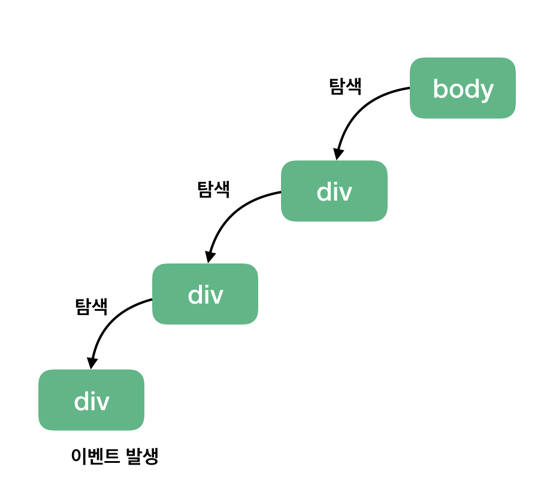

## Javascript

### 중요개념

## Javascript의 특징

#### 싱글쓰레스 언어이다.

[참고](https://chanyeong.com/blog/post/44)

- Javascript는 싱글 쓰레드 언어이다. Javascript의 메인 쓰레드인 이벤트 루프가 싱글 쓰레드이기 때문. 하지만 웹 브라우저나 Node.js같은 멀티 쓰레드 환경에서 실행된다. 즉, 자바스크립트 자체는 싱글 쓰레드이지만, 자바스크립트 런타임은 싱글 쓰레드가 아니다.

  **싱글 쓰레드로 한번에 여러 요청을 처리하는 방법**

  ​	동기식 요청은 코드를 한줄 한줄 차례대로 실행하므로 앞의 작업시간이 길수록 자원의 낭비가 심해진다. 이를 요청이 완료될 때 까지 기다리지 않고 동시에 다른 작업을 실행하는 비동기 호출로 극복할 수 있다.

  즉, Javascript는 싱글 쓰레드 이지만 작업을 비동기적으로 처리함으로써 한번에 여러 요청을 처리하는 것이다.

  **자바스크립트 비동기 런타임 과정**

  

  자바스크립트가 실행될 때 다음과 같은 요소들이 실행을 도와준다.
  -  Call Stack : 자바스크립트에서 수행해야할 함수들을 순차적으로 스택에 담아 처리
  - Web API : 웹 브라우저에서 제공하는 API로 AJAX나 Timeout등의 비동기 작업을 실행
  - Task Queue : CallBack Queue라고도 하며 Web API에서 넘겨받은 Callback함수를 저장
  - Event Loop : Call Stack이 비어있다면 Task Queue의 작업을 Call Stack으로 옮김

- 런타임 과정 예시

  
  
  - **호출 스택의 동작과정**
  
    - 코드를 실행하면 main함수를 stack에 넣는다. 그다음 printSquare가 실행되므로 stack에 들어가고 printSquare안의 quare가 실행된다... 차례대로 실행하고 실행이 끝나는 순서대로 pop을 통해 스택에서 나오게된다.
  
  - 자바스크립트는 이렇게 싱글 스레드 언어이기 때문에 함수를 실행하면 함수 호출이 스택에 순차적으로 쌓이고 스택의 맨 위에서부터 차례대로 한 번에 하나의 함수만 처리할 수 있다. 간단한 프로그램이라면 상관없지만 만약에 우리가 아주 복잡한 프로그램을 구동한다고 생각해보자. 시간이 매우 오래 걸리는 작업이 스택에 쌓이고 실행되면 그 다음 작업은 **무한정 대기**할 수밖에 없다.

  - 이러한 점을 극복하기 위한 해결 방안이 바로 **Asynchronous Callbacks(비동기 콜백)**이다!

    

  - **비동기 동작 예제**
    - 함수를 차례대로 call 스택에 push하며 처리하다가 콜백함수인 cb는 setTimeout을 처리하기 위해 web API로 넘긴다.
    - 이후 스택은 차례대로 함수를 push/pop해 나가고, web API에서 5초가 지나 동작이 완료되면 task queue에 콜백함수인 cb를 넘긴다. 이벤트 루프는 call stack을 감시하다가 call stack이 비어있는 것을 확인하면 task queue에 있는 cb를 스택에 push하여 실행하게 된다.

  **[비동기 동작에 대해 좀 더 자세한 설명](https://chanyeong.com/blog/post/33)**

#### Javascript는 왜 싱글 쓰레드일까?

- 결론은 **쉬워서**이다. 멀티 쓰레드로 실행되는 언어였다면 웹페이지에서 발생하는 동시성 문제에 대해 해결해야 했다. 하지만 자바스크립트는 단일 쓰레드로 실행되므로 인해 교착 상태와 같은 다중 쓰레드 환경에서 발생할 수 있는 복잡한 시나리오를 신경 쓸 필요가 없으며 비동기 처리를 통해 쉽게 여러 요청을 처리할 수 있다.

  *실제로 구글의 Chrome 브라우저 마저도 기존 웹 페이지에서 엄청난 동시성 문제를 일으킬 수 있다는 이유로 단일 웹 사이트 페이지의 자바스크립트 코드가 동시에 실행되는 것을 허용하지 않는다.*

## 이벤트 버블링, 이벤트 캡처, 이벤트 위임

### 이벤트 등록

이벤트 등록이란 웹 애플리케이션에서 사용자의 입력을 받기 위해 필요한 기능입니다.

예시

```html
<button>add one item</button>
```

```js
HTMLCopy
var button = document.querySelector('button');
button.addEventListener('click', addItem);

function addItem(event) {
	console.log(event);
}
```

add one item이라는 간단한 버튼을 만들어 클릭했을 때 addItem이라는 함수를 실행시키는 코드. 버튼을 클릭하고 나면 addItem 함수가 실행되고 addItem 함수에 `event`인자가 넘어온다. `event`인자를 콘솔에 출력해보면 이벤트와 관련된 정보를 확인할 수 있다.

이처럼 `addEventListener()` 웹 API는 웹 개발자들이 화면에 동적인 기능을 추가하기 위해 자연스럽게 접하게 되는 기본적인 기능입니다. 사용자의 입력에 따라 추가 동작을 구현할 수 있는 방법이죠. 여기서 브라우저는 어떻게 이벤트의 발생을 감지했을까요? 브라우저가 이벤트를 감지하는 방식 2가지를 아래에서 알아보겠습니다.

### 이벤트 버블링 - Event Bubbling

이벤트 버블링은 특정 화면 요소에서 이벤트가 발생했을 때 해당 이벤트가 더 상위의 화면 요소들로 전달되어 가는 특성을 의미합니다. 아래와 같은 그림처럼요.


> 상위의 화면 요소란? HTML 요소는 기본적으로 트리 구조를 갖습니다. 여기서는 트리 구조상으로 한 단계 위에 있는 요소를 상위 요소라고 하며 body 태그를 최상위 요소라고 부르겠습니다.

위 그림은 아래에 예시로 들 코드를 미리 도식화한 그림입니다. 세 개의 div 태그가 있고 가장 아래에 있는 div 태그에서 이벤트가 발생했을 때 최상위 요소인 body 태그까지 이벤트가 전달되는 모습을 나타내었습니다. 그럼 이제 같이 코드를 보겠습니다.

```html
<body>
	<div class="one">
		<div class="two">
			<div class="three">
			</div>
		</div>
	</div>
</body>
```

```js
var divs = document.querySelectorAll('div');
divs.forEach(function(div) {
	div.addEventListener('click', logEvent);
});

function logEvent(event) {
	console.log(event.currentTarget.className);
}
```

위 코드는 세 개의 div 태그에 모두 클릭 이벤트를 등록하고 클릭 했을 때 logEvent 함수를 실행시키는 코드입니다. 여기서 위 그림대로 최하위 div 태그 `<div class="three"></div>`를 클릭하면 아래와 같은 결과가 실행됩니다.


three 클래스를 갖는 div 태그를 클릭했을 때의 결과

div 태그 한 개만 클릭했을 뿐인데 왜 3개의 이벤트가 발생되는 걸까요? 그 이유는 브라우저가 이벤트를 감지하는 방식 때문입니다.

브라우저는 특정 화면 요소에서 이벤트가 발생했을 때 그 이벤트를 최상위에 있는 화면 요소까지 이벤트를 전파시킵니다. 따라서, 클래스 명 three -> two -> one 순서로 div 태그에 등록된 이벤트들이 실행됩니다. 마찬가지로 two 클래스를 갖는 두 번째 태그를 클릭했다면 two -> one 순으로 클릭 이벤트가 동작하겠죠.

여기서 주의해야 할 점은 각 태그마다 이벤트가 등록되어 있기 때문에 상위 요소로 이벤트가 전달되는 것을 확인할 수 있습니다. 만약 이벤트가 특정 div 태그에만 달려 있다면 위와 같은 동작 결과는 확인할 수 없습니다.

이와 같은 하위에서 상위 요소로의 이벤트 전파 방식을 **이벤트 버블링(Event Bubbling)**이라고 합니다.
“Trigger clicks all the way up”


### 이벤트 캡쳐 - Event Capture

이벤트 캡쳐는 이벤트 버블링과 반대 방향으로 진행되는 이벤트 전파 방식입니다.



클릭 이벤트가 발생한 지점을 찾아내려 가는 그림

위 그림처럼 특정 이벤트가 발생했을 때 최상위 요소인 body 태그에서 해당 태그를 찾아 내려갑니다. 그럼 이벤트 캡쳐는 코드로 어떻게 구현할 수 있을까요?

```html
<body>
	<div class="one">
		<div class="two">
			<div class="three">
			</div>
		</div>
	</div>
</body>
```

```js
var divs = document.querySelectorAll('div');
divs.forEach(function(div) {
	div.addEventListener('click', logEvent, {
		capture: true // default 값은 false입니다.
	});
});

function logEvent(event) {
	console.log(event.currentTarget.className);
}
```

`addEventListener()` API에서 옵션 객체에 `capture:true`를 설정해주면 됩니다. 그러면 해당 이벤트를 감지하기 위해 이벤트 버블링과 반대 방향으로 탐색합니다.

따라서, 아까와 동일하게 `<div class="three"></div>` 를 클릭해도 아래와 같은 결과가 나타납니다.


### event.stopPropagation()

“난 이렇게 복잡한 이벤트 전달 방식 알고 싶지 않고, 그냥 원하는 화면 요소의 이벤트만 신경 쓰고 싶어요.”라고 생각하시는 분들이 충분히 있을 수 있습니다. 실제로 마감 기한에 쫓기는 상황에서 이런 동작 방식을 정확히 이해하는 시간보다는 구현에 더 많은 시간을 쏟아야 하기 때문입니다. 그럴 때는 아래처럼 `stopPropagation()` 웹 API를 사용합니다.

```js
function logEvent(event) {
	event.stopPropagation();
}
```

위 API는 해당 이벤트가 전파되는 것을 막습니다. 따라서, 이벤트 버블링의 경우에는 클릭한 요소의 이벤트만 발생시키고 상위 요소로 이벤트를 전달하는 것을 방해합니다. 그리고 이벤트 캡쳐의 경우에는 클릭한 요소의 최상위 요소의 이벤트만 동작시키고 하위 요소들로 이벤트를 전달하지 않습니다.

위와 같이 logEvent 함수에 `stopPropagation()` API를 사용한다면 앞의 ‘이벤트 버블링 예제’와 ‘이벤트 캡쳐 예제’에서 사용한 코드 기준으로 각각 three와 one이 찍히겠네요.

```js
// 이벤트 버블링 예제
divs.forEach(function(div) {
	div.addEventListener('click', logEvent);
});

function logEvent(event) {
	event.stopPropagation();
	console.log(event.currentTarget.className); // three
}
```

```js
// 이벤트 캡쳐 예제
divs.forEach(function(div) {
	div.addEventListener('click', logEvent, {
		capture: true // default 값은 false입니다.
	});
});

function logEvent(event) {
	event.stopPropagation();
	console.log(event.currentTarget.className); // one
}
```

### 이벤트 위임 - Event Delegation

앞에서 살펴본 이벤트 버블링과 캡쳐는 사실 이벤트 위임을 위한 선수 지식이라고 해도 과언이 아닙니다. 이벤트 위임은 실제 바닐라 JS로 웹 앱을 구현할 때 자주 사용하게 되는 코딩 패턴입니다.

이벤트 위임을 한 문장으로 요약해보면 ‘하위 요소에 각각 이벤트를 붙이지 않고 상위 요소에서 하위 요소의 이벤트들을 제어하는 방식’입니다.

```html
<h1>오늘의 할 일</h1>
<ul class="itemList">
	<li>
		<input type="checkbox" id="item1">
		<label for="item1">이벤트 버블링 학습</label>
	</li>
	<li>
		<input type="checkbox" id="item2">
		<label for="item2">이벤트 캡쳐 학습</label>
	</li>
</ul>
```

```js
var inputs = document.querySelectorAll('input');
inputs.forEach(function(input) {
	input.addEventListener('click', function(event) {
		alert('clicked');
	});
});
```


<span style="font-size:14px;color:gray;">할 일 목록의 체크 박스를 클릭했을 때 클릭 이벤트 리스너가 동작하는 모습</span>

자바스크립트 `querySelectorAll()`를 이용해 화면에 존재하는 모든 인풋 박스 요소를 가져온 다음 각 인풋 박스의 요소에 클릭 이벤트 리스너를 추가합니다. 화면을 실행시키고 각 리스트 아이템의 인풋 박스(체크 박스)를 클릭하면 위와 같이 경고 창이 표시되죠.

여기까지는 별다를 것 없는 이상하지 않은 코드였는데요. 그런데 만약 여기서 할 일이 더 생겨서 리스트 아이템을 추가하면 어떻게 될까요?

```js
// ...

// 새 리스트 아이템을 추가하는 코드
var itemList = document.querySelector('.itemList');

var li = document.createElement('li');
var input = document.createElement('input');
var label = document.createElement('label');
var labelText = document.createTextNode('이벤트 위임 학습');

input.setAttribute('type', 'checkbox');
input.setAttribute('id', 'item3');
label.setAttribute('for', 'item3');
label.appendChild(labelText);
li.appendChild(input);
li.appendChild(label);
itemList.appendChild(li);
```

새로 추가한 리스트 아이템에 클릭 이벤트가 정상적으로 동작하는지 한번 확인해봤습니다.


<span style="font-size:14px; color:gray">새로 추가된 리스트 아이템(이벤트 위임 학습)에서 클릭 이벤트가 동작하지 않는 모습</span>

새로 추가된 리스트 아이템에는 클릭 이벤트 리스너가 동작하지 않네요. 왜 그럴까요?

코드를 다시 살펴보면, 인풋 박스에 클릭 이벤트 리스너를 추가하는 시점에서 리스트 아이템은 두 개입니다. 따라서, 새롭게 추가된 리스트 아이템에는 클릭 이벤트 리스너가 등록되지 않았죠. 이런 식으로 매번 새롭게 추가된 리스트 아이템까지 클릭 이벤트 리스너를 일일이 달아줘야 할까요?

리스트 아이템이 많아지면 많아질수록 이벤트 리스너를 다는 작업 자체가 매우 번거롭습니다. 이 번거로운 작업을 해결할 수 있는 방법이 바로 이벤트 위임(Event Delegation)입니다.

앞에서 살펴본 코드를 아래와 같이 변경해보겠습니다.

```js
// var inputs = document.querySelectorAll('input');
// inputs.forEach(function(input) {
// 	input.addEventListener('click', function() {
// 		alert('clicked');
// 	});
// });

var itemList = document.querySelector('.itemList');
itemList.addEventListener('click', function(event) {
	alert('clicked');
});

// 새 리스트 아이템을 추가하는 코드
// ...
```

화면의 모든 인풋 박스에 일일이 이벤트 리스너를 추가하는 대신 이제는 인풋 박스의 상위 요소인 ul 태그, `.itemList`에 이벤트 리스너를 달아놓고 하위에서 발생한 클릭 이벤트를 감지합니다. 이 부분이 앞에서 배웠던 이벤트 버블링이죠.

결과는 다음과 같습니다.


<span style="font-size:14px;color:gray;">새로 추가된 리스트 아이템에서 클릭 이벤트가 정상적으로 동작하는 모습</span>

**추가목표**

```
참고 : 위 코드는 현재 인풋 박스의 이벤트만 다루는 것이 아니라 label 태그의 이벤트도 감지합니다. event 객체를 이용하여 인풋 박스의 이벤트만 감지할 수 있도록 구현해보세요.
```


## 함수

[참조](https://gmlwjd9405.github.io/2019/04/20/function-declaration-vs-function-expression.html)

- 함수는 여러 개의 인자를 받아서, 결과를 출력한다.

- 파라미터의 개수와 인자의 개수가 일치하지 않아도 오류가 발생하지 않는다.

  - 만약, 파라미터 1개가 정의된 함수를 부를 떄, 인자의 개수를 0개 넣어 실행하면 이미 정의된 파라미터는 undefined라는 값을 갖게 된다.
  - 변수는 초기화됐지만, 값이 할당되지 않았기 때문이다.

- 자바스크립트에서는 함수도 객체이다.

  - 따라서 다른 객체와 마찬가지로 넘기거나 할당할 수 있다.

  - 함수를 객체 프로퍼티에 할당할 수도 있다.

    ```javascript
    const o = {};
    o.f = testFunc;
    o.f();
    ```

  - 함수를 객체 배열 요소로 할당할 수도 있다.

    ```javascript
    const arr = [1, 2, 3];
    arr[1] = testFunc;
    arr[1]();
    ```

#### 함수 호출 vs 함수 참조

- **함수 호출**

  - 함수 식별자 뒤에 괄호를 쓰면 함수 본문을 실행한다.

  - 함수를 호출한 표현식은 반환값이 된다.

  - `testFun()` (함수 호출)

    ```javascript
    function printName(firstname){
        var myname = "HEEE";
        return myname + " " + firstname;
    }
    ```

- 함수 참조
  - 함수 식별자 뒤에 괄호를 쓰지 않으면 함수는 실행되지 않는다.
  - `testFunc` (함수 참조)
  - `const f = testFunc`와 같이 함수를 변수에 할당하면 f()와 같이 다른 이름으로 함수를 호출할 수 있다.

#### 원시값 매개변수 vs 객체 매개변수

- 함수를 호출하면 함수 매개변수는 변수 자체가 아니라 그 값을 전달받는다
  - 따라서 넘겨받은 원시값 매개변수를 함수 내에서 변경하더라도 밖에서는 변경되지 않는다.
  - 하지만 넘겨받은 매개변수가 객체이고, 이 객체 자체를 변경하면 그 객체는 함수 밖에서도 바뀐 점이 반영된다.
- 원시값과 객체의 차이?
  - 원시값은 불변이므로 수정할 수 없다.
  - 원시값을 담은 변수는 수정할 수 있지만( 다른 원시값을 가지도록? ), 원시값 자체는 바뀌지 않는다.
  - 반면 객체는 바뀔 수 있다.

#### 반환값과 undefined

- 함수는 어떤 타입의 값이라도 반환할 수 있다.

- 자바스크립트 함수는 반드시 return값이 존재하며, 없을 때는 기본 반환값인 'undefined'가 반환된다.

  - 자바스크립트에서는 void타입이 없다.

  - Ex. 반환값 : undefined

    ```javascript
    function printName(firstname){
        var myname = "HEEE";
        var result = myname + " " + firstname;
    }
    ```

#### arguments 객체

- 함수 호출 시에 넘겨진 실제 인자값을 가지는 객체

- 함수가 실행되면 그 안에는 arguments라는 특별한 지역변수가 자동으로 생성된다.

  - arguments의 타입은 객체이다.

- 자바스크립트 함수는 선언한 파라미터보다 더 많은 인자를 보낼 수도 있다.

  - 이때 넘어온 인자를  arguments로 하나씩 접근할 수 있다.
  - arguments는 배열의 형태를 가지고 있다.

- arguments는 배열 타입은 아니다.

  - 따라서 배열의 메서드를 사용할 수 없다.

    ```javascript
    function a(){
        console.log(arguments);
    }
    a(1, 2, 3); // {'0':1, '1':2, '2':3}
    ```

- 자바스크립트의 가변인자를 받아서 처리하는 함수를 만드는 상황에서 arguments 속성을 유용하게 사용할 수 있다.

  ```javascript
  function a(){
      if(arguments.length < 3){ // 인자의 개수가 중요한 경우
          console.lor("errer");
          return;
      }
      otherMethod(arguments[1]); // 다른 메서드에 가변인자를 넘겨주는 경우
  }
  ```

- **주의할 점**

  - arguments도 남용하면 변경에 약한 코드가 된다.
  - arguments를 함부로 수정해서도 안된다. 수정이 된다 하더라도 수정을 해서 해당 값을 바꾸려고 하는 것은 좋지 않다.

#### 함수선언문과 함수표현식의 차이

#### 함수선언문

- 일반적인 프로그래밍 언어에서의 함수 선언과 비슷한 형식

  ```javascript
  function printName(firstname){
      var myname = "HEEE";
      return myname + " " + firstname;
  }
  ```

#### 함수표현식

- 변수값에 함수 표현을 담아 놓은 형태

  - 유연한 자바스크립트 언어의 특징을 활용한 선언 방식

- 함수표현식은 익명 함수표현식과 기명 함수표현식으로 나눌 수 있다.

  - 일반적으로 함수표현식이라고 부르면 앞에 익명이 생략된 형태라고 볼 수 있다.
  - 익명 함수표현식 : 함수에 식별자가 주어지지 않는다.
  - 기명 함수표현식 : 함수의 식별자가 존재한다.

- 함수표현식의 장점

  - 클로져로 사용
  - 콜백으로 사용(다른 함수의 인자로 넘길 수 있음)

  ```javascript
  var test1 = function() {
     return '익명 함수표현식';
  }
  
  var test2 = function test2() {
      return '기명 함수표현식';
  }
  ```

#### 함수선언문과 함수표현식의 차이

- 함수선언문은 호이스팅에 영향을 받지만, 함수표현식은 호이스팅에 영향을 받지 않는다

  - 함수선언문은 코드를 구현한 위치와 관계없이 자바스크립트의 특징인 호이스팅에 따라 브라우저가 자바스크립트를 해석할 때 맨 위로 끌어 올려진다.
  - 함수표현식은 함수선언문과 달리 선언과 호출 순서에 따라서 정상적으로 함수가 실행되지 않을 수 있다.

- 함수표현식 Error 예시

  ```javascript
  // 정상
  function printName(firstname){
      var inner = function() {
          return "inner value";
      }
      
      var result = inner();
      console.log("name is " + result);
  }
  
  printName(); // 결과 : "name is inner value"
  ```

  ```javascript
  // 오류
  function printName(firstname) {
      console.log(inner);
      var result = inner();
      console.log("name is " + result);
      
      var inner = function() {
          return "inner value";
      }
  }
  printName();
  
  // 호이스팅 결과
  
  function printName(firstname){
      var inner; // 호이스팅 - var변수 끌어올림
      console.log(inner); // "undefined"
      var result = inner();// ERROR!!
      console.log("name is " + result);
      
      inner = function() {
          return "inner value";
      }
  }
  printName(); // 결과 : TypeError: inner is not a function
  ```

## 호이스팅(Hoisting)

[링크](https://gmlwjd9405.github.io/2019/04/22/javascript-hoisting.html)

- 함수 안에 있는 선언들을 모두 끌어올려서 해당 함수 유효 범위의 최상단에 선언하는 것

- 자바스크립트 함수는 실행되기 전에 함수 안에 필요한 변수값들을 모두 모아서 유효 범위의 최상단에 선언한다.

  - 유효범위 : 함수 블록 {} 안에서 유효

- 즉, 함수 내에서 아래쪽에 존재하는 내용 중 필요한 값들을 끌어올리는 것이다.

  - 실제 코드가 끌어올려지는 것이 아니라 내부적으로 수행됨
  - 실제 메모리에서는 변화가 없다.

- **호이스팅의 대상**

  - var 변수 선언과 함수선언문에서만 호이스팅이 일어난다.

    - var 변수/함수의 **선언**만 위로 끌어 올려지며, **할당**은 끌어 올려지지 않는다.
    - let/const 변수 선언과 함수표현식에서는 호이스팅이 발생하지 않는다.

  - 예시1

    ```javascript
    console.log("hello");
    var myname = "HEEE";
    let myname2 = "HEEE2";
    ```

    ```javascript
    var myname; // 호이스팅 (var의 선언)
    console.log("hello");
    myname = "HEEE"; // 할당
    let myname2 = "HEEE2"; // 호이스팅 X
    ```

  - 예시2

    호이스팅전

    ```javascript
    foo();
    foo2();
    
    function foo(){
        console.log("hello");
    }
    var foo2 = function(){
        console.log("hello2");
    }
    ```

    호이스팅 후

    ```javascript
    var foo2;// 호이스팅 (var의 선언)
    function foo(){ // 호이스팅(함수 선언문)
        console.log("hello");
    }
    
    foo();
    foo2(); // ERROR!!
    
    foo2 = function(){
        console.log("hello2")
    }
    
    ```

    - 호이스팅은 함수선언문과 함수표현식에서 서로 다르게 동작하기 떄문에 주의해야 한다.
      - 변수에 할당된 함수표현식은 끌어 올려지지 않기 때문에 이때는 변수의 스코프 규칙을 그대로 따른다.

#### 함수선언문과 함수표현식에서의 호이스팅

#### 함수선언문에서의 호이스팅

호이스팅 전

```javascript
function printName(firstname) { // 함수선언문 
    var result = inner(); // "선언 및 할당"
    console.log(typeof inner); // > "function"
    console.log("name is " + result); // > "name is inner value"

    function inner() { // 함수선언문 
        return "inner value";
    }
}

printName(); // 함수 호출
```

호이스팅 후

```javascript
function printName(firstname) {
    var result; // 호이스팅 - var 변수 선언
    function inner() { // 호이스팅 - 함수 선언문
        return "inner value";
    }
    
    result = inner();
    console.log(typeof inner);
    console.log("name is " + result);
}

printName();
```

#### 함수표현식에서의 호이스팅

- 함수표현식은 함수선언문과 달리 선언과 호출 순서에 따라서 정상적으로 함수가 실행되지 않을 수 있다.
  - 함수표현식에서는 선언과 할당의 분리가 발생한다.

1. 함수표현식의 선언이 호출보다 위에 있는 경우 - 정상출력

   호이스팅 전

   ```javascript
   function printName(firstname) { // 함수선언문
        var inner = function() { // 함수표현식 
            return "inner value";
        }
           
        var result = inner(); // 함수 "호출"
        console.log("name is " + result);
    }
   
    printName(); // > "name is inner value"
   ```

   호이스팅 후

   ```javascript
   function printName(firstname) {
       var inner;
       var result;
       inner = function() {
           return "inner value";
       }
       
       result = inner();
       console.log("name is " + result);
   }
   
   printName();
   ```

2. 함수표현식의 선언이 호출보다 아래에 있는 경우

   호이스팅 전

   ```javascript
   function printName(firstname) { // 함수선언문
        console.log(inner); // > "undefined": 선언은 되어 있지만 값이 할당되어있지 않은 경우
        var result = inner(); // ERROR!!
        console.log("name is " + result);
   
        var inner = function() { // 함수표현식 
            return "inner value";
        }
    }
    printName(); // > TypeError: inner is not a function
   ```

   호이스팅 후

   ```javascript
   function printName(firstname){
       var result;
       var inner;
       
       console.log(inner);
       result = inner();
       console.log("name is " + result);
       inner = function() {
           return "inner value";
       }
   }
   printName();
   ```

3. 함수표현식의 선언이 호출보다 아래에 있는 경우

   ```javascript
    function printName(firstname) { // 함수선언문
        console.log(inner); // ERROR!!
        let result = inner();  
        console.log("name is " + result);
   
        let inner = function() { // 함수표현식 
            return "inner value";
        }
    }
    printName();
   ```

   - let/const는 호이스팅이 일어나지 않기 때문에 ERROR가 발생한다.

#### 호이스팅 우선순위

**같은 이름의 var 변수 선언과 함수 선언에서의 호이스팅**

- 변수 선언이 함수 선언보다 위로 끌어올려진다.

  호이스팅 전

  ```javascript
  var myName = "hi";
  
  function myName() {
        console.log("yuddomack");
  }
  function yourName() {
      console.log("everyone");
  }
  
  var yourName = "bye";
  
  console.log(typeof myName);
  console.log(typeof yourName);
  ```

  호이스팅 후

  ```javascript
  // 1. var변수 선언
  var myName;
  var yourName;
  // 2. 함수 선언문
  function myName(){
      console.log("yuddomack");
  }
  function yourName() {
      console.log("everyone");
  }
  
  myName = "hi";
  yourNAme = "bye";
  
  console.log(typeof myName); // 결과 : string
  console.log(typeof yourName); // 결과 : string
  ```

- 값이 할당되어 있지 않은 변수와 값이 할당되어 있는 변수에서의 호이스팅

  ```javascript
  var myName = "Heee";
  var yourName;
  
  function myName(){
      console.log("myName Function");
  }
  function yourNAme() {
      console.log("yourName Function");
  }
  console.log(typeof myName); // 결과 : string
  console.log(typeof yourName); // 결과 : function
  ```

  - 즉, 값이 할당되어 있지 않은 변수의 경우, 함수선언문이 변수를 덮어쓴다.
  - 값이 할당되어 있는 변수의 경우, 변수가 함수선언문을 덮어쓴다.

#### 주의점

- 코드의 가독성과 유지보수를 위해 호이스팅이 일어나지 않도록 한다.
  - 호이스팅을 제대로 모르더라도 함수와 변수를 가급적 코드 상단부에서 선언하면, 호이스팅으로 인한 스코프 꼬임 현상은 방지할 수 있다.
  - let/const를 사용한다
- var를 쓰면 혼란스럽고 쓸모없는 코드가 생길 수 있다. 그럼 왜 var와 호이스팅을 이해해야 할까?
  - ES6를 어디에서든 쓸 수 있으려면 아직 시간이 더 필요하므로 ES5로 트랜스컴파일을 해야한다. 따라서 아직은 var가 어떻게 동작하는지 이해하고 있어야 한다.

## 클로저

> 클로저는 독립적인(자유) 변수를 가리키는 **함수**이다. 또는, 클로저 안에 정의된 함수는 만들어진 환경을 '기억한다.'

```javascript
function getClosure() {
  var text = 'variable 1';
  return function() {
    return text;
  };
}

var closure = getClosure();
console.log(closure()); // 결과 : 'variable 1'
```

위에서 정의한 `getClosure()`는 함수를 반환하고, 반환된 함수는 `getClosure()` 내부에서 선언된 변수를 참조하고 있다. 또한 이렇게 참조된 변수는 함수 실행이 끝났다고 해서 사라지지 않았고, 여전히 제대로 된 값을 반환하고 있는 걸 알 수 있다.

```javascript
var base = 'Hello, ';
function sayHelloTo(name) {
  var text = base + name;
  return function() {
    console.log(text);
  };
}

var hello1 = sayHelloTo('승민');
var hello2 = sayHelloTo('현섭');
var hello3 = sayHelloTo('유근');
hello1(); // 'Hello, 승민'
hello2(); // 'Hello, 현섭'
hello3(); // 'Hello, 유근'
```

출력된 결과를 보면 `text` 변수가 동적으로 변화하고 있는 것처럼 보인다. 실제로는 `text`라는 변수 자체가 여러 번 생성된 것이다. 즉, `hello1()`과 `hello2()`, `hello3()`은 서로 다른 환경을 가지고 있다.

#### 클로저를 통한 은닉화

일반적으로 JavaScript에서 객체지향 프로그래밍을 말한다면 `Prototype`을 통해 객체를 다루는 것을 말한다. `Prototype`을 통한 객체를 만들 때의 주요한 문제 중 하나는 Private variables에 대한 접근 권한 문제이다. 예제 코드를 보자.

```javascript
function Hello(name) {
  this._name = name;
}

Hello.prototype.say = function() {
  console.log('Hello, ' + this._name);
}

var hello1 = new Hello('승민');
var hello2 = new Hello('현섭');
var hello3 = new Hello('유근');

hello1.say(); // 'Hello, 승민'
hello2.say(); // 'Hello, 현섭'
hello3.say(); // 'Hello, 유근'
hello1._name = 'anonymous';
hello1.say(); // 'Hello, anonymous'
```

위에서 `Hello()`로 생성된 객체들은 모두 `_name`이라는 변수를 가지게 된다. 변수명 앞에 underscore(_)를 포함했기 때문에 일반적인 JavaScript 네이밍 컨벤션을 생각해 봤을때 이 변수는 Private variable으로 쓰고싶다는 의도를 알 수 있다. 하지만 실제로는 여전히 외부에서도 쉽게 접근가능한 변수일 뿐이다.

이 경우에 클로저를 사용하여 외부에서 변수에 직접 접근하는 것을 제한할 수 있다.

```javascript
function hello(name) {
  var _name = name;
  return function() {
    console.log('Hello, ' + _name);
  };
}

var hello1 = hello('승민');
var hello2 = hello('현섭');
var hello3 = hello('유근');

hello1(); // 'Hello, 승민'
hello2(); // 'Hello, 현섭'
hello3(); // 'Hello, 유근'
```

특별히 인터페이스를 제공하는 것이 아니라면, 여기서는 외부에서 `_name`에 접근할 방법이 전혀 없다. 이렇게 은닉화도 생각보다 쉽게 해결할 수 있다.

#### 반복문 클로저

```javascript
var i;
for (i = 0; i < 10; i++) {
  setTimeout(function() {
    console.log(i);
  }, 100);
}
```

간단하게 0-9까지의 정수를 출력하는 코드이지만 실제로 돌려보면 엉뚱하게도 10만 열 번 출력되는 걸 볼 수 있다. 왜일까?

먼저 `setTimeout()`에 인자로 넘긴 익명함수는 모두 0.1초 뒤에 호출될 것이다. 그 0.1초 동안에 이미 반복문이 모두 순회되면서 `i`값은 이미 10이 된 상태. 그 때 익명함수가 호출되면서 이미 10이 되어버린 `i`를 참조하는 것이다. 

이 경우에도 클로저를 사용하면 원하는 대로 동작하도록 만들 수 있다.

```javascript
var i;
for (i = 0; i < 10; i++) {
  (function(j) {
    setTimeout(function() {
      console.log(j);
    }, 100);
  })(i);
}
```

중간에 IIFE를 덧붙여 `setTimeout()`에 걸린 익명함수를 클로저로 만들었다. 앞서 말한대로 클로저는 만들어진 환경을 기억한다. 이 코드에서 `i`는 IIFE내에 `j`라는 형태로 주입되고, 클로저에 의해 각기 다른 환경속에 포함된다. 반복문은 10회 반복되므로 10개의 환경이 생길 것이고, 10개의 서로 다른 환경에 10개의 서로 다른 j가 생긴다.

- **의문점** ( 수정**必** )

  - 만약 IIFE 매개변수로 i를 넘기지 않고, 그냥 직접 참조하게 된다면 당연히 클로저가 참조하는 IIFE의 함수 스코프에서도 `i`값이 없으므로 생성 당시의 외부 스코프인 글로벌을 탐색하게 되고 결국 모두 같은 `i`를 참조하게 된다. 반면에, 인자로 `i`를 넘기게 되면 IIFE로 만든 10개의 스코프에 모두 `i`라는 변수가 다른 값으로 생기므로 정상적으로 동작할 수 있는 것이다.

  - 콜백으로 넘기는 함수 자체를 IIFE로 만들면 원하는대로 0-9까지 출력은 되지만 함수 내부가 즉시 실행되어 버리므로 `setTimeout()`의 0.1초 딜레이가 작동하지 않게 된다.

#### 클로저의 성능

클로저는 각자의 환경을 가진다. 이 환경을 기억하기 위해서는 당연히 메모리가 소모될 것이다. 클로저를 생성해놓고 참조를 제거하지 않는 것은 C++에서 동적할당으로 객체를 생성해놓고 `delete`를 사용하지 않는 것과 비슷하다. 클로저를 통해 내부 변수를 참조하는 동안에는 내부 변수가 차지하는 메모리를 GC가 회수하지 않는다. 따라서 클로저 사용이 끝나면 참조를 제거하는 것이 좋다.

```javascript
function hello(name) {
  var _name = name;
  return function() {
    console.log('Hello, ' + _name);
  };
}

var hello1 = hello('승민');
var hello2 = hello('현섭');
var hello3 = hello('유근');

hello1(); // 'Hello, 승민'
hello2(); // 'Hello, 현섭'
hello3(); // 'Hello, 유근'

// 여기서 메모리를 release 시키기 클로저의 참조를 제거해야 한다.
hello1 = null;
hello2 = null;
hello3 = null;
```

## this

​	Javascript의 함수는 호출될 때, 매개변수로 전달되는 인자값 이외에, `arguments 객체`와 `this`를 암묵적으로 전달 받는다. 이 때, `this`에 바인딩 되는 객체는 해당 함수 호출 방식(함수 선언X)에 따라 달라진다.

### 함수 호출 방식과 this 바인딩

> 함수의 상위 스코프를 결정하는 방식인 [렉시컬 스코프(Lexical scope)](https://poiemaweb.com/js-scope#7-렉시컬-스코프)는 함수를 선언할 때 결정된다. this 바인딩과 혼동하지 않도록 주의

함수 호출 방식은 다양하다.

> 1. 함수 호출
> 2. 메소드 호출
> 3. 생성자 함수 호출
> 4. apply/call/bind 호출

```javascript
var foo = function (){
    console.dir(this);
};

// 1. 함수 호출
foo();

// 2. 메소드 호출
var obj = { foo: foo};
obj.foo();

// 3. 생성자 함수 호출
var instance = new foo();

// 4. apply/call/bind 호출
var bar = { name: 'bar' };
foo.call(bar);
foo.apply(bar);
foo.bind(bar)();
```

#### 1. 함수 호출

전역객체(Global Object)는 모든 객체의 유일한 최상위 객체를 의미하며 일반적으로 Browser-side에서는 `window`, Server-side에서는 `global` 객체를 의미한다.

```javascript
this === window // true
```


```javascript
var ga = 'Global variable';

console.log(ga);
console.log(window.ga); // 전역 변수 ga 는 window.ga와 같다

function foo() {
  console.log('invoked!');
}
window.foo(); // 즉, 전역함수 foo는 window.foo()로 실행이 가능하다
```

기본적으로 `this`는 전역객체(Global object)에 바인딩된다. 전역함수는 물론이고 심지어 내부함수의 경우도 `this`는 외부함수가 아닌 전역객체에 바인딩된다.

```javascript
function foo() {
  console.log("foo's this: ",  this);  // window
  function bar() {
    console.log("bar's this: ", this); // window
  }
  bar();
}
foo();
```

또한 메소드의 내부함수일 경우에도 `this`는 전역객체에 바인딩된다.

```javascript
var value = 1;

var obj = {
  value: 100,
  foo: function() {
    console.log("foo's this: ",  this);  // obj
    console.log("foo's this.value: ",  this.value); // 100
    function bar() {
      console.log("bar's this: ",  this); // window
      console.log("bar's this.value: ", this.value); // 1
    }
    bar();
  }
};

obj.foo();
```

- 결과
  - foo's this : obj (객체 전체를 의미)
  - foo's this.value: 100 (obj 객체 안의 value를 의미)
  - bar's this: window(글로벌 객체)
  - bar's this.value: 1 (글로벌 객체의 value를 의미)

콜백함수의 경우에도 `this`는 전역객체에 바인딩된다.

```javascript
var value = 1;

var obj = {
  value: 100,
  foo: function() {
    setTimeout(function() { // 콜백함수
      console.log("callback's this: ",  this);  // window
      console.log("callback's this.value: ",  this.value); // 1
    }, 100);
  }
};

obj.foo();
```

- 결과
  - callback's this: window(전역 객체)
  - callback's this.value: 1 (window.value)

**내부함수는 일반 함수, 메소드, 콜백함수 어디에서 선언되었든 관게없이 this는 전역객체를 바인딩한다.** 더글라스 크락포드는 “이것은 설계 단계의 결함으로 메소드가 내부함수를 사용하여 자신의 작업을 돕게 할 수 없다는 것을 의미한다” 라고 말한다. 내부함수의 `this`가 전역객체를 참조하는 것을 회피방법은 아래와 같다.

```javascript
var value = 1;

var obj = {
  value: 100,
  foo: function() {
    var that = this;  // Workaround : this === obj

    console.log("foo's this: ",  this);  // obj
    console.log("foo's this.value: ",  this.value); // 100
    function bar() {
      console.log("bar's this: ",  this); // window
      console.log("bar's this.value: ", this.value); // 1

      console.log("bar's that: ",  that); // obj
      console.log("bar's that.value: ", that.value); // 100
    }
    bar();
  }
};

obj.foo();
```


위 방법 이외에도 자바스크립트는 this를 명시적으로 바인딩할 수 있는 apply, call, bind 메소드를 제공한다.

```javascript
var value = 1;

var obj = {
  value: 100,
  foo: function() {
    console.log("foo's this: ",  this);  // obj
    console.log("foo's this.value: ",  this.value); // 100
    function bar(a, b) {
      console.log("bar's this: ",  this); // obj
      console.log("bar's this.value: ", this.value); // 100
      console.log("bar's arguments: ", arguments);
    }
    bar.apply(obj, [1, 2]);
    bar.call(obj, 1, 2);
    bar.bind(obj)(1, 2);
  }
};

obj.foo();
```

apply, call, bind를 이용하면 this는 해당 내부함수가 속해있는 object를 가리킨다.


#### 2. 메소드 호출

​	함수가 객체의 프로퍼티 값이면 메소드로서 호출된다. 이때 메소드 내부의 `this`는 해당 메소드를 소유한 객체, 즉 해당 메소드를 호출한 객체에 바인딩된다.

```javascript
var obj1 = {
  name: 'Lee',
  sayName: function() {
    console.log(this.name);
  }
}

var obj2 = {
  name: 'Kim'
}

obj2.sayName = obj1.sayName;

obj1.sayName();
obj2.sayName();
```

- 결과

  - "Lee"  (this는 obj1을 가리켰다)
  - "Kim" (this는 obj2를 가리켰다)

  

프로토타입 객체도 메소드를 가질 수 있다. 프로토타입 객체 메소드 내부에서 사용된 this도 일반 메소드 방식과 마찬가지로 해당 메소드를 호출한 객체에 바인딩된다.

```javascript
function Person(name) {
  this.name = name;
}

Person.prototype.getName = function() {
  return this.name;
}

var me = new Person('Lee');
console.log(me.getName());

Person.prototype.name = 'Kim';
console.log(Person.prototype.getName());
```


#### 3. 생성자 함수 호출

​	자바스크립트의 생성자 함수는 말 그대로 객체를 생성하는 역할을 한다. 하지만 자바와 같은 객체지향 언어의 생성자 함수와는 다르게 그 형식이 정해져 있는 것이 아니라 **기존 함수에 new 연산자를 붙여서 호출하면 해당 함수는 생성자 함수로 동작한다.**

이는 반대로 생각하면 생성자 함수가 아닌 일반 함수에 new 연산자를 붙여 호출하면 생성자 함수처럼 동작할 수 있다. 따라서 일반적으로 생성자 함수명은 첫문자를 대문자로 기술하여 혼란을 방지하려는 노력을 한다.

```javascript
// 생성자 함수
function Person(name) {
  this.name = name;
}

var me = new Person('Lee');
console.log(me); // Person;{name: "Lee"}

// new 연산자와 함께 생성자 함수를 호출하지 않으면 생성자 함수로 동작하지 않는다.
var you = Person('Kim');
console.log(you); // undefined
```

##### 3-1. 생성자 함수 동작 방식

​	new 연산자와 함께 생성자 함수를 호출하면 다음과 같은 수순으로 동작한다.

> **1. 빈 객체 생성 및 this 바인딩**
>
> 생성자 함수의 코드가 실행되기 전 빈 객체가 생성된다. 이 빈 객체가 생성자 함수가 새로 생성하는 객체이다. 이후 **생성자 함수 내에서 사용되는 this는 이 빈 객체를 가리킨다.** 그리고 생성된 빈 객체는 생성자 함수의 prototype 프로퍼티가 가리키는 객체를 자신의 프로토타입 객체로 설정한다.
>
> **2. this를 통한 프로퍼티 생성**
>
> 생성된 빈 객체에 this를 사용하여 동적으로 프로퍼티나 메소드를 생성할 수 있다. this는 새로 생성된 객체를 가리키므로 this를 통해 생성한 프로퍼티와 메소드는 새로 생성된 객체에 추가된다.
>
> **3. 생성된 객체 반환**
>
> - 반환문이 없는 경우, this에 바인딩된 새로 생성한 객체가 반환된다. 명시적으로 this를 반환하여도 결과는 같다.
> - 반환문이 this가 아닌 다른 객체를 명시적으로 반환하는 경우, this가 아닌 해당 객체가 반환된다. 이때 this를 반환하지 않은 함수는 생성자 함수로서의 역할을 수행하지 못한다. 따라서 생성자 함수는 반환문을 명시적으로 사용하지 않는다.

```javascript
function Person(name) {
  // 생성자 함수 코드 실행 전 -------- 1
  this.name = name;  // --------- 2
  // 생성된 함수 반환 -------------- 3
}

var me = new Person('Lee');
console.log(me.name);
```


#### 3.2 객체 리터럴 방식과 생성자 함수 방식의 차이

```javascript
// 객체 리터럴 방식
var foo = {
  name: 'foo',
  gender: 'male'
}

console.dir(foo);

// 생성자 함수 방식
function Person(name, gender) {
  this.name = name;
  this.gender = gender;
}

var me  = new Person('Lee', 'male');
console.dir(me);

var you = new Person('Kim', 'female');
console.dir(you);
```

객체 리터럴 방식과 생성자 함수 방식의 차이는 프로토타입 객체()[[Prototype]])에 있다.

- 객체 리터럴 방식의 경우, 생성된 객체의 프로토타입 객체는 Object.prototype이다.
- 생성자 함수 방식의 경우, 생성된 객체의 프로토타입 객체는 Person.prototype이다.

#### 3.3 생성자 함수에 new 연산자를 붙이지 않고 호출할 경우

**일반함수와 생성자 함수에 특별한 형식적 차이는 없으며 함수에 new 연산자를 붙여서 호출하면 해당 함수는 생성자 함수로 동작한다.**

그러나 객체 생성 목적으로 작성한 생성자 함수를 new 없이 호출하거나 일반함수에 new를 붙여 호출하면 오류가 발생할 수 있다. 일반함수와 생성자 함수의 호출 시 this 바인딩 방식이 다르기 때문이다.

일반 함수를 호출하면 this는 전역객체에 바인딩되지만 new 연산자와 함께 생성자 함수를 호출하면 this는 생성자 함수가 암묵적으로 생성한 빈 객체에 바인딩된다.

```javascript
function Person(name) {
  // new없이 호출하는 경우, 전역객체에 name 프로퍼티를 추가
  this.name = name;
};

// 일반 함수로서 호출되었기 때문에 객체를 암묵적으로 생성하여 반환하지 않는다.
// 일반 함수의 this는 전역객체를 가리킨다.
var me = Person('Lee'); // 전역객체에 name: Lee가 추가된다.

console.log(me); // undefined
console.log(window.name); // Lee
```

생성자 함수를 new 없이 호출한 경우, 함수 Person 내부의 this는 전역객체를 가리키므로 name은 전역변수(window)에 바인딩된다. 또한 new와 함께 생성자 함수를 호출하는 경우에 암묵적으로 반환하던 this도 반환하지 않으며, 반환문이 없으므로 undefined를 반환하게 된다.

일반함수와 생성자 함수에 특별한 형식적 차이는 없기 때문에 일반적으로 생성자 함수명은 첫문자를 대문자로 기술하여 혼란을 방지하려는 노력을 한다. 그러나 이러한 규칙을 사용한다 하더라도 실수는 발생할 수 있다.

이러한 위험성을 회피하기 위해 사용되는 패턴(Scope-Safe Constructor)은 다음과 같다. 이 패턴은 대부분의 라이브러리에서 광범위하게 사용된다.

참고로 대부분의 빌트인 생성자(Object, Regex, Array 등)는 new 연산자와 함께 호출되었는지를 확인한 후 적절한 값을 반환한다.

다시 말하지만 new 연산자와 함께 생성자 함수를 호출하는 경우, 생성자 함수 내부의 this는 생성자 함수에 의해 생성된 인스턴스를 가리킨다. 따라서 아래 A 함수가 new 연산자와 함께 생성자 함수로써 호출되면 A 함수 내부의 this는 A 생성자 함수에 의해 생성된 인스턴스를 가리킨다.

```javascript
// Scope-Safe Constructor Pattern
function A(arg) {
  // 생성자 함수가 new 연산자와 함께 호출되면 함수의 선두에서 빈객체를 생성하고 this에 바인딩한다.

  /*
  this가 호출된 함수(arguments.callee, 본 예제의 경우 A)의 인스턴스가 아니면 new 연산자를 사용하지 않은 것이므로 이 경우 new와 함께 생성자 함수를 호출하여 인스턴스를 반환한다.
  arguments.callee는 호출된 함수의 이름을 나타낸다. 이 예제의 경우 A로 표기하여도 문제없이 동작하지만 특정함수의 이름과 의존성을 없애기 위해서 arguments.callee를 사용하는 것이 좋다.
  */
  if (!(this instanceof arguments.callee)) {
    return new arguments.callee(arg);
  }

  // 프로퍼티 생성과 값의 할당
  this.value = arg ? arg : 0;
}

var a = new A(100);
var b = A(10);

console.log(a.value);
console.log(b.value);
```

### 4. apply/call/bind호출

this에 바인딩될 객체는 함수 호출 패턴에 의해 결정된다. 이는 자바스크립트 엔진이 수행하는 것이다. 이러한 자바스크립트 엔진의 암묵적 this 바인딩 이외에 this를 특정 객체에 명시적으로 바인딩하는 방법도 제공된다. 이것을 가능하게 하는 것이 Function.prototype.apply, Function.prototype.call 메소드이다.

이 메소드들은 모든 함수 객체의 프로토타입 객체인 Function.prototype 객체의 메소드이다.

```javascript
func.apply(thisArg, [argsArray])

// thisArg: 함수 내부의 this에 바인딩할 객체
// argsArray: 함수에 전달할 argument의 배열
```

기억해야 할 것은 apply() 메소드를 호출하는 주체는 함수이며 apply() 메소드는 this를 특정 객체에 바인딩할 뿐 본질적인 기능은 함수 호출이라는 것이다.

```javascript
var Person = function (name) {
  this.name = name;
};

var foo = {};

// apply 메소드는 생성자함수 Person을 호출한다. 이때 this에 객체 foo를 바인딩한다.
Person.apply(foo, ['name']);

console.log(foo); // { name: 'name' }
```

빈 객체 foo를 apply() 메소드의 첫번째 매개변수에, argument의 배열을 두번째 매개변수에 전달하면서 Person 함수를 호출하였다. 이때 Person 함수의 this는 foo 객체가 된다. Person 함수는 this의 name 프로퍼티에 매개변수 name에 할당된 인수를 할당하는데 this에 바인딩된 foo 객체에는 name 프로퍼티가 없으므로 name 프로퍼티가 동적 추가되고 값이 할당된다.

apply() 메소드의 대표적인 용도는 arguments 객체와 같은 유사 배열 객체에 배열 메소드를 사용하는 경우이다. arguments 객체는 배열이 아니기 때문에 slice() 같은 배열의 메소드를 사용할 수 없으나 apply() 메소드를 이용하면 가능하다.

```javascript
function convertArgsToArray() {
  console.log(arguments);

  // arguments 객체를 배열로 변환
  // slice: 배열의 특정 부분에 대한 복사본을 생성한다.
  var arr = Array.prototype.slice.apply(arguments); // arguments.slice
  // var arr = [].slice.apply(arguments);

  console.log(arr);
  return arr;
}

convertArgsToArray(1, 2, 3);
```

`Array.prototype.slice.apply(arguments)`는 “Array.prototype.slice() 메소드를 호출하라. 단 this는 arguments 객체로 바인딩하라”는 의미가 된다. 결국 Array.prototype.slice() 메소드를 arguments 객체 자신의 메소드인 것처럼 `arguments.slice()`와 같은 형태로 호출하라는 것이다.


call() 메소드의 경우, apply()와 기능은 같지만 apply()의 두번째 인자에서 배열 형태로 넘긴 것을 각각 하나의 인자로 넘긴다.

```javascript
Person.apply(foo, [1, 2, 3]);

Person.call(foo, 1, 2, 3);
```

apply()와 call() 메소드는 콜백 함수의 this를 위해서 사용되기도 한다.

#### <콜백함수 공부 후 다시 공부할것>

```javascript
function Person(name) {
  this.name = name;
}

Person.prototype.doSomething = function(callback) {
  if(typeof callback == 'function') {
    // --------- 1
    callback();
  }
};

function foo() {
  console.log(this.name); // --------- 2
}

var p = new Person('Lee');
p.doSomething(foo);  // undefined
```

1의 시점에서 this는 Person 객체이다. 그러나 2의 시점에서 this는 전역 객체 window를 가리킨다. 콜백함수를 호출하는 외부 함수 내부의 this와 콜백함수 내부의 this가 상이하기 때문에 문맥상 문제가 발생한다. 따라서 콜백함수 내부의 this를 콜백함수를 호출하는 함수 내부의 this와 일치시켜 주어야 하는 번거로움이 발생한다.

```javascript
function Person(name) {
  this.name = name;
}

Person.prototype.doSomething = function (callback) {
  if (typeof callback == 'function') {
    callback.call(this);
  }
};

function foo() {
  console.log(this.name);
}

var p = new Person('Lee');
p.doSomething(foo);  // 'Lee'
```

```javascript
function Person(name) {
  this.name = name;
}

Person.prototype.doSomething = function (callback) {
  if (typeof callback == 'function') {
    // callback.call(this);
    // this가 바인딩된 새로운 함수를 호출
    callback.bind(this)();
  }
};

function foo() {
  console.log('#', this.name);
}

var p = new Person('Lee');
p.doSomething(foo);  // 'Lee'
```

## JavaScript: 비동기 처리, 콜백 함수, Promise, Async/Await

**비동기 처리** : 특정 코드의 연산이 끝날 때 까지 코드 실행을 멈추지 않고, 다음 코드를 먼저 실행하는 Javascript의 특성

**동기 처리** : 작업이 끝날 때 까지 기다리는 동안 준비상태가 되기 때문에 다른 작업이 진행 될 수 없다. (작업을 순차적으로 처리하는 것)

**비동기 처리 사례(1)**

```javascript
function getData(callbackFunc){
    $.get('https://domain.com/products/1', function(response){ // ajax통신
        tableData = reponse;
    });
    return tableData;
}
console.log(getData()); // undefined
```

httmps://domain.com에 HTTP GET 요청을 날려서, products 폴더 내의 1번 상품 정보를 요청하는 코드이다. 그렇게 받아온 데이터가 response 인자에 담긴다. 그리고 tableData라는 변수에 받아온 내용을 저장한다.

콘솔에 getData()를 호출하면, 어떤 값이든 찍히는 것이 타당해 보이지만 undefined라고 나올 것이다. 왜냐면, 데이터를 받아올 때 까지 기다리지 않고 다음 코드인 return tableData;를 실행했기 때문이다. 이렇게 특정 로직의 실행이 끝날 때 까지 기다리지 않고 나머지 코드를 먼저 처리하는 것이 비동기 처리이다.

**비동기 처리 사례(2)**

```javascript
// #1
console.log('Hello');
// #2
setTimeout(function() {
	console.log('Bye');
}, 3000);
// #3
console.log('Hello Again');
```

setTimeout() 역시 비동기 방식으로 실행되기 때문에 3초를 기다렸다가 다음 코드를 수행하는 것이 아니라 일단 setTimeout()을 실행하고 나서 바로 다음 코드인 `console.log('Hello Again');`으로 넘어간다. 따라서, ‘Hello’, ‘Hello Again’를 먼저 출력하고 3초가 지나면 ‘Bye’가 출력된다.


### 콜백 함수

[참고](https://joshua1988.github.io/web-development/javascript/javascript-asynchronous-operation/)

콜백 함수란, 함수 안에서 어떤 특정한 시점에 호출되는 함수를 말하낟. 보통 콜백 함수는 함수의 매개변수로 전달하여, 특정 시점에서 콜백 함수를 호출한다.

즉, 함수A의 파라미터로 함수B를 받아오고, 함수 A의 작업이 끝나고 나서 함수 B를 실행하는 것이다. 이렇게 하면 비동기 처리 방식의 문제를 해결할 수 있다.

```javascript
function getData(callbackFunc) { // getData
	$.get('https://domain.com/products/1', function(response) {
		callbackFunc(response);
	});
}

// 1번 형태
getData(function(tableData)) {
	console.log(tableData);
}
// 2번 형태
getData((tableData)=>{
    console.log(tableData);
})
```

**동작설명**

- getData가 실행되면 get이 실행된다. 비동기 처리가 종료되면 그 결과가 response에 담겨 function(response)를 실행한다. 해당 함수 안에 파라미터로 들어온 callbackFunc라는 함수를 실행시킨다. 즉, getData의 get요청에 의해 response가 들어왔을때, 콜백함수가 실행된다.

EX.

```javascript
function work(callback) {
	setTimeout(() => {
		const start = Date.now();
		for (let i = 0; i < 1000000000; i++) {}
		const end = Date.now();
		console.log(end - start + 'ms');
		callback(end - start)
	}, 0)
}

console.log('작업 시작!');
work((ms) => {
	console.log('작업이 끝났어요!');
	console.log(ms + 'ms 걸렸어요.');
});
console.log('다음 작업');
```

- 결과 
  - '작업 시작!'이 출력된다.
  - work함수가 실행된다.
  - work함수가 동작하는 동안 '다음 작업'이 출력된다.
  - work함수 안의 for문이 종료되면 end - start를 출력하고 callback함수에 end - start값을 전달한다. 그럼 work함수 안의 익명함수는 ms 에 end - start값을 받아 '작업이 끝났어요!', ~~ms 걸렸어요 가 출력된다.

### Promise

[참고](https://joshua1988.github.io/web-development/javascript/promise-for-beginners/#%ED%94%84%EB%A1%9C%EB%AF%B8%EC%8A%A4-%EC%BD%94%EB%93%9C---%EA%B8%B0%EC%B4%88)

프로미스는 자바스크립트 비동기 처리에 사용되는 객체이다.

**Promise 적용 전**

```javascript
function getData(callbackFunc) {
  $.get('url 주소/products/1', function(response) {
    callbackFunc(response); // 서버에서 받은 데이터 response를 callbackFunc() 함수에 넘겨줌
  });
}

getData(function(tableData) {
  console.log(tableData); // $.get()의 response 값이 tableData에 전달됨
});
```

**Promise 적용 후 **

```javascript
function getData(callback) {
  // new Promise() 추가
  return new Promise(function(resolve, reject) {
    $.get('url 주소/products/1', function(response) {
      // 데이터를 받으면 resolve() 호출
      resolve(response);
    });
  });
}

// getData()의 실행이 끝나면 호출되는 then()
getData().then(function(tableData) {
  // resolve()의 결과 값이 여기로 전달됨
  console.log(tableData); // $.get()의 reponse 값이 tableData에 전달됨
});
```

#### 프로미스의 3가지 상태(states)

프로미스를 사용할 때 알아야 하는 가장 기본적인 개념이 바로 프로미스의 상태(states)입니다. 여기서 말하는 상태란 프로미스의 처리 과정을 의미합니다. `new Promise()`로 프로미스를 생성하고 종료될 때까지 3가지 상태를 갖습니다.

- Pending(대기) : 비동기 처리 로직이 아직 완료되지 않은 상태
- Fulfilled(이행) : 비동기 처리가 완료되어 프로미스가 결과 값을 반환해준 상태
- Rejected(실패) : 비동기 처리가 실패하거나 오류가 발생한 상태

**Pending(대기)**

먼저 아래와 같이 `new Promise()` 메서드를 호출하면 대기(Pending) 상태가 됩니다.

```javascript
new Promise();
```

`new Promise()` 메서드를 호출할 때 콜백 함수를 선언할 수 있고, 콜백 함수의 인자는 `resolve`, `reject`입니다.

```javascript
new Promise(function(resolve, reject) {
  // ...
});
```

**Fulfilled**

여기서 콜백 함수의 인자 `resolve`를 아래와 같이 실행하면 이행(Fulfilled)(완료) 상태가 됩니다.

```javascript
new Promise(function(resolve, reject) {
  resolve();
});
```

그리고 이행 상태가 되면 아래와 같이 `then()`을 이용하여 처리 결과 값을 받을 수 있습니다.

```javascript
function getData() {
  return new Promise(function(resolve, reject) {
    var data = 100;
    resolve(data);
  });
}

// resolve()의 결과 값 data를 resolvedData로 받음
getData().then(function(resolvedData) {
  console.log(resolvedData); // 100
});
```

**Rejected(실패)**

`new Promise()`로 프로미스 객체를 생성하면 콜백 함수 인자로 `resolve`와 `reject`를 사용할 수 있다고 했습니다. 여기서 `reject`를 아래와 같이 호출하면 실패(Rejected) 상태가 됩니다.

```javascript
new Promise(function(resolve, reject) {
  reject();
});
```

그리고, 실패 상태가 되면 실패한 이유(실패 처리의 결과 값)를 `catch()`로 받을 수 있습니다.

```javascript
function getData() {
  return new Promise(function(resolve, reject) {
    reject(new Error("Request is failed"));
  });
}

// reject()의 결과 값 Error를 err에 받음
getData().then().catch(function(err) {
  console.log(err); // Error: Request is failed
});
```


**예제**

```js
function getData() {
  return new Promise(function(resolve, reject) {
    $.get('url 주소/products/1', function(response) {
      if (response) { // 이 부분에서 resolve또는 reject 둘 중 한가지 값만 가지게된다
        resolve(response); // 즉, else문 필요 X
      }
      reject(new Error("Request is failed"));
    });
  });
}

// 위 $.get() 호출 결과에 따라 'response' 또는 'Error' 출력
getData().then(function(data) {
  console.log(data); // response 값 출력
}).catch(function(err) {
  console.error(err); // Error 출력
});
```

**여러 개의 프로미스 연결하기 (Promise Chaining)**

프로미스의 또 다른 특징은 여러 개의 프로미스를 연결하여 사용할 수 있다는 점입니다. 앞 예제에서 `then()` 메서드를 호출하고 나면 새로운 프로미스 객체가 반환됩니다. 따라서, 아래와 같이 코딩이 가능합니다.

```js
new Promise(function(resolve, reject){
  setTimeout(function() {
    resolve(1);
  }, 2000);
})
.then(function(result) {
  console.log(result); // 1
  return result + 10;
})
.then(function(result) {
  console.log(result); // 11
  return result + 20;
})
.then(function(result) {
  console.log(result); // 31
});
```

`resolve()`가 호출되면 프로미스가 대기 상태에서 이행 상태로 넘어가기 때문에 첫 번째 `.then()`의 로직으로 넘어갑니다. 첫 번째 `.then()`에서는 이행된 결과 값 1을 받아서 10을 더한 후 그다음 `.then()` 으로 넘겨줍니다. 두 번째 `.then()`에서도 마찬가지로 바로 이전 프로미스의 결과 값 11을 받아서 20을 더하고 다음 `.then()`으로 넘겨줍니다. 마지막 `.then()`에서 최종 결과 값 31을 출력합니다.

**실무에서 있을 법한 프로미스 연결 사례**

실제 웹 서비스에서 있을 법한 사용자 로그인 인증 로직에 프로미스를 여러 개 연결해보겠습니다.

```javascript
getData(userInfo)
  .then(parseValue)
  .then(auth)
  .then(diaplay);
JsCopy
```

위 코드는 페이지에 입력된 사용자 정보를 받아와 파싱, 인증 등의 작업을 거치는 코드를 나타내었습니다. 여기서 `userInfo`는 사용자 정보가 담긴 객체를 의미하고, `parseValue`, `auth`, `display`는 각각 프로미스를 반환해주는 함수라고 가정했습니다. 아래와 같이 말이죠.

```js
var userInfo = {
  id: 'test@abc.com',
  pw: '****'
};

function parseValue() {
  return new Promise({
    // ...
  });
}
function auth() {
  return new Promise({
    // ...
  });
}
function display() {
  return new Promise({
    // ...
  });
}
```

이처럼 여러 개의 프로미스를 `.then()`으로 연결하여 처리할 수 있습니다.

**프로미스의 에러 처리**

```js
function getData() {
  return new Promise(function(resolve, reject) {
    reject('failed');
  });
}
// 1. then()의 두 번째 인자로 에러를 처리하는 코드
getData().then(function() {
  // ...
}, function(err) {
  console.log(err);
});

// 2. catch()로 에러를 처리하는 코드
getData().then().catch(function(err) {
  console.log(err);
});
```

가급적이면 2번 형태를 권장

#### Async/Await

[참고](https://joshua1988.github.io/web-development/javascript/js-async-await/)

Promise를 더욱 쉽게 사용하기 위해 쓴다.

**콜백을 사용해서 구현한 함수**

```js
function logName() {
  // 아래의 user 변수는 위의 코드와 비교하기 위해 일부러 남겨놓았습니다.
  var user = fetchUser('domain.com/users/1', function(user) {
    if (user.id === 1) {
      console.log(user.name);
    }
  });
}
```

**async await를 사용한 경우**

```js
async function logName() {
  var user = await fetchUser('domain.com/users/1');
  if (user.id === 1) {
    console.log(user.name);
  }
}
```

**async & await 기본 문법**

```js
async function 함수명() {
  await 비동기_처리_메서드_명(); // ajax,axios 등
}
```

먼저 함수의 앞에 `async` 라는 예약어를 붙입니다. 그러고 나서 함수의 내부 로직 중 HTTP 통신을 하는 비동기 처리 코드 앞에 `await`를 붙입니다. 여기서 주의하셔야 할 점은 비동기 처리 메서드가 꼭 프로미스 객체를 반환해야 `await`가 의도한 대로 동작합니다.

일반적으로 `await`의 대상이 되는 비동기 처리 코드는 Axios 등 프로미스를 반환하는 API 호출 함수입니다.

**예제**

```js
function fetchItems() {
  return new Promise(function(resolve, reject) {
    setTimeout(function() {
      var items = [1,2,3];
      resolve(items)
    }, 3000);
  });
}


async function logItems() {
  var resultItems = await fetchItems();
  console.log(resultItems); // [1,2,3]
}
```

logItems가 실행되면, fetchItems()가 실행된다. fetchItems는 Promise의 결과인 items가 resultItems에 저장된다.

**async & await 실용 예제**

async & await 문법이 가장 빛을 발하는 순간은 여러 개의 비동기 처리 코드를 다룰 때입니다. 아래와 같이 각각 **사용자**와 **할 일 목록**을 받아오는 HTTP 통신 코드가 있다고 하겠습니다.

```js
//Promise 객체를 반환하는 HTTP통신 코트
function fetchUser() {
  var url = 'https://jsonplaceholder.typicode.com/users/1'
  return fetch(url).then(function(response) {
    return response.json();
  });
}

function fetchTodo() {
  var url = 'https://jsonplaceholder.typicode.com/todos/1';
  return (url).then(function(response) {
    return response.json();
  });
}


async function logTodoTitle() {
  var user = await fetchUser();
  if (user.id === 1) {
    var todo = await fetchTodo();
    console.log(todo.title); // delectus aut autem
  }
}
```

1. `fetchUser()`를 이용하여 사용자 정보 호출
2. 받아온 사용자 아이디가 `1`이면 할 일 정보 호출
3. 받아온 할 일 정보의 제목을 콘솔에 출력

`logTodoTitle()`를 실행하면 콘솔에 *delectus aut autem*가 출력될 것입니다. 위 비동기 처리 코드를 만약 콜백이나 프로미스로 했다면 훨씬 더 코드가 길어졌을 것이고 인덴팅 뿐만 아니라 가독성도 좋지 않았을 겁니다. 이처럼 async await 문법을 이용하면 기존의 비동기 처리 코드 방식으로 사고하지 않아도 되는 장점이 생깁니다.

**async & await 예외 처리**

async & await에서 예외를 처리하는 방법은 바로 try catch입니다. 프로미스에서 에러 처리를 위해 `.catch()`를 사용했던 것처럼 async에서는 `catch {}` 를 사용하시면 됩니다.

조금 전 코드에 바로 `try catch` 문법을 적용해보겠습니다.

```js
async function logTodoTitle() {
  try {
    var user = await fetchUser();
    if (user.id === 1) {
      var todo = await fetchTodo();
      console.log(todo.title); // delectus aut autem
    }
  } catch (error) { // 에러처리
    console.log(error);
  }
}
```

위의 코드를 실행하다가 발생한 네트워크 통신 오류뿐만 아니라 간단한 타입 오류 등의 일반적인 오류까지도 `catch`로 잡아낼 수 있습니다. 발견된 에러는 `error` 객체에 담기기 때문에 에러의 유형에 맞게 에러 코드를 처리해주시면 됩니다.

## 실행 컨텍스트 (추가 필)

**실행 컨텍스트는 실행 가능한 코드가 실행되기 위해 필요한 환경** 이라고 말할 수 있다. 여기서 말하는 실행 가능한 코드는 아래와 같다.

- 전역 코드 : 전역 영역에 존재하는 코드
- Eval 코드 : eval 함수로 실행되는 코드
- 함수 코드 : 함수 내에 존재하는 코드

일반적으로 실행 가능한 코드는 전역 코드와 함수 내 코드이다.

자바스크립트 엔진은 코드를 실행하기 위하여 실행에 필요한 여러가지 정보를 알고 있어야 한다. 실행에 필요한 여러가지 정보란 아래와 같은 것들이 있다.

- 변수 : 전역변수, 지역변수, 매개변수, 객체의 프로퍼티
- 함수 선언
- 변수의 유효범위(Scope)
- this

이와 같이 실행에 필요한 정보를 형상화하고 구분하기 위해 자바스크립트 엔진은 실행 컨텍스트를 물리적 객체의 형태로 관리한다. 아래의 코드를 살펴보자.

```js
var x = 'xxx';

function foo () {
  var y = 'yyy';

  function bar () {
    var z = 'zzz';
    console.log(x + y + z);
  }
  bar();
}
foo();
```

## require vs import

**export**

- 모듈 정의하기
- 파일내 한번만 사용가능하다.

**require**

- 모듈을 가져오는데 사용한다. but, 코드를 모두 불러온다.

**import**

- 모듈 가져오기
- 원하는 부분만 가져올 수 있다. 
- 코드량, 성능적으로 좋다

#### Java vs JavaScript

둘은 완전 별개의 언어이다.

**Java**

- 다용도의 목적을 가진 언어
- 객체지향 언어
- 클래스 베이스드 언어(모든 것을 클래스로 설계함)
- 어플리케이션을 개발하는데 사용된다. => 컴파일을 통해 실행파일을 만들면 운영체제에 상관없이 동작한다.
- 백엔드에 많이 사용된다.

**JavaScript**

- 스크립트 언어이다(컴파일 X)
- 다이나믹하게 타입을 할당할 수 있다.
- 프로토타입을 이용해 객체지향처럼 사용할 수 있도록 했다.
- 

## 용어

**IIFE(Immediately Invoked Function Expressions)**  :  즉시 호출함수. 정의와 동시에 즉시 실행되는 함수를 의미

**GC (Garbage Collection)** : Javascript의 메모리 관리 방법

## 추가로 공부해야할 것

**Javascript 네이밍 컨벤션**

**javascript의 prototype**[링크](https://poiemaweb.com/js-prototype#4-prototype-chain)

**스코프**

**콜백**