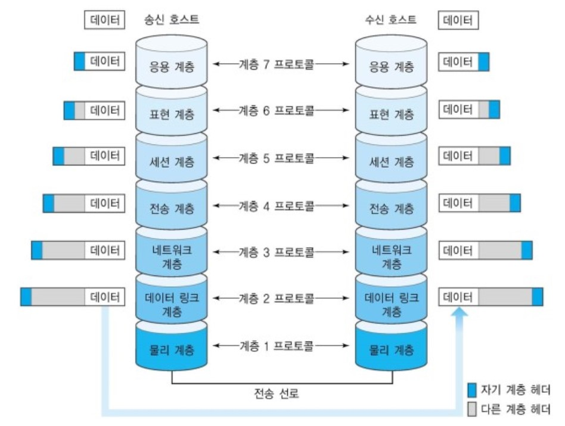

# Network 면접질문

### Network

- **Network란**
  - 사용자 혹은 데이터가 어떤 곳에서 다른 곳으로 이동할 수 있게 만든 통로이다.

### OSI(Open System Interconnection) 7계층

- **OSI 7계층이란**

  - 두 개체간에 서로 통신할 경우 연결 과정을 7단계로 나누어 놓은 것
  - 네트워크 분야에서 가장 중요하게 다루는 것으로서 세계적으로 사용이 되고 있는 네트워크 표준 모델이다. 이 안에 TCP/IP 및 네트워크 통신에 사용되는 전반적인 **프로토콜**(인터넷을 사용할 때 따라야하는 규칙)이 모두 포함되어 있다. 어떻게 인터넷을 통해서 통신을 하게 되는지 그 과정을 자세히 다룬 모델이다.
  - '네트워크를 구상할 때 이것을 참조해서 만들어라'라고 하는 참조 모델이다.

  

  - 1계층 : 물리층  : 실제로 장치들을 연결하기 위한 물리적인 사항을 정의한다.
  - 2계층 : 데이터 링크층 : 두 지점 간의 신뢰성 있는 전송을 보장한다.
    - 데이터 링크 층에서 각 지점들을 분류하는 방법은 MAC주소이다.
    - MAC주소 : 모든 장치 마다 1개씩 가지고 있는 고유한 물리적 주소이다.(랜카드에 저장되어 있음)
    - Frame이라는 단위를 사용한다.
    - 근거리에 있는 두 지점간의 신뢰성있는 전송을 보장해 주는 역할을 한다.
  - 3계층 : 네트워크층 : 여러 개의 지점을 거칠 때 경로를 찾아준다.
    - ip주소를 이용한다. 
    - 라우터가 라우팅을 통해서 경로를 찾고, 다른 곳에 위치한 서버에 접속한다.
    - 접속하고자 하는 서버의 ip주소가 우리와 동일한 라우터상에 존재하지 않는다면 해당 라우터 바깥쪽에 있는 ip로 포워딩같은 전반적인 일들을 해준다.
    - 전송단위는 패킷이라고 함
    - ip 주소로 패킷을 보내는 일을 하는 곳
  - 4계층 : 전송층 : 양 끝단의 사용자들이 송수신에 있어서 신뢰성을 보장한다.
    - 프로세스와 프로세스의 연결을 도와준다.
    - 예
      - 메신저 프로그램을 실행시켜서 다른 친구와 대화를 하고 있을 때, 그 친구에게 보내는 메세지는 특정한 프로세스의 특정한 포트 번호로 나가게 된다.
      - 즉, 양 끝단의 사용자들의 송 수신에 있어서 신뢰성을 보장한다.
      - 양 끝단 : 하나의 프로그램에 열린 하나의 포트번호 까지의 전달을 의미한다.
  - 5계층 : 세션층 : 양 끝단의 프로세스가 통신을 관리하기 위한 방법을 제공한다.
    - 통신관리 : 동기화나 tcp/ip의 세션 설정같은 것을 의미
    - 연결이 되어있는데 그 상태 자체를 관리할 수 있는 다양한 방법들을 제공해 줄 수 있다.
  - 6계층 : 표현층 : 인코딩 및 데이터의 형식 차이를 조절해 준다.
  - 7계층 : 응용층 : 응용 프로그램에서 서비스를 수행
    - UI등을 이용하여 서비스를 수행하는 계층이다.

- **편지를 보내는 과정으로 비유한 7 Layer**([참고](https://www.youtube.com/watch?v=aTPy201F0AA))

  - 편지를 보낼 때 편지지에 편지를 쓴다 => **응용계층**
  - 편지지를 영어로 썼을때, 받는쪽에서 영어를 이용해서 해석하는 것 => **표현계층**
    - 인코딩과 디코딩을 통해 전송할 데이터를 암호화 복호화한다. 정해진 형식으로 변환해서 해석한다.
    - 예를 들어 미국인이 한국인에게 숫자를 보낸다고 했을 때, one, two, three로 보내는 것이 아니라 1,2,3이라는 형식으로 보내면 한국인은 하나, 둘, 셋으로 읽을 수 있다
  - 전화처럼 쌍방으로 동시에 주고받을 것인지? 무전기 처럼 한쪽씩 번갈아 가며 주고 받을 것인지? 한쪽에서 일방적으로 보낼것인지 논리적인 통신 회선을 생성 유지함 => **세션층**
  - 편지를 누구에게 보낼 것인지? 누가 보내는 것인지?(포트번호) 적어주는것 => **전송층**
    - 추가적으로 TCP, UDP에 대해서 정의를 하는 것
  - 편지를 누구한테 보내는데, 그 사람이 어디에 사는지(IP)? 적어주는것 => **네트워크층**
    - 편지가 어느 경로를 통해서 움직여야 하는지에 대한 내용을 담고 있다.
  - 사람이 사는 아파트까지 도착했을 때, 몇 동 몇 호(MAC)에 사는지 알려주는 것 => **데이터 링크층**

#### TCP/IP와의 관계

- TCP/IP 프로토콜은 미국 국방성에서 개발한 프로토콜로, OSI 7계층 보다 개발 시기가 앞선다.
- TCP/IP는 비공식, OSI 7계층은 국제 공식 표준이다.

- 3계층(네트워크계층)에서 IP, 4계층(전송계층)에서 TCP를 표준 프로토콜로 이용하지만, 일반적인 의미로 TCP/IP는 OSI 7계층 전체에서의 기능적인 표준에 기존의 TCP/IP 개념이 들어가 있다고 볼 수 있다.
- 또한, 실제 업계에서 많이 쓰이는 프로토콜이 TCP/IP 프로토콜이라는 점에서 OSI 모델을 이론적인 모델이라고 칭하기도 한다. 
- 공통점은 둘 다 패킷을 이용해 통신하고 계층 구조를 가지고 있다. 보내는 입장과 받는 입장 모두 각각의 계층에서 통신이 이루어지면 완벽한 상호작용이 가능하다는 것이다.
- 각각의 계층을 이동하면서 캡슐화/역캡슐화가 가능해진다.
- 계층으로 나누어놓으면 문제가 발생했을 때 어떤 계층을 확인하면 되는지 결정할 수 있어서 효율적인 대처가 가능하다.

#### 미디어 계층(하위계층)

- OSI 7계층에서 하위 3계층(물리층, 데이터링크층, 네트워크층)을 포함하는 것. 
- 서로 연결된 컴퓨터 사이의 데이터 전송과 목적지까지의 데이터 전송의 전반을 담당한다.
- **물리층**
  - 네트워크 장비 사이에서 실제로 발생하는 전기적인 통신을 담당한다.
  - 데이터의 전송 단위는 Bit
  - 주로 랜선을 의미하는 것으로 통신에 필요한 공간 자체를 물리층이라고 말한다.
- **데이터 링크층**
  - 네트워크 장비 사이에서 두 지점간의 신뢰성 있는 전송을 보장하기 위한 계층
  - 물리적인 데이터의 전송 등에 관심이 많은 계층이다.
  - 데이터의 전송 단위는 frame
  - 물리적인 주소(MAC 주소)가 상호 통신에 사용된다.
  - ipconfig /all 명령어를 이용해 ip정보를 확인해보면 물리적 주소가 있다. 이 물리적 주소가 랜카드의 주소이다. 물리적주소의 앞 6자리는 만든 회사의 고유번호이고 뒤의 6자리는 장치의 고유번호이다.
- **네트워크 층**
  - 여러 개의 노드를 거칠 때 경로를 찾아주는 역할을 하는 계층이다.
  - 데이터 전송 단위는 패킷
  - 패킷에 ip관련 정보다 담겨 전송된다.
  - 네트워크층에서 경로를 찾기 위한 주소는 ip주소이다.
  - 흔히 사용되는 IPv4는 8비트의 수 4개로 총 32비트 주소 체계이다. IP 주소는 네트워크 부분과 호스트 부분으로 나누어지며 총 5개의 클래스로 구분할 수 있다.
  - 클래스에 따라 앞의 몇 비트가 네트워크 비트고, 뒤의 몇 비트가 호스트 비트인지 나누어진다.
    - Class A : 국가 단위의 거대한 네트워크에 사용되는 주소
      - 네트워크비트 : 8비트
      - 호스트 비트 : 24비트
    - Class B 
      - 네트워크비트 : 16비트
      - 호스트 비트 : 16비트
    - Class C : 학교 단위의 작은 기관에 사용되는 주소
      - 네트워크비트 : 24비트
      - 호스트 비트 : 8비트

#### 호스트 계층

> OSI 7계층에서 상위 계층(세션층, 표현층, 응용층)과 중간 계층(전송층)을 포함하는 것.

#### 중간계층

- **전송층**
  - 양 끝단의 사용자들이 신뢰성 있는 데이터를 주고받을 수 있도록 하는 계층
  - 오류 및 흐름 제어를 진행한다.
  - 데이터 전송단위는 세그먼트
  - 전송층에 들어가는 대표적인 프로토콜은 TCP, UDP가 있다.
  - 컴퓨터에서 실행중인 프로세스까지의 도달을 책임지므로 포트 번호가 중요하게 사용된다.
  - 컴퓨터에서는 2의 16제곱개의 포트 번호가 존재하며 각 프로그램마다 통신을 위한 포트 번호를 사용하게 된다.
  - Well Known Port란 0부터 1023번 까지의 이미 사용 용도가 정해진 포트이며 세계적으로 사용하고 있는 포트 번호 표준이다.
  - 

